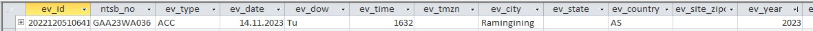
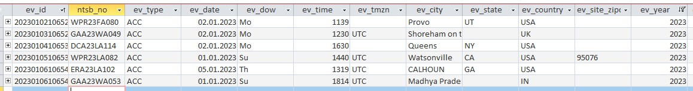
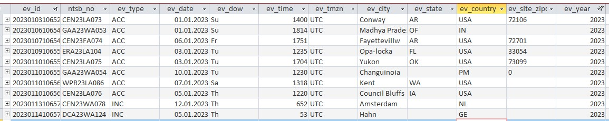

# Data Analysis: Events in 2023

**Important**: All statistics provided below are based on NTSB data as of February 1, 2023 (period 2008 to 2023).

## 1. Events by up99MON.mdb

### 08.12.2022

#### NTSB

<kbd></kbd>

#### IO-AVSTATS-DB

```
ev_id         |ntsb_no   |ev_type|ev_date                |ev_dow|ev_time|ev_tmzn|ev_city    |
--------------+----------+-------+-----------------------+------+-------+-------+-----------+
20221205106413|GAA23WA036|ACC    |2023-11-14 00:00:00.000|Tu    |   1632|       |Ramingining|
```

### 08.01.2023

#### NTSB

<kbd></kbd>

#### IO-AVSTATS-DB

```
ev_id         |ntsb_no   |ev_type|ev_date                |ev_dow|ev_time|ev_tmzn|ev_city            |
--------------+----------+-------+-----------------------+------+-------+-------+-------------------+
20230102106520|WPR23FA080|ACC    |2023-01-02 00:00:00.000|Mo    |   1139|       |Provo              |
20230103106528|GAA23WA049|ACC    |2023-01-02 00:00:00.000|Mo    |   1230|UTC    |Shoreham on the Sea|
20230104106534|DCA23LA114|ACC    |2023-01-02 00:00:00.000|Mo    |   1630|       |Queens             |
20230105106536|WPR23LA082|ACC    |2023-01-01 00:00:00.000|Su    |   1440|UTC    |Watsonville        |
20230106106545|ERA23LA102|ACC    |2023-01-05 00:00:00.000|Th    |   1319|UTC    |CALHOUN            |
20230106106547|GAA23WA053|ACC    |2023-01-01 00:00:00.000|Su    |   1814|UTC    |Madhya Pradesh     |
20221205106413|GAA23WA036|ACC    |2023-11-14 00:00:00.000|Tu    |   1632|       |Ramingining        |
```

### 15.01.2023

#### NTSB

<kbd></kbd>

#### IO-AVSTATS-DB

```
ev_id         |ntsb_no   |ev_type|ev_date                |ev_dow|ev_time|ev_tmzn|ev_city            |
--------------+----------+-------+-----------------------+------+-------+-------+-------------------+
20230102106520|WPR23FA080|ACC    |2023-01-02 00:00:00.000|Mo    |   1139|       |Provo              |
20230103106528|GAA23WA049|ACC    |2023-01-02 00:00:00.000|Mo    |   1230|UTC    |Shoreham on the Sea|
20230104106534|DCA23LA114|ACC    |2023-01-02 00:00:00.000|Mo    |   1630|       |Queens             |
20230105106536|WPR23LA082|ACC    |2023-01-01 00:00:00.000|Su    |   1440|UTC    |Watsonville        |
20230106106545|ERA23LA102|ACC    |2023-01-05 00:00:00.000|Th    |   1319|UTC    |CALHOUN            |
20230106106547|GAA23WA053|ACC    |2023-01-01 00:00:00.000|Su    |   1814|UTC    |Madhya Pradesh     |
20221205106413|GAA23WA036|ACC    |2023-11-14 00:00:00.000|Tu    |   1632|       |Ramingining        |
20230103106524|CEN23LA073|ACC    |2023-01-01 00:00:00.000|Su    |   1400|UTC    |Conway             |
20230107106548|CEN23FA074|ACC    |2023-01-06 00:00:00.000|Fr    |   1751|       |Fayettevillw       |
20230109106551|ERA23LA104|ACC    |2023-01-03 00:00:00.000|Tu    |   1235|UTC    |Opa-locka          |
20230110106558|CEN23LA075|ACC    |2023-01-03 00:00:00.000|Tu    |   1704|UTC    |Yukon              |
20230110106559|GAA23WA054|ACC    |2023-01-10 00:00:00.000|Tu    |   1230|UTC    |Changuinoia        |
20230110106561|WPR23LA086|ACC    |2023-01-07 00:00:00.000|Sa    |   1318|UTC    |Kent               |
20230110106562|CEN23LA076|ACC    |2023-01-05 00:00:00.000|Th    |   1220|UTC    |Council Bluffs     |
20230113106572|CEN23WA078|INC    |2023-01-12 00:00:00.000|Th    |    652|UTC    |Amsterdam          |
20230114106576|DCA23WA124|INC    |2023-01-05 00:00:00.000|Th    |     53|UTC    |Hahn               |
```

### 22.01.2023

#### NTSB

<kbd></kbd>

#### IO-AVSTATS-DB

```
ev_id         |ntsb_no   |ev_type|ev_date                |ev_dow|ev_time|ev_tmzn|ev_city            |
--------------+----------+-------+-----------------------+------+-------+-------+-------------------+
20230102106520|WPR23FA080|ACC    |2023-01-02 00:00:00.000|Mo    |   1139|       |Provo              |
20230103106528|GAA23WA049|ACC    |2023-01-02 00:00:00.000|Mo    |   1230|UTC    |Shoreham on the Sea|
20230105106536|WPR23LA082|ACC    |2023-01-01 00:00:00.000|Su    |   1440|UTC    |Watsonville        |
20230106106545|ERA23LA102|ACC    |2023-01-05 00:00:00.000|Th    |   1319|UTC    |CALHOUN            |
20230106106547|GAA23WA053|ACC    |2023-01-01 00:00:00.000|Su    |   1814|UTC    |Madhya Pradesh     |
20230104106534|DCA23LA114|ACC    |2023-01-02 00:00:00.000|Mo    |   1635|       |New York           |
20221205106413|GAA23WA036|ACC    |2023-11-14 00:00:00.000|Tu    |   1632|       |Ramingining        |
20230103106524|CEN23LA073|ACC    |2023-01-01 00:00:00.000|Su    |   1400|UTC    |Conway             |
20230107106548|CEN23FA074|ACC    |2023-01-06 00:00:00.000|Fr    |   1751|       |Fayettevillw       |
20230109106551|ERA23LA104|ACC    |2023-01-03 00:00:00.000|Tu    |   1235|UTC    |Opa-locka          |
20230110106558|CEN23LA075|ACC    |2023-01-03 00:00:00.000|Tu    |   1704|UTC    |Yukon              |
20230110106559|GAA23WA054|ACC    |2023-01-10 00:00:00.000|Tu    |   1230|UTC    |Changuinoia        |
20230110106561|WPR23LA086|ACC    |2023-01-07 00:00:00.000|Sa    |   1318|UTC    |Kent               |
20230110106562|CEN23LA076|ACC    |2023-01-05 00:00:00.000|Th    |   1220|UTC    |Council Bluffs     |
20230113106572|CEN23WA078|INC    |2023-01-12 00:00:00.000|Th    |    652|UTC    |Amsterdam          |
20230114106576|DCA23WA124|INC    |2023-01-05 00:00:00.000|Th    |     53|UTC    |Hahn               |
20230105106537|WPR23FA083|ACC    |2023-01-04 00:00:00.000|We    |   1456|       |New Harmony        |
20230108106549|ERA23FA103|ACC    |2023-01-07 00:00:00.000|Sa    |   1213|UTC    |Suffolk            |
20230109106552|ERA23LA105|ACC    |2023-01-05 00:00:00.000|Th    |   1604|UTC    |Paris              |
20230110106560|ERA23LA107|ACC    |2023-01-01 00:00:00.000|Su    |   1930|UTC    |Old Bridge         |
20230112106567|GAA23WA055|ACC    |2023-01-06 00:00:00.000|Fr    |   1920|UTC    |Marabá Paulista    |
20230116106578|GAA23WA056|ACC    |2023-01-10 00:00:00.000|Tu    |   1230|UTC    |Lesna Jania        |
20230116106579|CEN23FA079|ACC    |2023-01-16 00:00:00.000|Mo    |   1242|       |Kingfisher         |
20230117106582|CEN23LA080|ACC    |2023-01-10 00:00:00.000|Tu    |   1357|UTC    |Boling Brook       |
20230117106583|ERA23LA111|ACC    |2023-01-12 00:00:00.000|Th    |   1630|UTC    |Somerville         |
20230117106584|CEN23LA081|ACC    |2023-01-14 00:00:00.000|Sa    |   1425|UTC    |Conroe             |
20230117106585|CEN23LA082|ACC    |2023-01-14 00:00:00.000|Sa    |   1130|UTC    |Las Animas         |
20230117106587|CEN23LA083|ACC    |2023-01-15 00:00:00.000|Su    |    930|UTC    |Brashear           |
20230117106588|CEN23FA084|ACC    |2023-01-17 00:00:00.000|Tu    |   1039|UTC    |Yoakum             |
20230118106592|ANC23LA013|ACC    |2023-01-13 00:00:00.000|Fr    |   1545|       |Wasilla            |
20230118106593|WPR23LA087|ACC    |2023-01-18 00:00:00.000|We    |    830|UTC    |Poplar             |
20230118106595|WPR23LA088|ACC    |2023-01-11 00:00:00.000|We    |   1100|UTC    |Julian             |
20230118106596|WPR23LA089|ACC    |2023-01-12 00:00:00.000|Th    |   1300|UTC    |Yelm               |
20230118106598|WPR23LA091|ACC    |2023-01-15 00:00:00.000|Su    |   1025|UTC    |San Diego          |
20230119106601|ENG23WA012|INC    |2023-01-18 00:00:00.000|We    |   1415|       |Sydney             |
20230119106607|CEN23LA086|ACC    |2023-01-10 00:00:00.000|Tu    |   1240|UTC    |Fowlerton          |
```

## 2. Status of avall.mdb and IO-AVSTATS-DB as of February 1, 2023

### 2.1 NTSB avall.mdb

Events: 68

```
ev_id         ntsb_no     ev_type  ev_date  ev_dow   ev_time  ev_tmzn   ev_city             ev_state  ev_country  ev_site_zipcode  ev_year
20230102106520WPR23FA080  ACC      02.01.202Mo            1135          Provo               UT        USA         84601                 2023
20230103106524CEN23LA073  ACC      01.01.202Su            1400UTC       Conway              AR        USA         72034                 2023
20230103106528GAA23WA049  ACC      02.01.202Mo            1230UTC       Shoreham on the Sea           UK                                2023
20230104106534DCA23LA114  ACC      02.01.202Mo            1635          New York            NY        USA                               2023
20230105106536WPR23LA082  ACC      01.01.202Su            1440UTC       Watsonville         CA        USA         95076                 2023
20230105106537WPR23FA083  ACC      04.01.202We            1456          New Harmony         UT        USA         84757                 2023
20230106106542ERA23LA101  ACC      03.01.202Tu            1139UTC       Atlantic Ocean      AO        TK                                2023
20230106106545ERA23LA102  ACC      05.01.202Th            1319UTC       CALHOUN             GA        USA                               2023
20230106106547GAA23WA053  ACC      01.01.202Su            1814UTC       Madhya Pradesh      OF        IN                                2023
20230107106548CEN23FA074  ACC      06.01.202Fr            1751          Fayettevillw        AR        USA         72701                 2023
20230108106549ERA23FA103  ACC      07.01.202Sa            1213UTC       Suffolk             VA        USA         23434                 2023
20230109106551ERA23LA104  ACC      03.01.202Tu            1235UTC       Opa-locka           FL        USA         33054                 2023
20230109106552ERA23LA105  ACC      05.01.202Th            1604UTC       Paris               KY        USA         40361                 2023
20230110106557ANC23LA011  ACC      02.01.202Mo            1457UTC       Kenai               AK        USA         99611                 2023
20230110106558CEN23LA075  ACC      03.01.202Tu            1704UTC       Yukon               OK        USA         73099                 2023
20230110106559GAA23WA054  ACC      10.01.202Tu            1230UTC       Changuinoia                   PM          0                     2023
20230110106560ERA23LA107  ACC      01.01.202Su            1930UTC       Old Bridge          NJ        USA                               2023
20230110106561WPR23LA086  ACC      07.01.202Sa            1318UTC       Kent                WA        USA                               2023
20230110106562CEN23LA076  ACC      05.01.202Th            1220UTC       Council Bluffs      IA        USA                               2023
20230112106566CEN23FA077  ACC      11.01.202We            1924UTC       Auburn              NE        USA         68305                 2023
20230112106567GAA23WA055  ACC      06.01.202Fr            1920UTC       Marabá Paulista               BR                                2023
20230113106572CEN23WA078  INC      12.01.202Th             652UTC       Amsterdam                     NL                                2023
20230113106575ERA23FA109  ACC      12.01.202Th            2017UTC       Dawsonville         GA        USA         30534                 2023
20230114106576DCA23WA124  INC      05.01.202Th              53UTC       Hahn                          GE                                2023
20230115106577DCA23LA125  ACC      14.01.202Sa             144UTC       Queens              NY        USA                               2023
20230116106578GAA23WA056  ACC      10.01.202Tu            1230UTC       Lesna Jania                   PL          0                     2023
20230116106579CEN23FA079  ACC      16.01.202Mo            1242          Kingfisher          OK        USA         73750                 2023
20230117106582CEN23LA080  ACC      10.01.202Tu            1357UTC       Boling Brook        IL        USA         60440                 2023
20230117106583ERA23LA111  ACC      12.01.202Th            1630UTC       Somerville          TN        USA                               2023
20230117106584CEN23LA081  ACC      14.01.202Sa            1425UTC       Conroe              TX        USA         77301                 2023
20230117106585CEN23LA082  ACC      14.01.202Sa            1130UTC       Las Animas          CO        USA         81054                 2023
20230117106587CEN23LA083  ACC      15.01.202Su             930UTC       Brashear            TX        USA         75420                 2023
20230117106588CEN23FA084  ACC      17.01.202Tu            1039UTC       Yoakum              TX        USA         77995                 2023
20230117106589ANC23LA012  ACC      16.01.202Mo             500UTC       Kaunakakai          HI        USA                               2023
20230118106590CEN23LA085  ACC      17.01.202Tu            1515UTC       Brush               CO        USA         80723                 2023
20230118106592ANC23LA013  ACC      13.01.202Fr            1545          Wasilla             AK        USA         99654                 2023
20230118106593WPR23LA087  ACC      18.01.202We             818UTC       Poplar              MT        USA         59255                 2023
20230118106594GAA23WA057  INC      08.01.202Su            1130          Hamilton Island               AS                                2023
20230118106595WPR23LA088  ACC      11.01.202We            1100UTC       Julian              CA        USA         92036                 2023
20230118106596WPR23LA089  ACC      12.01.202Th            1300UTC       Yelm                WA        USA         98597                 2023
20230118106597WPR23LA090  ACC      16.01.202Mo            1045UTC       Minidoka            ID        USA                               2023
20230118106598WPR23LA091  ACC      15.01.202Su            1030UTC       San Diego           CA        USA         92123                 2023
20230118106599WPR23FA092  ACC      18.01.202We            1307          Modesto             CA        USA                               2023
20230119106601ENG23WA012  INC      18.01.202We            1415          Sydney              OF        AS                                2023
20230119106604WPR23LA094  ACC      19.01.202Th             800UTC       Carlsbad            CA        USA                               2023
20230119106607CEN23LA086  ACC      10.01.202Tu            1240UTC       Fowlerton           TX        USA         78921                 2023
20230123106615ERA23LA114  ACC      20.01.202Fr            1530UTC       Wauchula            FL        USA                               2023
20230123106616ERA23LA115  ACC      20.01.202Fr            1930UTC       Benton              TN        USA         37307                 2023
20230123106617ERA23LA116  ACC      19.01.202Th            1130UTC       Orlando             FL        USA                               2023
20230123106618WPR23LA095  ACC      20.01.202Fr             930UTC       Calexico            CA        USA         92231                 2023
20230123106621CEN23LA089  ACC      20.01.202Fr             850UTC       San Antonio         TX        USA                               2023
20230123106622CEN23LA090  ACC      20.01.202Fr            1830UTC       Hyannis             NE        USA         69350                 2023
20230124106624GAA23WA058  ACC      11.01.202We             730UTC       Boa Vista                     BR                                2023
20230124106626CEN23LA092  ACC      23.01.202Mo            1000UTC       Eden Prairie        MN        USA         55347                 2023
20230124106627WPR23LA096  ACC      23.01.202Mo            1645UTC       Mesa                AZ        USA         85212                 2023
20230124106629ANC23LA015  ACC      16.01.202Mo            1408          Anchorage           AK        USA         99515                 2023
20230124106631WPR23LA097  ACC      24.01.202Tu            1300UTC       Sweet Home          OR        USA         97386                 2023
20230125106632DCA23LA133  INC      23.01.202Mo            1611          Honolulu            HI        USA                               2023
20230126106635DCA23WA135  ACC      07.01.202Sa            1000          Miyazaki                      JA                                2023
20230126106636DCA23WA136  INC      23.01.202Mo             830UTC       Kermanshah                    IR                                2023
20230126106637DCA23WA137  ACC      25.01.202We             740          Narita                        JA                                2023
20230126106638DCA23WA138  INC      26.01.202Th             905UTC       Merauke-Papua Island          ID                                2023
20230126106639CEN23LA094  ACC      24.01.202Tu            1832UTC       Joplin              MO        USA                               2023
20230127106640ERA23LA118  ACC      23.01.202Mo            1844UTC       Raleigh/Durham      NC        USA         27612                 2023
20230130106647WPR23LA099  ACC      24.01.202Tu            1929UTC       Evanston            UT        USA                               2023
20230130106651ERA23LA122  ACC      28.01.202Sa            2351UTC       Sylacauga           AL        USA                               2023
20230130106658WPR23LA101  ACC      29.01.202Su            1300UTC       Dallesport          WA        USA                               2023
20230131106659DCA23WA141  INC      29.01.202Su            1815UTC       Doha                          QA                                2023
```
### 2.2 IO-AVSTATS-DB

Events: 36

```
ev_id         |ntsb_no   |ev_type|ev_date                |ev_dow|ev_time|ev_tmzn|ev_city            |
--------------+----------+-------+-----------------------+------+-------+-------+-------------------+
20230102106520|WPR23FA080|ACC    |2023-01-02 00:00:00.000|Mo    |   1139|       |Provo              |
20230103106528|GAA23WA049|ACC    |2023-01-02 00:00:00.000|Mo    |   1230|UTC    |Shoreham on the Sea|
20230105106536|WPR23LA082|ACC    |2023-01-01 00:00:00.000|Su    |   1440|UTC    |Watsonville        |
20230106106545|ERA23LA102|ACC    |2023-01-05 00:00:00.000|Th    |   1319|UTC    |CALHOUN            |
20230106106547|GAA23WA053|ACC    |2023-01-01 00:00:00.000|Su    |   1814|UTC    |Madhya Pradesh     |
20230104106534|DCA23LA114|ACC    |2023-01-02 00:00:00.000|Mo    |   1635|       |New York           |
20221205106413|GAA23WA036|ACC    |2023-11-14 00:00:00.000|Tu    |   1632|       |Ramingining        |
20230103106524|CEN23LA073|ACC    |2023-01-01 00:00:00.000|Su    |   1400|UTC    |Conway             |
20230107106548|CEN23FA074|ACC    |2023-01-06 00:00:00.000|Fr    |   1751|       |Fayettevillw       |
20230109106551|ERA23LA104|ACC    |2023-01-03 00:00:00.000|Tu    |   1235|UTC    |Opa-locka          |
20230110106558|CEN23LA075|ACC    |2023-01-03 00:00:00.000|Tu    |   1704|UTC    |Yukon              |
20230110106559|GAA23WA054|ACC    |2023-01-10 00:00:00.000|Tu    |   1230|UTC    |Changuinoia        |
20230110106561|WPR23LA086|ACC    |2023-01-07 00:00:00.000|Sa    |   1318|UTC    |Kent               |
20230110106562|CEN23LA076|ACC    |2023-01-05 00:00:00.000|Th    |   1220|UTC    |Council Bluffs     |
20230113106572|CEN23WA078|INC    |2023-01-12 00:00:00.000|Th    |    652|UTC    |Amsterdam          |
20230114106576|DCA23WA124|INC    |2023-01-05 00:00:00.000|Th    |     53|UTC    |Hahn               |
20230105106537|WPR23FA083|ACC    |2023-01-04 00:00:00.000|We    |   1456|       |New Harmony        |
20230108106549|ERA23FA103|ACC    |2023-01-07 00:00:00.000|Sa    |   1213|UTC    |Suffolk            |
20230109106552|ERA23LA105|ACC    |2023-01-05 00:00:00.000|Th    |   1604|UTC    |Paris              |
20230110106560|ERA23LA107|ACC    |2023-01-01 00:00:00.000|Su    |   1930|UTC    |Old Bridge         |
20230112106567|GAA23WA055|ACC    |2023-01-06 00:00:00.000|Fr    |   1920|UTC    |Marabá Paulista    |
20230116106578|GAA23WA056|ACC    |2023-01-10 00:00:00.000|Tu    |   1230|UTC    |Lesna Jania        |
20230116106579|CEN23FA079|ACC    |2023-01-16 00:00:00.000|Mo    |   1242|       |Kingfisher         |
20230117106582|CEN23LA080|ACC    |2023-01-10 00:00:00.000|Tu    |   1357|UTC    |Boling Brook       |
20230117106583|ERA23LA111|ACC    |2023-01-12 00:00:00.000|Th    |   1630|UTC    |Somerville         |
20230117106584|CEN23LA081|ACC    |2023-01-14 00:00:00.000|Sa    |   1425|UTC    |Conroe             |
20230117106585|CEN23LA082|ACC    |2023-01-14 00:00:00.000|Sa    |   1130|UTC    |Las Animas         |
20230117106587|CEN23LA083|ACC    |2023-01-15 00:00:00.000|Su    |    930|UTC    |Brashear           |
20230117106588|CEN23FA084|ACC    |2023-01-17 00:00:00.000|Tu    |   1039|UTC    |Yoakum             |
20230118106592|ANC23LA013|ACC    |2023-01-13 00:00:00.000|Fr    |   1545|       |Wasilla            |
20230118106593|WPR23LA087|ACC    |2023-01-18 00:00:00.000|We    |    830|UTC    |Poplar             |
20230118106595|WPR23LA088|ACC    |2023-01-11 00:00:00.000|We    |   1100|UTC    |Julian             |
20230118106596|WPR23LA089|ACC    |2023-01-12 00:00:00.000|Th    |   1300|UTC    |Yelm               |
20230118106598|WPR23LA091|ACC    |2023-01-15 00:00:00.000|Su    |   1025|UTC    |San Diego          |
20230119106601|ENG23WA012|INC    |2023-01-18 00:00:00.000|We    |   1415|       |Sydney             |
20230119106607|CEN23LA086|ACC    |2023-01-10 00:00:00.000|Tu    |   1240|UTC    |Fowlerton          |
```
