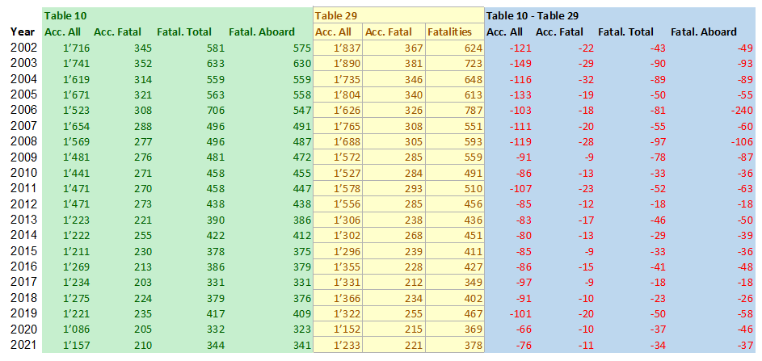

# Data Analysis: DB Table **`io_ntsb_2002_2021`**

**Note**: The `IO-AVSTATS` database used here contains NTSB aircraft accident data as of January 1, 2023.

This report is about comparing the `IO-AVSTATS` database to common public records for aviation accidents.  

In the November 17, 2021, news release [U.S. Civil Aviation Fatalities and Flight Activity Decreased in 2020](https://www.ntsb.gov/news/press-releases/Pages/NR20211117.aspx){:target="_blank"}, the NTSB published, among other things, the [US Civil Aviation Accident Statistics](https://www.ntsb.gov/safety/Pages/research.aspx){:target="_blank"}.
These are available on this website at this [link](https://www.ntsb.gov/safety/data/Documents/AviationAccidentStatistics_2002-2021_20221208.xlsx){:target="_blank"} as a Microsoft Execel file.

## 1.Worksheet no. 29

Worksheet no. 29 obviously contains the detailed events underlying the statistics in the previous worksheets.
Now, in order to make the data in the `IO-AVSTATS` database comparable to this MS Excel file, the data from Worksheet no. 29 was loaded into the `IO-AVSTATS` database as database table **`io_ntsb_2002_2021`**, unchanged.

### Observation 1 - Fatalities

#### Observation: Discrepancy between `Fatal Injuries` and `Highest Injury Level`:

```sql
SELECT ev_year                                                "Year",
       count(*) FILTER (WHERE highest_injury_level = 'Fatal') "Accidents Fatal 1",
       count(*) FILTER (WHERE fatal_injuries > 0)             "Accidents Fatal 2"
FROM io_ntsb_2002_2021
GROUP BY ev_year
HAVING count(*) FILTER (WHERE highest_injury_level = 'Fatal') != count(*) FILTER (WHERE fatal_injuries > 0)
ORDER BY ev_year
```

```
Year|Accidents Fatal 1|Accidents Fatal 2|
----+-----------------+-----------------+
2008|              298|              305|
```

#### Events affected - Table 29:

```sql
SELECT ntsb_number, event_date, fatal_injuries, highest_injury_level
FROM io_ntsb_2002_2021
WHERE fatal_injuries > 0
  AND highest_injury_level != 'Fatal'
```

```
ntsb_number|event_date             |fatal_injuries|highest_injury_level|
-----------+-----------------------+--------------+--------------------+
ANC09FA001 |2008-10-01 00:00:00.000|             2|                    |
DFW08FA237 |2008-09-28 00:00:00.000|             2|                    |
LAX08FA300 |2008-09-28 00:00:00.000|             1|                    |
MIA08MA203 |2008-09-27 00:00:00.000|             4|                    |
NYC08FA319 |2008-09-23 00:00:00.000|             1|                    |
NYC08FA324 |2008-09-26 00:00:00.000|             1|                    |
NYC08LA322 |2008-09-23 00:00:00.000|             1|                    |
```

#### This problem does not occur in the `IO-AVSTATS` database!

```sql
SELECT ntsb_no, ev_year, inj_f_grnd, inj_tot_f, ev_highest_injury
FROM io_app_aaus1982 iaa
WHERE (inj_f_grnd > 0 OR inj_tot_f > 0)
  AND ev_highest_injury != 'FATL'
ORDER BY ntsb_no 
```

```
ntsb_no|ev_year|inj_f_grnd|inj_tot_f|ev_highest_injury|
-------+-------+----------+---------+-----------------+
```

#### The corrupted data in the MS Excel file looks correct in the `IO-AVSTATS` database:

```sql
SELECT ntsb_no, ev_year, inj_f_grnd, inj_tot_f, ev_highest_injury
FROM io_app_aaus1982 iaa
WHERE ntsb_no
          IN ('NYC08FA319',
              'NYC08LA322',
              'NYC08FA324',
              'MIA08MA203',
              'DFW08FA237',
              'LAX08FA300',
              'ANC09FA001')
ORDER BY ntsb_no
```

```
ntsb_no   |ev_year|inj_f_grnd|inj_tot_f|ev_highest_injury|
----------+-------+----------+---------+-----------------+
ANC09FA001|   2008|         0|        2|FATL             |
DFW08FA237|   2008|         0|        2|FATL             |
LAX08FA300|   2008|         0|        1|FATL             |
MIA08MA203|   2008|         0|        4|FATL             |
NYC08FA319|   2008|         0|        1|FATL             |
NYC08FA324|   2008|         0|        1|FATL             |
NYC08LA322|   2008|         0|        1|FATL             |
```

#### Conclusion: The `Highest Injury Level` column in the MS Excel file cannot be used to determine fatalities!

### Observation 2 - Incidents

#### Observation: If the worksheet no. 29+ also contains events of type `INC` (incident):

```sql
SELECT ntsb_number, event_date
FROM io_ntsb_2002_2021
WHERE ntsb_number IN (SELECT ntsb_no FROM io_app_aaus1982 WHERE ev_type = 'INC')
```

```
ntsb_number|event_date|
-----------+----------+
```

#### Conclusion: Worksheet no. 29 does not contain any events of type 'INC'!

## 2.Worksheet no. 10 vs. no. 29

[Worksheet no. 10](./img/AviationAccidentStatistics_2002-2021_20221208.pdf){:target="_blank"}

### Observation 1 - Completeness

#### Observation: Are all events from worksheet 29 included in worksheet 10:

```sql
SELECT ev_year                                    "Year",
       count(*)                                   "Accidents All",
       count(*) FILTER (WHERE fatal_injuries > 0) "Accidents Fatal",
       sum(fatal_injuries)                        "Fatalities"
FROM io_ntsb_2002_2021
GROUP BY ev_year
ORDER BY ev_year
```

```
Year|Accidents All|Accidents Fatal|Fatalities|
----+-------------+---------------+----------+
2002|         1837|            367|       624|
2003|         1890|            381|       723|
2004|         1735|            346|       648|
2005|         1804|            340|       613|
2006|         1626|            326|       787|
2007|         1765|            308|       551|
2008|         1688|            305|       593|
2009|         1572|            285|       559|
2010|         1527|            284|       491|
2011|         1578|            293|       510|
2012|         1556|            285|       456|
2013|         1306|            238|       436|
2014|         1302|            268|       451|
2015|         1296|            239|       411|
2016|         1355|            228|       427|
2017|         1331|            212|       349|
2018|         1366|            234|       402|
2019|         1322|            255|       467|
2020|         1152|            215|       369|
2021|         1233|            221|       378|
```

#### Conclusion: Worksheet no. 29 always contains more events than are included in Worksheet no. 10!

<kbd></kbd>


### Observation 2 - Search discrepancy

#### Observation: Look for reasons for the discrepancies:

**`state_or_region`**:

```sql
SELECT state_or_region                            "State",
       count(*)                                   "Accidents All",
       count(*) FILTER (WHERE fatal_injuries > 0) "Accidents Fatal",
       sum(fatal_injuries)                        "Fatalities"
FROM io_ntsb_2002_2021
WHERE ev_YEAR = 2020
  AND ev_state IS null
GROUP BY state_or_region
ORDER BY 1
```

```
State        |Accidents All|Accidents Fatal|Fatalities|
-------------+-------------+---------------+----------+
             |           16|              6|        11|
Other Foreign|            4|              2|         3|
Puerto Rico  |            4|              1|         2|
```

**`country`**:

```sql
SELECT country                                    "Country",
       count(*)                                   "Accidents All",
       count(*) FILTER (WHERE fatal_injuries > 0) "Accidents Fatal",
       sum(fatal_injuries)                        "Fatalities"
FROM io_ntsb_2002_2021
WHERE ev_YEAR = 2020 AND ev_state IS null
GROUP BY country
ORDER BY 1
```

```
Country      |Accidents All|Accidents Fatal|Fatalities|
-------------+-------------+---------------+----------+
Afghanistan  |            1|              0|          |
Australia    |            1|              1|         3|
Bahamas      |            1|              0|          |
France       |            3|              2|         5|
Germany      |            4|              2|         3|
Guadeloupe   |            1|              0|          |
Guatemala    |            1|              1|         1|
Iraq         |            1|              0|          |
Ireland      |            1|              0|          |
Mexico       |            1|              0|          |
Romania      |            1|              0|          |
Saudi Arabia |            1|              1|         1|
South Africa |            2|              1|         1|
United States|            5|              1|         2|
```

**`aircraft_number`**:

```sql
SELECT aircraft_number                            "Aircraft Number",
       count(*)                                   "Accidents All",
       count(*) FILTER (WHERE fatal_injuries > 0) "Accidents Fatal",
       sum(fatal_injuries)                        "Fatalities"
FROM io_ntsb_2002_2021
WHERE ev_YEAR = 2020
GROUP BY aircraft_number
ORDER BY 1
```

```
Aircraft Number|Accidents All|Accidents Fatal|Fatalities|
---------------+-------------+---------------+----------+
              1|         1138|            210|       349|
              2|           14|              5|        20|
```

**`damage_level`**:

```sql
SELECT damage_level                               "Damage Level",
       count(*)                                   "Accidents All",
       count(*) FILTER (WHERE fatal_injuries > 0) "Accidents Fatal",
       sum(fatal_injuries)                        "Fatalities"
FROM io_ntsb_2002_2021
WHERE ev_YEAR = 2020
GROUP BY damage_level
ORDER BY 1
```

```
Damage Level|Accidents All|Accidents Fatal|Fatalities|
------------+-------------+---------------+----------+
Destroyed   |          154|            120|       216|
Minor       |            4|              0|         0|
None        |           15|              0|         0|
Substantial |          979|             95|       153|
```

**`registration_number`**:

```sql
SELECT registration_number                        "Registration Number",
       count(*)                                   "Accidents All",
       count(*) FILTER (WHERE fatal_injuries > 0) "Accidents Fatal",
       sum(fatal_injuries)                        "Fatalities"
FROM io_ntsb_2002_2021
WHERE ev_YEAR = 2020 AND registration_number NOT LIKE 'N%'
GROUP BY registration_number
ORDER BY 1
```

```
Registration Number|Accidents All|Accidents Fatal|Fatalities|
-------------------+-------------+---------------+----------+
CBP213             |            1|              0|          |
CBP233             |            1|              0|          |
```

**`aircraft_category`**:

```sql
SELECT aircraft_category                          "Aircraft Category",
       count(*)                                   "Accidents All",
       count(*) FILTER (WHERE fatal_injuries > 0) "Accidents Fatal",
       sum(fatal_injuries)                        "Fatalities"
FROM io_ntsb_2002_2021
WHERE ev_YEAR = 2020
GROUP BY aircraft_category
ORDER BY 1
```

```
Aircraft Category|Accidents All|Accidents Fatal|Fatalities|
-----------------+-------------+---------------+----------+
Airplane         |         1008|            183|       321|
Balloon          |            8|              0|          |
Glider           |           19|              5|         5|
Gyroplane        |            9|              4|         5|
Helicopter       |           94|             20|        35|
Powered parachute|            3|              0|          |
Unknown          |            1|              1|         1|
Weight-shift     |           10|              2|         2|
```

**`flight_regulation`**:

```sql
SELECT flight_regulation                          "Flight Regulation",
       count(*)                                   "Accidents All",
       count(*) FILTER (WHERE fatal_injuries > 0) "Accidents Fatal",
       sum(fatal_injuries)                        "Fatalities"
FROM io_ntsb_2002_2021
WHERE ev_YEAR = 2020
GROUP BY flight_regulation
ORDER BY 1
```

```
Flight Regulation             |Accidents All|Accidents Fatal|Fatalities|
------------------------------+-------------+---------------+----------+
Non-U.S., non-commercial      |           11|              6|        10|
Part 121: Air carrier         |           14|              0|         0|
Part 133: Rotorcraft ext. load|           11|              4|         6|
Part 135: Air taxi & commuter |           45|              7|        26|
Part 137: Agricultural        |           50|              9|         9|
Part 91: General aviation     |         1006|            182|       307|
Public aircraft               |           12|              5|         7|
Unknown                       |            3|              2|         4|
```

**`flight_schedule_type`**:

```sql
SELECT flight_schedule_type                       "Flight Schedule Type",
       count(*)                                   "Accidents All",
       count(*) FILTER (WHERE fatal_injuries > 0) "Accidents Fatal",
       sum(fatal_injuries)                        "Fatalities"
FROM io_ntsb_2002_2021
WHERE ev_YEAR = 2020
GROUP BY flight_schedule_type
ORDER BY 1
```

```
Flight Schedule Type|Accidents All|Accidents Fatal|Fatalities|
--------------------+-------------+---------------+----------+
                    |         1043|            194|       326|
Non-scheduled       |           94|             20|        38|
Scheduled           |           15|              1|         5|
```

**`purpose_of_flight`**:

```sql
SELECT purpose_of_flight                          "Purpose of Flight",
       count(*)                                   "Accidents All",
       count(*) FILTER (WHERE fatal_injuries > 0) "Accidents Fatal",
       sum(fatal_injuries)                        "Fatalities"
FROM io_ntsb_2002_2021
WHERE ev_YEAR = 2020
GROUP BY purpose_of_flight
ORDER BY 1
```

```
Purpose of Flight        |Accidents All|Accidents Fatal|Fatalities|
-------------------------+-------------+---------------+----------+
                         |           66|             13|        36|
Aerial application       |           51|             10|        10|
Aerial observation       |           19|              5|        17|
Banner tow               |            4|              0|          |
Business                 |           21|              5|        10|
Executive/Corporate      |            7|              0|         0|
External load            |           11|              4|         6|
Ferry                    |            3|              1|         1|
Firefighting             |            6|              4|         6|
Flight test              |           18|              5|         7|
Glider tow               |            2|              1|         1|
Instructional            |          153|             12|        20|
Other work use           |           11|              1|         1|
Personal                 |          751|            149|       249|
Positioning              |           19|              3|         3|
Public aircraft          |            1|              0|          |
Public aircraft - federal|            2|              0|          |
Public aircraft - local  |            2|              1|         1|
Public aircraft - state  |            1|              0|          |
Skydiving                |            1|              0|          |
Unknown                  |            3|              1|         1|
```

**`intentional_act`**:

```sql
SELECT intentional_act                            "Intentional Act",
       count(*)                                   "Accidents All",
       count(*) FILTER (WHERE fatal_injuries > 0) "Accidents Fatal",
       sum(fatal_injuries)                        "Fatalities"
FROM io_ntsb_2002_2021
WHERE ev_YEAR = 2020
GROUP BY intentional_act
ORDER BY 1
```

```
Intentional Act|Accidents All|Accidents Fatal|Fatalities|
---------------+-------------+---------------+----------+
               |         1152|            215|       369|
```

**`defining_event`**:

```sql
SELECT defining_event                             "Defining Event",
       count(*)                                   "Accidents All",
       count(*) FILTER (WHERE fatal_injuries > 0) "Accidents Fatal",
       sum(fatal_injuries)                        "Fatalities"
FROM io_ntsb_2002_2021
WHERE ev_YEAR = 2020
GROUP BY defining_event
ORDER BY 1
```

```
Defining Event                       |Accidents All|Accidents Fatal|Fatalities|
-------------------------------------+-------------+---------------+----------+
                                     |           19|              3|         3|
Abnormal Runway Contact              |          148|              0|         0|
Abrupt Maneuver                      |            4|              2|         4|
Aerodrome                            |            1|              0|          |
Bird Strike                          |            3|              1|         1|
Cabin Safety Events                  |            1|              0|          |
Collision on Takeoff or Landing      |           47|              4|         6|
Controlled Flight Into Terrain       |           24|             13|        26|
Fire - Non-Impact                    |            5|              1|         2|
Fuel Related                         |          108|             18|        23|
Ground Collision                     |           14|              0|         0|
Ground Handling                      |            4|              0|          |
Loss of Control In-Flight            |          187|             87|       136|
Loss of Control on Ground            |          204|              3|         3|
Loss of Lift                         |            7|              0|          |
Low Altitude Operation               |           26|              3|         3|
Medical Event                        |            4|              3|         3|
Midair                               |           13|              9|        39|
Navigation Error                     |            4|              1|         1|
Other                                |           43|             12|        20|
Runway Excursion                     |           28|              2|         6|
System/Component Failure - Non-power |           46|              7|        11|
System/Component Failure - Powerplant|          145|             18|        29|
Turbulence Encounter                 |            8|              0|         0|
Undershoot/Overshoot                 |           11|              0|         0|
Unintended Flight Into IMC           |           10|              6|        16|
Unknown                              |           32|             21|        35|
Wildlife Encounter                   |            5|              0|         0|
Windshear/Thunderstorm               |            1|              1|         2|
```

**`phase_of_flight`**:

```sql
SELECT phase_of_flight                            "Phase of Flight",
       count(*)                                   "Accidents All",
       count(*) FILTER (WHERE fatal_injuries > 0) "Accidents Fatal",
       sum(fatal_injuries)                        "Fatalities"
FROM io_ntsb_2002_2021
WHERE ev_YEAR = 2020
GROUP BY phase_of_flight
ORDER BY 1
```

```
Phase of Flight  |Accidents All|Accidents Fatal|Fatalities|
-----------------+-------------+---------------+----------+
                 |            5|              1|         1|
Approach         |          139|             39|        61|
Emergency Descent|           10|              2|         6|
Enroute          |          180|             62|       142|
Initial Climb    |           85|             27|        41|
Landing          |          378|              4|         4|
Maneuvering      |          134|             50|        67|
Standing         |           19|              0|         0|
Takeoff          |          162|             18|        27|
Taxi             |           21|              1|         1|
Unknown          |           19|             11|        19|
```

#### Conclusion: TODO!

```sql
SELECT * FROM (
SELECT 'state_or_region'                          "Type", 
       state_or_region                            "State",
       count(*)                                   "Accidents All",
       count(*) FILTER (WHERE fatal_injuries > 0) "Accidents Fatal",
       sum(fatal_injuries)                        "Fatalities"
FROM io_ntsb_2002_2021
WHERE ev_YEAR = 2020
  AND ev_state IS null
GROUP BY state_or_region
UNION 
SELECT 'country'                                  "Type", 
       country                                    "Country",
       count(*)                                   "Accidents All",
       count(*) FILTER (WHERE fatal_injuries > 0) "Accidents Fatal",
       sum(fatal_injuries)                        "Fatalities"
FROM io_ntsb_2002_2021
WHERE ev_YEAR = 2020 AND ev_state IS null
GROUP BY country
UNION 
SELECT 'aircraft_number'                          "Type", 
       aircraft_number::varchar(10)               "Aircraft Number",
       count(*)                                   "Accidents All",
       count(*) FILTER (WHERE fatal_injuries > 0) "Accidents Fatal",
       sum(fatal_injuries)                        "Fatalities"
FROM io_ntsb_2002_2021
WHERE ev_YEAR = 2020
GROUP BY aircraft_number
UNION 
SELECT 'damage_level'                             "Type", 
       damage_level                               "Damage Level",
       count(*)                                   "Accidents All",
       count(*) FILTER (WHERE fatal_injuries > 0) "Accidents Fatal",
       sum(fatal_injuries)                        "Fatalities"
FROM io_ntsb_2002_2021
WHERE ev_YEAR = 2020
GROUP BY damage_level
UNION 
SELECT 'registration_number'                      "Type", 
       registration_number                        "Registration Number",
       count(*)                                   "Accidents All",
       count(*) FILTER (WHERE fatal_injuries > 0) "Accidents Fatal",
       sum(fatal_injuries)                        "Fatalities"
FROM io_ntsb_2002_2021
WHERE ev_YEAR = 2020 AND registration_number NOT LIKE 'N%'
GROUP BY registration_number
UNION 
SELECT 'aircraft_category'                        "Type", 
       aircraft_category                          "Aircraft Category",
       count(*)                                   "Accidents All",
       count(*) FILTER (WHERE fatal_injuries > 0) "Accidents Fatal",
       sum(fatal_injuries)                        "Fatalities"
FROM io_ntsb_2002_2021
WHERE ev_YEAR = 2020
GROUP BY aircraft_category
UNION 
SELECT 'flight_regulation'                        "Type", 
       flight_regulation                          "Flight Regulation",
       count(*)                                   "Accidents All",
       count(*) FILTER (WHERE fatal_injuries > 0) "Accidents Fatal",
       sum(fatal_injuries)                        "Fatalities"
FROM io_ntsb_2002_2021
WHERE ev_YEAR = 2020
GROUP BY flight_regulation
UNION 
SELECT 'flight_schedule_type'                     "Type", 
       flight_schedule_type                       "Flight Schedule Type",
       count(*)                                   "Accidents All",
       count(*) FILTER (WHERE fatal_injuries > 0) "Accidents Fatal",
       sum(fatal_injuries)                        "Fatalities"
FROM io_ntsb_2002_2021
WHERE ev_YEAR = 2020
GROUP BY flight_schedule_type
UNION 
SELECT 'purpose_of_flight'                       "Type", 
       purpose_of_flight                          "Purpose of Flight",
       count(*)                                   "Accidents All",
       count(*) FILTER (WHERE fatal_injuries > 0) "Accidents Fatal",
       sum(fatal_injuries)                        "Fatalities"
FROM io_ntsb_2002_2021
WHERE ev_YEAR = 2020
GROUP BY purpose_of_flight
UNION 
SELECT 'intentional_act'                          "Type", 
       intentional_act::varchar(10)               "Intentional Act",
       count(*)                                   "Accidents All",
       count(*) FILTER (WHERE fatal_injuries > 0) "Accidents Fatal",
       sum(fatal_injuries)                        "Fatalities"
FROM io_ntsb_2002_2021
WHERE ev_YEAR = 2020
GROUP BY intentional_act
UNION 
SELECT 'defining_event'                           "Type", 
       defining_event                             "Defining Event",
       count(*)                                   "Accidents All",
       count(*) FILTER (WHERE fatal_injuries > 0) "Accidents Fatal",
       sum(fatal_injuries)                        "Fatalities"
FROM io_ntsb_2002_2021
WHERE ev_YEAR = 2020
GROUP BY defining_event
UNION 
SELECT 'phase_of_flight'                          "Type", 
       phase_of_flight                            "Phase of Flight",
       count(*)                                   "Accidents All",
       count(*) FILTER (WHERE fatal_injuries > 0) "Accidents Fatal",
       sum(fatal_injuries)                        "Fatalities"
FROM io_ntsb_2002_2021
WHERE ev_YEAR = 2020
GROUP BY phase_of_flight) xx
WHERE "Accidents All" <= 66
  AND "Accidents Fatal" <= 10
ORDER BY 3, 1, 2
```

```
Type                |State                               |Accidents All|Accidents Fatal|Fatalities|
--------------------+------------------------------------+-------------+---------------+----------+
aircraft_category   |Unknown                             |            1|              1|         1|
country             |Afghanistan                         |            1|              0|          |
country             |Australia                           |            1|              1|         3|
country             |Bahamas                             |            1|              0|          |
country             |Guadeloupe                          |            1|              0|          |
country             |Guatemala                           |            1|              1|         1|
country             |Iraq                                |            1|              0|          |
country             |Ireland                             |            1|              0|          |
country             |Mexico                              |            1|              0|          |
country             |Romania                             |            1|              0|          |
country             |Saudi Arabia                        |            1|              1|         1|
defining_event      |Aerodrome                           |            1|              0|          |
defining_event      |Cabin Safety Events                 |            1|              0|          |
defining_event      |Windshear/Thunderstorm              |            1|              1|         2|
purpose_of_flight   |Public aircraft                     |            1|              0|          |
purpose_of_flight   |Public aircraft - state             |            1|              0|          |
purpose_of_flight   |Skydiving                           |            1|              0|          |
registration_number |CBP213                              |            1|              0|          |
registration_number |CBP233                              |            1|              0|          |
country             |South Africa                        |            2|              1|         1|
purpose_of_flight   |Glider tow                          |            2|              1|         1|
purpose_of_flight   |Public aircraft - federal           |            2|              0|          |
purpose_of_flight   |Public aircraft - local             |            2|              1|         1|
aircraft_category   |Powered parachute                   |            3|              0|          |
country             |France                              |            3|              2|         5|
defining_event      |Bird Strike                         |            3|              1|         1|
flight_regulation   |Unknown                             |            3|              2|         4|
purpose_of_flight   |Ferry                               |            3|              1|         1|
purpose_of_flight   |Unknown                             |            3|              1|         1|
country             |Germany                             |            4|              2|         3|
damage_level        |Minor                               |            4|              0|         0|
defining_event      |Abrupt Maneuver                     |            4|              2|         4|
defining_event      |Ground Handling                     |            4|              0|          |
defining_event      |Medical Event                       |            4|              3|         3|
defining_event      |Navigation Error                    |            4|              1|         1|
purpose_of_flight   |Banner tow                          |            4|              0|          |
state_or_region     |Other Foreign                       |            4|              2|         3|
state_or_region     |Puerto Rico                         |            4|              1|         2|
country             |United States                       |            5|              1|         2|
defining_event      |Fire - Non-Impact                   |            5|              1|         2|
defining_event      |Wildlife Encounter                  |            5|              0|         0|
phase_of_flight     |                                    |            5|              1|         1|
purpose_of_flight   |Firefighting                        |            6|              4|         6|
defining_event      |Loss of Lift                        |            7|              0|          |
purpose_of_flight   |Executive/Corporate                 |            7|              0|         0|
aircraft_category   |Balloon                             |            8|              0|          |
defining_event      |Turbulence Encounter                |            8|              0|         0|
aircraft_category   |Gyroplane                           |            9|              4|         5|
aircraft_category   |Weight-shift                        |           10|              2|         2|
defining_event      |Unintended Flight Into IMC          |           10|              6|        16|
phase_of_flight     |Emergency Descent                   |           10|              2|         6|
defining_event      |Undershoot/Overshoot                |           11|              0|         0|
flight_regulation   |Non-U.S., non-commercial            |           11|              6|        10|
flight_regulation   |Part 133: Rotorcraft ext. load      |           11|              4|         6|
purpose_of_flight   |External load                       |           11|              4|         6|
purpose_of_flight   |Other work use                      |           11|              1|         1|
flight_regulation   |Public aircraft                     |           12|              5|         7|
defining_event      |Midair                              |           13|              9|        39|
aircraft_number     |2                                   |           14|              5|        20|
defining_event      |Ground Collision                    |           14|              0|         0|
flight_regulation   |Part 121: Air carrier               |           14|              0|         0|
damage_level        |None                                |           15|              0|         0|
flight_schedule_type|Scheduled                           |           15|              1|         5|
state_or_region     |                                    |           16|              6|        11|
purpose_of_flight   |Flight test                         |           18|              5|         7|
aircraft_category   |Glider                              |           19|              5|         5|
defining_event      |                                    |           19|              3|         3|
phase_of_flight     |Standing                            |           19|              0|         0|
purpose_of_flight   |Aerial observation                  |           19|              5|        17|
purpose_of_flight   |Positioning                         |           19|              3|         3|
phase_of_flight     |Taxi                                |           21|              1|         1|
purpose_of_flight   |Business                            |           21|              5|        10|
defining_event      |Low Altitude Operation              |           26|              3|         3|
defining_event      |Runway Excursion                    |           28|              2|         6|
flight_regulation   |Part 135: Air taxi & commuter       |           45|              7|        26|
defining_event      |System/Component Failure - Non-power|           46|              7|        11|
defining_event      |Collision on Takeoff or Landing     |           47|              4|         6|
flight_regulation   |Part 137: Agricultural              |           50|              9|         9|
purpose_of_flight   |Aerial application                  |           51|             10|        10|
```
