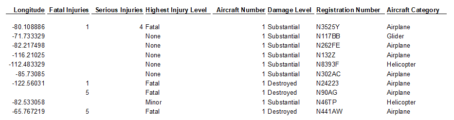
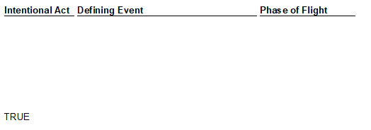
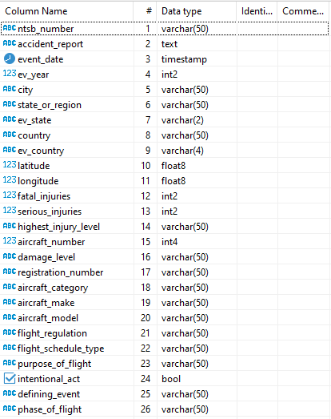
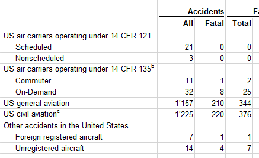
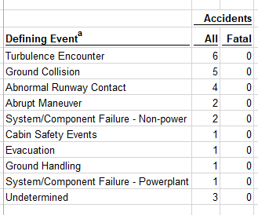

# Data Analysis: DB Table **`io_ntsb_2002_2021`**

**Note**: The **IO-AVSTATS-DB** database used here contains **NTSB** aircraft event data as of January 8, 2023.

## 1. Introduction

The **NTSB** makes available on its website statistical data on flight events since 1982 in the form of MS Access database files.
Events are classified as accidents and incidents according to [§ 830.2 Definitions](https://www.ecfr.gov/current/title-49/section-830.2) in the Code of Federal Regulations.
The following file types can be downloaded from the website ([link](https://data.ntsb.gov/avdata)):

- `Pre2008.zip`: contains data from events that happened before the year 2008.
- `avall.zip`: contains data of events that happened since 2008 until the current beginning of the month.
- `up99MON.zip`: At the 1st, 8th, 15th and 22nd of each month an update file with new or changed events. These updates are available for one year.

**IO-Aero** has loaded the data from the MS Access files `Pre2008` and `avall` once into the PostgreSQL database **IO-AVSTATS-DB** in November 2022 and since then regularly updates the **IO-AVSTATS-DB** with the update files provided by **NTSB**,

In the November 17, 2021, news release [U.S. Civil Aviation Fatalities and Flight Activity Decreased in 2020](https://www.ntsb.gov/news/press-releases/Pages/NR20211117.aspx){:target="_blank"}, the **NTSB** published, among other things, the [US Civil Aviation Accident Statistics](https://www.ntsb.gov/safety/Pages/research.aspx){:target="_blank"} - hereinafter referred to as **20-Year Statistics**.
These are available on this website at this [link](https://www.ntsb.gov/safety/data/Documents/AviationAccidentStatistics_2002-2021_20221208.xlsx){:target="_blank"} as an MS Excel file.
This file contains 28 worksheets (Table 1 through Table 28) of accumulated data, and in Worksheet 29 (Table 29. Accident Aircraft, 2002 through 2021, US Civil Aviation) (most likely) the underlying event and aircraft details. 

#### Beginning of file:

<kbd></kbd>

<kbd></kbd>

<kbd></kbd>

<kbd></kbd>

Unfortunately, **NTSB** does not provide sufficient documentation on the statistical data provided. 
For this reason, a project was started at **IO-Aero** to gain more information about the structure of the statistical data. 
In the first step, the data from worksheet 29 of the MS Excel file were loaded unchanged into a new table of the database **IO-AVSTATS-DB**.
On this basis, the following three questions were now investigated:

1. how are the data in worksheet 29 structured, e.g. with regard to categorization?
2. how can accumulated data, e.g. in worksheet 10, be derived from the data in worksheet 29?
3. how can the data in the MS Excel file be compared with the data in the MS Access files in the period 2002 to 2021?  

## 2. DB Table `io_ntsb_2002_2021`

To store the data from Worksheet 29 of the MS Excel file containing the **20-Year Statistics** in the **IO-AVSTATS-DB** database, the new database table `io_ntsb_2002_2021` was defined as follows:

<kbd></kbd>

The data from the MS Excel file were loaded unchanged into the new database table.
To simplify the use of the database table, only the columns `ev_year`, `ev_state` and `ev_country`, derived from the columns `event_date`, `state_or_region` and `country`, were added.
The header lines and the empty lines for the loading process were ignored but recorded in the log file: 

```
Progress update 2023-01-15 12:46:10.973510 : ===============================================================================.
Progress update 2023-01-15 12:46:10.973510 : INFO.00.004 Start Launcher.
Progress update 2023-01-15 12:46:10.979008 : INFO.00.001 The logger is configured and ready.
Progress update 2023-01-15 12:46:18.297008 : INFO.00.041 Arguments task='l_n_s' {msexecel}='AviationAccidentStatistics_2002-2021_20221208'.
Progress update 2023-01-15 12:46:18.297008 : -------------------------------------------------------------------------------.
Progress update 2023-01-15 12:46:18.297008 : INFO.00.072 Loading NTSB MS Ecel statistic data from file 'AviationAccidentStatistics_2002-2021_20221208'.
Progress update 2023-01-15 12:46:18.297508 : --------------------------------------------------------------------------------
Unprocessed row #     1: Table 29. Accident Aircraft, 2002 through 2021, US Civil Aviation | None | None | ...
Unprocessed row #     2: None | None | None | ...
Unprocessed row #     3: NTSB Number | Accident Report | Event Date | ...
Progress update 2023-01-15 12:48:30.355445 : Number of rows so far read :   5000.
Progress update 2023-01-15 12:50:35.554697 : Number of rows so far read :  10000.
Progress update 2023-01-15 12:52:39.895361 : Number of rows so far read :  15000.
Progress update 2023-01-15 12:54:44.828003 : Number of rows so far read :  20000.
Progress update 2023-01-15 12:56:47.277567 : Number of rows so far read :  25000.
Progress update 2023-01-15 12:58:50.693799 : Number of rows so far read :  30000.
Unprocessed row # 30245: None | None | None | ...
...
Unprocessed row # 30729: None | None | None | ...
Progress update 2023-01-15 12:58:59.416221 : Number rows selected :  30729.
Progress update 2023-01-15 12:58:59.416723 : Number rows inserted :  30241.
Progress update 2023-01-15 12:58:59.416723 : Number rows updated  :  90723.
Progress update 2023-01-15 12:58:59.416723 : -------------------------------------------------------------------------------.
Progress update 2023-01-15 12:58:59.417222 :      768,612,714,000 ns - Total time launcher.
Progress update 2023-01-15 12:58:59.417222 : INFO.00.006 End   Launcher.
Progress update 2023-01-15 12:58:59.417222 : ===============================================================================.
```

### 2.1 Data Migration Verification

According to the log file, 30'241 rows were loaded into the database table which exactly matches the MS Excel file where the data is stored in Excel rows 4 to 30'244.Summing the columns `Fatal Injuries` (I) and `Serious Injuries` (J) gives 10,245 and 5,700 respectively.
These numbers can be confirmed with the following query in the database table `io_ntsb_2002_2021`:

```sql92
    SELECT count(*)              "Accidents All",
           sum(fatal_injuries)   "Fatal Injuries",
           sum(serious_injuries) "Serious Injuries"
    FROM io_ntsb_2002_2021
```
Results:
```
    Accidents All|Fatal Injuries|Serious Injuries|
    -------------+--------------+----------------+
            30241|         10245|            5700|
```

The following database query can be used to verify that the **20-Year Statistics** data is still contained in the current MS Access databases:

```sql92
    SELECT ntsb_number, ev_year
    FROM io_ntsb_2002_2021 in2
    WHERE (ntsb_number, aircraft_number) NOT IN (SELECT e.ntsb_no, a.aircraft_key
                                                   FROM events e INNER JOIN aircraft a 
                                                                 ON e.ev_id = a.ev_id)
```
Results:
```
ntsb_number|ev_year|
-----------+-------+
CEN21LA236 |   2021|
```

This one event is actually missing from the MS Access databases, although the report is still available. 
This one case can certainly be neglected, but it clearly shows that the data on which the **20-Year Statistics** are based could have been changed afterwards.

## 3. Data Characteristic of Worksheet no. 29

An appropriate adaption of the following database query was used to analyze the data categories:

```sql92
    SELECT <category>                                 "<category>",
           count(*)                                   "Accidents All",
           count(*) FILTER (WHERE fatal_injuries > 0) "Accidents Fatal",
           sum(fatal_injuries)                        "Fatalities"
      FROM io_ntsb_2002_2021
     GROUP BY <category>
     ORDER BY 1
```

On the data categorization view, the following picture emerges:

### 3.1 `aircraft_category`

```
aircraft_category|Accidents All|Accidents Fatal|Fatalities|
-----------------+-------------+---------------+----------+
                 |            1|              1|        12|
Airplane         |        25995|           4880|      8956|
Balloon          |          241|             25|        49|
Blimp            |            3|              0|          |
Glider           |          536|            104|       121|
Gyroplane        |          174|             46|        54|
Helicopter       |         3050|            509|       971|
Powered-lift     |            3|              0|          |
Powered parachute|           74|             12|        15|
Ultralight       |           13|              2|         3|
Unknown          |            1|              1|         1|
Weight-shift     |          150|             50|        63|
```

### 3.2 `aircraft_number`

```
aircraft_number|Accidents All|Accidents Fatal|Fatalities|
---------------+-------------+---------------+----------+
              1|        29887|           5530|      9850|
              2|          347|             97|       388|
              3|            6|              2|         6|
              4|            1|              1|         1|
```

#### I. Duplication of events per aircraft involved

- The same event is included in the MS Excel file for each aircraft involved. It must be ensured that these events differ only in the aircraft data:

```sql92
    SELECT ntsb_number, count(*)
      FROM io_ntsb_2002_2021 in2
     WHERE ntsb_number IN (SELECT in3.ntsb_number
                          FROM io_ntsb_2002_2021 in3
                          GROUP BY in3.ntsb_number
                          HAVING count(*) > 1)
     GROUP BY ntsb_number, event_date, city, state_or_region, country,
              latitude, longitude, fatal_injuries, serious_injuries, highest_injury_level
    HAVING count(*) = 1
     ORDER BY ntsb_number
```
Results:
```
    ntsb_number|count|
    -----------+-----+
```

No inconsistencies found.

### 3.3 `country`

(sorted by `Accidents All` descending)

```
country                       |Accidents All|Accidents Fatal|Fatalities|
------------------------------+-------------+---------------+----------+
United States                 |        29697|           5357|      9453|
Bahamas                       |           57|             30|        82|
Mexico                        |           48|             33|        70|
Canada                        |           46|             25|        47|
France                        |           38|             22|        55|
Germany                       |           28|             15|        29|
United Kingdom                |           28|             13|        28|
Dominican Republic            |           17|             12|        25|
Italy                         |           15|              7|         8|
                              |           13|              5|        11|
Guatemala                     |           11|              7|        13|
Japan                         |           11|              2|         4|
Colombia                      |           11|              6|        12|
Brazil                        |            9|              5|       165|
Venezuela                     |            9|              3|         7|
Unknown                       |            9|              3|         5|
Spain                         |            9|              6|        15|
Switzerland                   |            7|              4|         6|
Argentina                     |            7|              2|         6|
China                         |            6|              2|         2|
Austria                       |            6|              4|        10|
Costa Rica                    |            6|              4|        16|
Afghanistan                   |            6|              3|        16|
Guadeloupe                    |            5|              0|          |
Ireland                       |            5|              2|         4|
Netherlands Antilles          |            5|              1|         2|
Panama                        |            5|              2|        13|
Malaysia                      |            5|              2|         4|
Iceland                       |            5|              4|         6|
Poland                        |            4|              2|        12|
South Africa                  |            4|              3|        11|
Belgium                       |            4|              2|         7|
Honduras                      |            4|              3|        12|
British Virgin Islands        |            4|              1|         1|
Philippines                   |            3|              0|         0|
Turks And Caicos Islands      |            3|              2|        16|
American Samoa                |            3|              1|         2|
Romania                       |            3|              1|         1|
Greenland                     |            3|              3|         3|
United Arab Emirates          |            3|              2|         6|
El Salvador                   |            3|              2|         5|
Uruguay                       |            3|              1|         1|
Hungary                       |            3|              0|          |
Australia                     |            3|              1|         3|
Chile                         |            2|              1|         1|
Dominica                      |            2|              1|         2|
Kiribati                      |            2|              1|         1|
Congo                         |            2|              2|         5|
Bermuda                       |            2|              0|          |
Nicaragua                     |            2|              0|          |
Guyana                        |            2|              2|         5|
Sweden                        |            2|              0|          |
Haiti                         |            2|              2|         7|
St Kitts And Nevis            |            2|              0|          |
Cuba                          |            2|              0|          |
Antarctica                    |            2|              0|          |
Peru                          |            2|              1|         2|
Jamaica                       |            2|              1|         3|
Iraq                          |            2|              1|         3|
Nigeria                       |            2|              1|         2|
Northern Mariana Islands      |            2|              0|          |
New Zealand                   |            2|              1|         2|
Russia                        |            2|              0|          |
Indonesia                     |            2|              1|         1|
Netherlands                   |            2|              0|          |
Republic Of Korea             |            1|              0|          |
Czech Republic                |            1|              1|         1|
Jordan                        |            1|              0|          |
Singapore                     |            1|              0|          |
Papua New Guinea              |            1|              1|         1|
Barbados                      |            1|              0|          |
Saudi Arabia                  |            1|              1|         1|
Cayman Islands                |            1|              0|          |
Marshall Islands              |            1|              0|          |
Slovenia                      |            1|              1|         4|
Greece                        |            1|              0|          |
India                         |            1|              0|          |
Israel                        |            1|              0|          |
Suriname                      |            1|              0|          |
Denmark                       |            1|              0|          |
Mozambique                    |            1|              0|          |
Qatar                         |            1|              1|         1|
Paraguay                      |            1|              1|         1|
Federated States Of Micronesia|            1|              0|          |
Martinique                    |            1|              0|          |
Angola                        |            1|              0|          |
Lithuania                     |            1|              1|         1|
Sudan                         |            1|              1|         2|
Morocco                       |            1|              1|         4|
Solomon Islands               |            1|              1|         1|
```

Without duplication of events caused by involved aircraft, i.e. only including events with the value '1' in the column `aircraft_number`:

```
country                       |Accidents All|Accidents Fatal|Fatalities|
------------------------------+-------------+---------------+----------+
United States                 |        29347|           5261|      9217|
Bahamas                       |           57|             30|        82|
Mexico                        |           48|             33|        70|
Canada                        |           44|             23|        43|
France                        |           38|             22|        55|
Germany                       |           28|             15|        29|
United Kingdom                |           28|             13|        28|
Dominican Republic            |           17|             12|        25|
Italy                         |           15|              7|         8|
                              |           13|              5|        11|
Japan                         |           11|              2|         4|
Colombia                      |           11|              6|        12|
Guatemala                     |           11|              7|        13|
Unknown                       |            9|              3|         5|
Venezuela                     |            9|              3|         7|
Spain                         |            9|              6|        15|
Brazil                        |            8|              4|        11|
Argentina                     |            7|              2|         6|
Switzerland                   |            7|              4|         6|
China                         |            6|              2|         2|
Costa Rica                    |            6|              4|        16|
Austria                       |            6|              4|        10|
Afghanistan                   |            6|              3|        16|
Ireland                       |            5|              2|         4|
Malaysia                      |            5|              2|         4|
Iceland                       |            5|              4|         6|
Guadeloupe                    |            5|              0|          |
Netherlands Antilles          |            5|              1|         2|
Panama                        |            5|              2|        13|
Belgium                       |            4|              2|         7|
South Africa                  |            4|              3|        11|
Honduras                      |            4|              3|        12|
Poland                        |            4|              2|        12|
British Virgin Islands        |            4|              1|         1|
Philippines                   |            3|              0|         0|
Turks And Caicos Islands      |            3|              2|        16|
American Samoa                |            3|              1|         2|
Greenland                     |            3|              3|         3|
El Salvador                   |            3|              2|         5|
Australia                     |            3|              1|         3|
Hungary                       |            3|              0|          |
Uruguay                       |            3|              1|         1|
United Arab Emirates          |            3|              2|         6|
Chile                         |            2|              1|         1|
Dominica                      |            2|              1|         2|
Kiribati                      |            2|              1|         1|
Congo                         |            2|              2|         5|
Bermuda                       |            2|              0|          |
Nicaragua                     |            2|              0|          |
Guyana                        |            2|              2|         5|
Sweden                        |            2|              0|          |
Haiti                         |            2|              2|         7|
St Kitts And Nevis            |            2|              0|          |
Cuba                          |            2|              0|          |
Antarctica                    |            2|              0|          |
Peru                          |            2|              1|         2|
Jamaica                       |            2|              1|         3|
Iraq                          |            2|              1|         3|
Nigeria                       |            2|              1|         2|
Northern Mariana Islands      |            2|              0|          |
New Zealand                   |            2|              1|         2|
Russia                        |            2|              0|          |
Indonesia                     |            2|              1|         1|
Netherlands                   |            2|              0|          |
Romania                       |            2|              0|          |
Republic Of Korea             |            1|              0|          |
Czech Republic                |            1|              1|         1|
Jordan                        |            1|              0|          |
Papua New Guinea              |            1|              1|         1|
Singapore                     |            1|              0|          |
Barbados                      |            1|              0|          |
Saudi Arabia                  |            1|              1|         1|
Cayman Islands                |            1|              0|          |
Marshall Islands              |            1|              0|          |
Slovenia                      |            1|              1|         4|
Greece                        |            1|              0|          |
India                         |            1|              0|          |
Israel                        |            1|              0|          |
Suriname                      |            1|              0|          |
Denmark                       |            1|              0|          |
Mozambique                    |            1|              0|          |
Qatar                         |            1|              1|         1|
Paraguay                      |            1|              1|         1|
Federated States Of Micronesia|            1|              0|          |
Martinique                    |            1|              0|          |
Angola                        |            1|              0|          |
Lithuania                     |            1|              1|         1|
Sudan                         |            1|              1|         2|
Morocco                       |            1|              1|         4|
Solomon Islands               |            1|              1|         1|
```

### 3.4 `damage_level`

```
damage_level|Accidents All|Accidents Fatal|Fatalities|
------------+-------------+---------------+----------+
            |            2|              2|         2|
Destroyed   |         3586|           2797|      5674|
Minor       |          256|             35|       195|
None        |          493|             37|        44|
Substantial |        25900|           2759|      4330|
Unknown     |            4|              0|          |
```

### 3.5 `defining_event`

```
defining_event                       |Accidents All|Accidents Fatal|Fatalities|
-------------------------------------+-------------+---------------+----------+
                                     |        10870|           2142|      4097|
Abnormal Runway Contact              |         2522|             34|        43|
Abrupt Maneuver                      |          136|             55|       105|
Aerodrome                            |           21|              1|         1|
Air Traffic Management               |            2|              1|         2|
Bird Strike                          |          128|              9|        28|
Cabin Safety Events                  |           54|              2|         2|
Collision on Takeoff or Landing      |          487|             48|       105|
Controlled Flight Into Terrain       |          527|            294|       588|
Evacuation                           |            2|              0|          |
External Load                        |           22|              7|         8|
Fire - Non-Impact                    |          135|             21|        40|
Fire - Post-Impact                   |            1|              0|          |
Fuel Related                         |         1137|            135|       204|
Glider Towing                        |           15|              3|         5|
Ground Collision                     |          376|              6|        15|
Ground Handling                      |          121|             18|        24|
Icing                                |           24|             10|        15|
Loss of Control In-Flight            |         3403|           1486|      2625|
Loss of Control on Ground            |         2923|             35|        53|
Loss of Lift                         |          137|              9|        19|
Low Altitude Operation               |          341|            116|       166|
Medical Event                        |           14|             11|        12|
Midair                               |          213|            111|       296|
Navigation Error                     |           13|              3|         4|
Other                                |          959|            171|       274|
Runway Excursion                     |          442|             11|        28|
Runway Incursion - Vehicle           |           15|              4|         6|
Security Related                     |           11|              7|         8|
Simulated/training event             |           11|              2|         3|
System/Component Failure - Non-power |          886|            139|       247|
System/Component Failure - Powerplant|         3169|            335|       504|
Turbulence Encounter                 |          205|             16|        22|
Undershoot/Overshoot                 |          252|              3|         9|
Unintended Flight Into IMC           |          249|            173|       317|
Unknown                              |          284|            189|       323|
Wildlife Encounter                   |           58|              0|         0|
Windshear/Thunderstorm               |           76|             23|        47|
```

### 3.6 `ev_year` via `event_date`

```
ev_year|Accidents All|Accidents Fatal|Fatalities|
-------+-------------+---------------+----------+
   2002|         1837|            367|       624|
   2003|         1890|            381|       723|
   2004|         1735|            346|       648|
   2005|         1804|            340|       613|
   2006|         1626|            326|       787|
   2007|         1765|            308|       551|
   2008|         1688|            305|       593|
   2009|         1572|            285|       559|
   2010|         1527|            284|       491|
   2011|         1578|            293|       510|
   2012|         1556|            285|       456|
   2013|         1306|            238|       436|
   2014|         1302|            268|       451|
   2015|         1296|            239|       411|
   2016|         1355|            228|       427|
   2017|         1331|            212|       349|
   2018|         1366|            234|       402|
   2019|         1322|            255|       467|
   2020|         1152|            215|       369|
   2021|         1233|            221|       378|
```

Without duplication of events caused by involved aircraft, i.e. only including events with the value '1' in the column `aircraft_number`:

```
ev_year|Accidents All|Accidents Fatal|Fatalities|
-------+-------------+---------------+----------+
   2002|         1821|            362|       615|
   2003|         1869|            373|       699|
   2004|         1719|            339|       637|
   2005|         1779|            332|       598|
   2006|         1609|            320|       620|
   2007|         1745|            303|       540|
   2008|         1660|            299|       568|
   2009|         1558|            279|       541|
   2010|         1507|            278|       477|
   2011|         1556|            286|       499|
   2012|         1538|            281|       450|
   2013|         1296|            235|       429|
   2014|         1290|            263|       442|
   2015|         1281|            238|       406|
   2016|         1336|            221|       408|
   2017|         1316|            211|       347|
   2018|         1346|            230|       394|
   2019|         1302|            250|       455|
   2020|         1138|            210|       349|
   2021|         1221|            220|       376|
```

### 3.7 `fatal_injuries`

```
fatal_injuries|Accidents All|Accidents Fatal|Fatalities|
--------------+-------------+---------------+----------+
             0|          715|              0|         0|
             1|         3072|           3072|      3072|
             2|         1622|           1622|      3244|
             3|          481|            481|      1443|
             4|          266|            266|      1064|
             5|          101|            101|       505|
             6|           37|             37|       222|
             7|           19|             19|       133|
             8|            6|              6|        48|
             9|            8|              8|        72|
            10|            6|              6|        60|
            11|            3|              3|        33|
            12|            1|              1|        12|
            13|            1|              1|        13|
            14|            1|              1|        14|
            16|            1|              1|        16|
            20|            1|              1|        20|
            21|            1|              1|        21|
            49|            1|              1|        49|
            50|            1|              1|        50|
           154|            1|              1|       154|
              |        23896|              0|          |
```

Without duplication of events caused by involved aircraft, i.e. only including events with the value '1' in the column `aircraft_number`:

```
fatal_injuries|Accidents All|Accidents Fatal|Fatalities|
--------------+-------------+---------------+----------+
             0|          708|              0|         0|
             1|         3038|           3038|      3038|
             2|         1593|           1593|      3186|
             3|          463|            463|      1389|
             4|          259|            259|      1036|
             5|           95|             95|       475|
             6|           36|             36|       216|
             7|           17|             17|       119|
             8|            5|              5|        40|
             9|            7|              7|        63|
            10|            6|              6|        60|
            11|            3|              3|        33|
            12|            1|              1|        12|
            13|            1|              1|        13|
            14|            1|              1|        14|
            16|            1|              1|        16|
            20|            1|              1|        20|
            21|            1|              1|        21|
            49|            1|              1|        49|
            50|            1|              1|        50|
              |        23649|              0|          |
```

### 3.8 `flight_regulation`

```
flight_regulation             |Accidents All|Accidents Fatal|Fatalities|
------------------------------+-------------+---------------+----------+
Armed Forces                  |            1|              0|          |
Non-U.S., non-commercial      |          288|            171|       394|
Part 121: Air carrier         |          657|             20|       180|
Part 125: 20+ pax,6000+ lbs   |            9|              3|         5|
Part 133: Rotorcraft ext. load|          151|             36|        42|
Part 135: Air taxi & commuter |         1054|            233|       621|
Part 137: Agricultural        |         1442|            157|       164|
Part 91: General aviation     |        26256|           4925|      8665|
Part 91 subpart k: Fractional |            8|              0|         0|
Public aircraft               |          349|             70|       125|
Unknown                       |           26|             15|        49|
```

### 3.9 `flight_schedule_type`

```
flight_schedule_type|Accidents All|Accidents Fatal|Fatalities|
--------------------+-------------+---------------+----------+
                    |        28266|           5319|      9349|
Non-scheduled       |         1292|            290|       710|
Scheduled           |          683|             21|       186|
```

### 3.10 `highest_injury_level`

```
highest_injury_level|Accidents All|Accidents Fatal|Fatalities|
--------------------+-------------+---------------+----------+
                    |           96|              7|        12|
Fatal               |         5623|           5623|     10233|
Minor               |         4577|              0|         0|
None                |        16426|              0|         0|
Serious             |         3519|              0|         0|
```

Without duplication of events caused by involved aircraft, i.e. only including events with the value '1' in the column `aircraft_number`:

```
highest_injury_level|Accidents All|Accidents Fatal|Fatalities|
--------------------+-------------+---------------+----------+
                    |           94|              7|        12|
Fatal               |         5523|           5523|      9838|
Minor               |         4548|              0|         0|
None                |        16221|              0|         0|
Serious             |         3501|              0|         0|
```

The question here is whether the values in the three columns `highest_injury_level`, `fatal_injuries` and `serious_injuries` are consistent: 

#### I. `highest_injury_level` and `fatal_injuries`

- For each column where `highest_injury_level` equals `Fatal` the value of the column `fatal_injuries` must be greater than zero:

```sql92
    SELECT ntsb_number, highest_injury_level, fatal_injuries
      FROM io_ntsb_2002_2021 in2
     WHERE highest_injury_level = 'Fatal'
       AND fatal_injuries = 0
     ORDER BY 1
```
Results:
```
    ntsb_number|highest_injury_level|fatal_injuries|
    -----------+--------------------+--------------+
```

No inconsistencies found.

- For each column where `fatal_injuries` greater than zero the value of the column `highest_injury_level` must be `Fatal`:

```sql92
    SELECT ntsb_number, highest_injury_level, fatal_injuries
      FROM io_ntsb_2002_2021 in2
     WHERE fatal_injuries > 0
       AND highest_injury_level != 'Fatal'
     ORDER BY 1
```
Results:
```
    ntsb_number|highest_injury_level|fatal_injuries|
    -----------+--------------------+--------------+
    ANC09FA001 |                    |             2|
    DFW08FA237 |                    |             2|
    LAX08FA300 |                    |             1|
    MIA08MA203 |                    |             4|
    NYC08FA319 |                    |             1|
    NYC08FA324 |                    |             1|
    NYC08LA322 |                    |             1|
```

Found 7 rows with inconsistent data.

#### II. `highest_injury_level` and `serious_injuries`

- For each column where `highest_injury_level` equals `Serious` the value of the column `serious_injuries` must be greater than zero:

```sql92
    SELECT ntsb_number, highest_injury_level, serious_injuries
      FROM io_ntsb_2002_2021 in2
     WHERE highest_injury_level = 'Serious'
       AND fatal_injuries = 0
       AND serious_injuries = 0
     ORDER BY 1
```
Results:
```
    ntsb_number|highest_injury_level|serious_injuries|
    -----------+--------------------+----------------+
```

No inconsistencies found.

- For each column where `serious_injuries` greater than zero the value of the column `highest_injury_level` must be `Serious`:

```sql92
    SELECT ntsb_number, highest_injury_level, serious_injuries
      FROM io_ntsb_2002_2021 in2
     WHERE fatal_injuries = 0
       AND serious_injuries > 0 
       AND highest_injury_level != 'Serious'
     ORDER BY 1
```
Results:
```
    ntsb_number|highest_injury_level|serious_injuries|
    -----------+--------------------+----------------+
```

No inconsistencies found.

### 3.11 `intentional_act`

```
intentional_act|Accidents All|Accidents Fatal|Fatalities|
---------------+-------------+---------------+----------+
true           |           55|             32|        39|
               |        30186|           5598|     10206|
```

### 3.12 `phase_of_flight`

```
phase_of_flight     |Accidents All|Accidents Fatal|Fatalities|
--------------------+-------------+---------------+----------+
                    |        10822|           2135|      4086|
Approach            |         2147|            569|      1089|
Emergency Descent   |          200|             36|        58|
Enroute             |         3150|            906|      1728|
Initial Climb       |         1870|            529|       938|
Landing             |         6112|            101|       141|
Maneuvering         |         2536|            985|      1562|
Post-Impact         |            6|              0|          |
Pushback/Tow        |           24|              0|          |
Standing            |          392|             35|        47|
Takeoff             |         2205|            205|       368|
Taxi                |          569|              6|        10|
Uncontrolled Descent|           42|             24|        44|
Unknown             |          166|             99|       174|
```

### 3.13 `purpose_of_flight`

```
purpose_of_flight        |Accidents All|Accidents Fatal|Fatalities|
-------------------------+-------------+---------------+----------+
                         |         1808|            318|       969|
Aerial application       |         1442|            167|       177|
Aerial observation       |          342|             90|       168|
Air drop                 |            8|              2|         3|
Air race/show            |          147|             63|        81|
Banner tow               |           98|             15|        18|
Business                 |          778|            194|       403|
Executive/Corporate      |          139|             35|       126|
External load            |          109|             25|        30|
Ferry                    |          160|             42|       211|
Firefighting             |           28|              9|        14|
Flight test              |          338|             69|        99|
Glider tow               |           53|             15|        20|
Instructional            |         4030|            374|       675|
Other work use           |          502|             92|       180|
Personal                 |        18909|           3826|      6538|
Positioning              |          688|            156|       262|
Public aircraft          |          152|             28|        43|
Public aircraft - federal|           94|             18|        33|
Public aircraft - local  |           74|              9|        13|
Public aircraft - state  |           61|             12|        23|
Skydiving                |          128|             19|        52|
Unknown                  |          153|             52|       107|
```

### 3.14 `registration_number`

```
SELECT registration_number                        "registration_number",
       count(*)                                   "Accidents All",
       count(*) FILTER (WHERE fatal_injuries > 0) "Accidents Fatal",
       sum(fatal_injuries)                        "Fatalities"
FROM (SELECT CASE
                 WHEN i.registration_number = 'UNREG' THEN i.registration_number
                 WHEN upper(i.registration_number) ~ '^N[1-9][0-9][0-9][0-9][0-9]$' THEN 'USA'
                 WHEN upper(i.registration_number) ~ '^N[1-9][0-9][0-9][0-9][A-Z]$' THEN 'USA'
                 WHEN upper(i.registration_number) ~ '^N[1-9][0-9][0-9][A-Z][A-Z]$' THEN 'USA'
                 ELSE 'NON-US'
                 END registration_number,
             i.fatal_injuries
        FROM io_ntsb_2002_2021 i) j
GROUP BY registration_number
ORDER BY 1 
```
Result:
```
registration_number|Accidents All|Accidents Fatal|Fatalities|
-------------------+-------------+---------------+----------+
NON-US             |         4585|           1050|      1848|
UNREG              |            3|              0|          |
USA                |        25653|           4580|      8397|
```

### 3.15 `serious_injuries`

```
serious_injuries|Accidents All|Accidents Fatal|Fatalities|
----------------+-------------+---------------+----------+
               0|          736|            169|       288|
               1|         3288|            553|       866|
               2|          758|            112|       210|
               3|          149|             50|        88|
               4|           53|             17|        44|
               5|           13|              6|        14|
               6|            6|              2|         6|
               7|            5|              1|         5|
               8|            1|              1|         1|
               9|            3|              3|        16|
              66|            1|              1|        11|
                |        25228|           4715|      8696|
```

Without duplication of events caused by involved aircraft, i.e. only including events with the value '1' in the column `aircraft_number`:

```
serious_injuries|Accidents All|Accidents Fatal|Fatalities|
----------------+-------------+---------------+----------+
               0|          729|            169|       288|
               1|         3258|            536|       838|
               2|          753|            111|       208|
               3|          147|             49|        87|
               4|           53|             17|        44|
               5|           13|              6|        14|
               6|            6|              2|         6|
               7|            5|              1|         5|
               8|            1|              1|         1|
               9|            2|              2|        10|
              66|            1|              1|        11|
                |        24919|           4635|      8338|
```

## 4. Derivation Rules for the Aggregated Worksheets

### 4.1 Table 1

**Accidents, Fatalities, and Rates, 2021 Statistics, 
US Aviation**

#### I. `flight_regulation`

```sql92
SELECT flight_regulation                          "flight_regulation",
       count(*)                                   "Accidents All",
       count(*) FILTER (WHERE fatal_injuries > 0) "Accidents Fatal",
       sum(fatal_injuries)                        "Fatalities"
  FROM io_ntsb_2002_2021
 WHERE ev_year = 2021
 GROUP BY flight_regulation
 ORDER BY 1
```
Results:
```
flight_regulation             |Accidents All|Accidents Fatal|Fatalities|
------------------------------+-------------+---------------+----------+
Armed Forces                  |            1|              0|          |
Non-U.S., non-commercial      |           23|              7|        19|
Part 121: Air carrier         |           26|              0|         0|
Part 133: Rotorcraft ext. load|            7|              0|         0|
Part 135: Air taxi & commuter |           44|             10|        32|
Part 137: Agricultural        |           56|             12|        12|
Part 91: General aviation     |         1056|            189|       310|
Part 91 subpart k: Fractional |            1|              0|         0|
Public aircraft               |           13|              2|         3|
Unknown                       |            6|              1|         2|
```

#### II. `flight_schedule_type`

```sql92
SELECT flight_schedule_type                       "flight_schedule_type",
       count(*)                                   "Accidents All",
       count(*) FILTER (WHERE fatal_injuries > 0) "Accidents Fatal",
       sum(fatal_injuries)                        "Fatalities"
  FROM io_ntsb_2002_2021
 WHERE ev_year = 2021
 GROUP BY flight_schedule_type
 ORDER BY 1
```
Results:
```
flight_schedule_type|Accidents All|Accidents Fatal|Fatalities|
--------------------+-------------+---------------+----------+
                    |         1050|            190|       324|
Non-scheduled       |          147|             30|        52|
Scheduled           |           36|              1|         2|
```

#### III. `flight_regulation` & `flight_schedule_type`

```sql92
SELECT flight_regulation                          "flight_regulation",
       flight_schedule_type                       "flight_schedule_type",
       count(*)                                   "Accidents All",
       count(*) FILTER (WHERE fatal_injuries > 0) "Accidents Fatal",
       sum(fatal_injuries)                        "Fatalities"
  FROM io_ntsb_2002_2021
 WHERE ev_year = 2021
 GROUP BY flight_regulation, flight_schedule_type
 ORDER BY 1, 2
```
Results:
```
flight_regulation             |flight_schedule_type|Accidents All|Accidents Fatal|Fatalities|
------------------------------+--------------------+-------------+---------------+----------+
Armed Forces                  |                    |            1|              0|          |
Non-U.S., non-commercial      |                    |           23|              7|        19|
Part 121: Air carrier         |Non-scheduled       |            3|              0|          | ok
Part 121: Air carrier         |Scheduled           |           23|              0|         0|
Part 133: Rotorcraft ext. load|                    |            4|              0|          |
Part 133: Rotorcraft ext. load|Non-scheduled       |            2|              0|         0|
Part 133: Rotorcraft ext. load|Scheduled           |            1|              0|          |
Part 135: Air taxi & commuter |                    |            1|              1|         5|
Part 135: Air taxi & commuter |Non-scheduled       |           32|              8|        25| ok
Part 135: Air taxi & commuter |Scheduled           |           11|              1|         2| ok
Part 137: Agricultural        |                    |           45|              9|         9|
Part 137: Agricultural        |Non-scheduled       |           11|              3|         3|
Part 91: General aviation     |                    |          958|            170|       286|
Part 91: General aviation     |Non-scheduled       |           97|             19|        24|
Part 91: General aviation     |Scheduled           |            1|              0|          |
Part 91 subpart k: Fractional |Non-scheduled       |            1|              0|         0|
Public aircraft               |                    |           12|              2|         3|
Public aircraft               |Non-scheduled       |            1|              0|          |
Unknown                       |                    |            6|              1|         2|
```
Table 1:

<kbd></kbd>

### 4.2 Table 9

**Accidents, Fatalities, and Rates, 2002 through 2021, 
for US Air Carriers Operating Under 14 CFR 135, 
On-Demand Operationsa**

#### I.  `flight_regulation` & `flight_schedule_type`

```sql92
SELECT ev_year                                    "year",  
       count(*)                                   "Accidents All",
       count(*) FILTER (WHERE fatal_injuries > 0) "Accidents Fatal",
       sum(fatal_injuries)                        "Fatalities"
  FROM io_ntsb_2002_2021
 WHERE flight_regulation = 'Part 135: Air taxi & commuter'
   AND flight_schedule_type = 'Non-scheduled'
 GROUP BY ev_year
 ORDER BY 1
```
Results:
```
year|Accidents All|Accidents Fatal|Fatalities|
----+-------------+---------------+----------+
2002|           64|             18|        35|
2003|           74|             18|        42|
2004|           66|             23|        64|
2005|           65|             11|        18|
2006|           52|             10|        16|
2007|           63|             14|        43|
2008|           59|             21|        76|
2009|           47|              2|        17|
2010|           31|              6|        17|
2011|           51|             17|        42|
2012|           39|              8|        12|
2013|           45|             10|        25|
2014|           36|              8|        20|
2015|           39|              7|        27|
2016|           29|              7|        19|
2017|           44|              8|        16|
2018|           40|              7|        16|
2019|           34|             13|        38|
2020|           39|              6|        21|
2021|           32|              8|        25|
```
Table 9:

<kbd></kbd>

### 4.3 Table 10

**Accidents, Fatalities, and Rates, 2002 through 2021, 
US General Aviation**

#### I.  `flight_regulation` & `flight_schedule_type`

```sql92
SELECT ev_year                                    "year",  
       count(*)                                   "Accidents All",
       count(*) FILTER (WHERE fatal_injuries > 0) "Accidents Fatal",
       sum(fatal_injuries)                        "Fatalities"
  FROM io_ntsb_2002_2021
 WHERE flight_regulation in ('Part 91: General aviation', 
                             'Part 135: Air taxi & commuter', 
                             'Part 137: Agricultural', 
                             'Part 91 subpart k: Fractional')
 GROUP BY ev_year
 ORDER BY 1
```
Results:
```
year|Accidents All|Accidents Fatal|Fatalities|
----+-------------+---------------+----------+
2002|         1751|            351|       590|
2003|         1790|            366|       682|
2004|         1661|            327|       610|
2005|         1726|            321|       551|
2006|         1545|            312|       715|
2007|         1702|            296|       533|
2008|         1622|            288|       541|
2009|         1505|            268|       481|
2010|         1447|            266|       453|
2011|         1505|            279|       486|
2012|         1475|            269|       411|
2013|         1240|            213|       379|
2014|         1216|            251|       401|
2015|         1234|            228|       394|
2016|         1279|            210|       390|
2017|         1260|            203|       334|
2018|         1295|            218|       368|
2019|         1249|            240|       435|
2020|         1101|            198|       342|
2021|         1157|            211|       354|
```
Table 10:

<kbd></kbd>

**2 aircraft involved:**

```sql92
SELECT ev_year                                    "year",
       count(*)                                   "Accidents All",
       count(*) FILTER (WHERE fatal_injuries > 0) "Accidents Fatal",
       sum(fatal_injuries)                        "Fatalities"
  FROM io_ntsb_2002_2021
 WHERE flight_regulation in ('Part 91: General aviation',
                            'Part 135: Air taxi & commuter',
                            'Part 137: Agricultural',
                            'Part 91 subpart k: Fractional')
   AND ntsb_number IN (SELECT ntsb_number
                      FROM io_ntsb_2002_2021 in2
                      GROUP BY ntsb_number
                      HAVING count(*) = 3)
 GROUP BY ev_year
 ORDER BY 1
```
Results:
```
year|Accidents All|Accidents Fatal|Fatalities|
----+-------------+---------------+----------+
year|Accidents All|Accidents Fatal|Fatalities|
----+-------------+---------------+----------+
2002|           29|              8|        16|
2003|           41|             16|        48|
2004|           32|             14|        22|
2005|           35|             10|        20|
2006|           24|             10|        26|
2007|           36|             10|        22|
2008|           48|             12|        50|
2009|           27|             12|        36|
2010|           30|              8|        16|
2011|           36|             14|        22|
2012|           30|              8|        12|
2013|           20|              6|        14|
2014|           21|             10|        18|
2015|           29|              2|        10|
2016|           36|             14|        38|
2017|           20|              2|         4|
2018|           36|              6|        14|
2019|           32|             10|        24|
2020|           22|              8|        36|
2021|           12|              2|         4|
```

**3 aircraft involved:**

```sql92
SELECT ev_year                                    "year",
       count(*)                                   "Accidents All",
       count(*) FILTER (WHERE fatal_injuries > 0) "Accidents Fatal",
       sum(fatal_injuries)                        "Fatalities"
  FROM io_ntsb_2002_2021
 WHERE flight_regulation in ('Part 91: General aviation',
                            'Part 135: Air taxi & commuter',
                            'Part 137: Agricultural',
                            'Part 91 subpart k: Fractional')
   AND ntsb_number IN (SELECT ntsb_number
                      FROM io_ntsb_2002_2021 in2
                      GROUP BY ntsb_number
                      HAVING count(*) = 3)
 GROUP BY ev_year
 ORDER BY 1
```
Results:
```
year|Accidents All|Accidents Fatal|Fatalities|
----+-------------+---------------+----------+
2010|            3|              3|         9|
```


### 4.3 Table 13

**Defining Event for Accidents in 2021,  
for US Air Carriers Operating Under 14 CFR 121**

#### I.  `flight_regulation` & `flight_schedule_type`

```sql92
SELECT defining_event                             "defining_event",
       count(*)                                   "Accidents All",
       count(*) FILTER (WHERE fatal_injuries > 0) "Accidents Fatal"
  FROM io_ntsb_2002_2021
 WHERE ev_year = 2021
   AND flight_regulation = 'Part 121: Air carrier'     
 GROUP BY defining_event
```
Results:
```
defining_event                       |Accidents All|Accidents Fatal|
-------------------------------------+-------------+---------------+
Turbulence Encounter                 |            6|              0| ok
Ground Collision                     |            5|              0| ok
Abnormal Runway Contact              |            4|              0| ok
Abrupt Maneuver                      |            2|              0| ok
System/Component Failure - Non-power |            2|              0| ok
Cabin Safety Events                  |            1|              0| ok
Evacuation                           |            1|              0| ok
Ground Handling                      |            1|              0| ok
System/Component Failure - Powerplant|            1|              0| ok
                                     |            3|              0| ok
```
Table 13:

<kbd></kbd>


## 5. Legacy stuff


Worksheet no. 29 obviously contains the detailed events underlying the statistics in the previous worksheets.
Now, in order to make the data in the **IO-AVSTATS-DB** database comparable to this MS Excel file, the data from Worksheet no. 29 was loaded into the **IO-AVSTATS-DB** database as database table **`io_ntsb_2002_2021`**, unchanged.

### Totals

#### From Table 10

```
accidents_all|accidents_fatal|fatalities_total|fatalities_aboard|
-------------+---------------+----------------+-----------------+
        28255|           5291|            9248|             8991|
```

#### Total

```sql
SELECT count(*)                                   accidents_all,
       count(*) FILTER (WHERE fatal_injuries > 0) accidents_fatal,
       sum(fatal_injuries)                        fatalities_total
 FROM io_ntsb_2002_2021 in2 
```

```
accidents_all|accidents_fatal|fatalities_total|
-------------+---------------+----------------+
        30241|           5630|           10245|
```

```sql
SELECT count(*)                                   accidents_all,
       count(*) FILTER (WHERE fatal_injuries > 0) accidents_fatal,
       sum(fatal_injuries)                        fatalities_total
 FROM io_ntsb_2002_2021 in2 
WHERE aircraft_number = 1
```

```
accidents_all|accidents_fatal|fatalities_total|
-------------+---------------+----------------+
        29887|           5530|            9850|
```

```sql
SELECT count(*)                                   accidents_all,
       count(*) FILTER (WHERE fatal_injuries > 0) accidents_fatal,
       sum(fatal_injuries)                        fatalities_total
 FROM io_ntsb_2002_2021 in2 
WHERE country = 'United States'
```

```
accidents_all|accidents_fatal|fatalities_total|
-------------+---------------+----------------+
        29697|           5357|            9453|
```

```sql
SELECT count(*)                                   accidents_all,
       count(*) FILTER (WHERE fatal_injuries > 0) accidents_fatal,
       sum(fatal_injuries)                        fatalities_total
 FROM io_ntsb_2002_2021 in2 
WHERE aircraft_number = 1
  AND country IN ('Bahamas', 'United States')
```

```
accidents_all|accidents_fatal|fatalities_total|
-------------+---------------+----------------+
        29347|           5261|            9217|
```

```sql
SELECT country,
       count(*)                                   accidents_all,
       count(*) FILTER (WHERE fatal_injuries > 0) accidents_fatal,
       sum(fatal_injuries)                        fatalities_total
 FROM io_ntsb_2002_2021 in2
WHERE aircraft_number = 1
GROUP BY country  
ORDER BY 3 DESC
```


```sql
SELECT aircraft_number,
       count(*)                                   accidents_all,
       count(*) FILTER (WHERE fatal_injuries > 0) accidents_fatal,
       sum(fatal_injuries)                        fatalities_total
 FROM io_ntsb_2002_2021 in2
GROUP BY aircraft_number  
ORDER BY 1```

```
aircraft_number|accidents_all|accidents_fatal_hil|accidents_fatal_fi|fatalities_total|
---------------+-------------+-------------------+------------------+----------------+
              1|        29887|               5523|              5530|            9850|
              2|          347|                 97|                97|             388|
              3|            6|                  2|                 2|               6|
              4|            1|                  1|                 1|               1|
```

```sql
SELECT country,
       count(*)                                   accidents_all,
       count(*) FILTER (WHERE fatal_injuries > 0) accidents_fatal,
       sum(fatal_injuries)                        fatalities_total
 FROM io_ntsb_2002_2021 in2
WHERE aircraft_number = 1
  AND country = 'United States'
GROUP BY country  
ORDER BY 1
```

```
country      |accidents_all|accidents_fatal_hil|accidents_fatal_fi|fatalities_total|
-------------+-------------+-------------------+------------------+----------------+
United States|        29347|               5254|              5261|            9217|
```


#### Total by Country

```sql
SELECT country,
       count(*)                                   accidents_all,
       count(*) FILTER (WHERE fatal_injuries > 0) accidents_fatal,
       sum(fatal_injuries)                        fatalities_total
 FROM io_ntsb_2002_2021 in2
WHERE aircraft_number = 1
GROUP BY country  
ORDER BY 3 DESC
```

```
country                       |accidents_all|accidents_fatal|fatalities_total|
------------------------------+-------------+---------------+----------------+
United States                 |        29347|           5261|            9217|
Mexico                        |           48|             33|              70|
Bahamas                       |           57|             30|              82|
Canada                        |           44|             23|              43|
France                        |           38|             22|              55|
Germany                       |           28|             15|              29|
United Kingdom                |           28|             13|              28|
Dominican Republic            |           17|             12|              25|
Guatemala                     |           11|              7|              13|
Italy                         |           15|              7|               8|
Spain                         |            9|              6|              15|
Colombia                      |           11|              6|              12|
                              |           13|              5|              11|
Costa Rica                    |            6|              4|              16|
Iceland                       |            5|              4|               6|
Switzerland                   |            7|              4|               6|
Austria                       |            6|              4|              10|
Brazil                        |            8|              4|              11|
Honduras                      |            4|              3|              12|
Venezuela                     |            9|              3|               7|
...
```


#### Total by Flight Regulation

```sql
SELECT flight_regulation ,
       count(*)                                   accidents_all,
       count(*) FILTER (WHERE fatal_injuries > 0) accidents_fatal,
       sum(fatal_injuries)                        fatalities_total
 FROM io_ntsb_2002_2021 in2
WHERE aircraft_number = 1
GROUP BY flight_regulation  
ORDER BY 3 DESC
```

```
flight_regulation             |accidents_all|accidents_fatal|fatalities_total|
------------------------------+-------------+---------------+----------------+
Part 91: General aviation     |        25981|           4840|            8309|
Part 135: Air taxi & commuter |         1033|            227|             595|
Non-U.S., non-commercial      |          286|            169|             390|
Part 137: Agricultural        |         1427|            152|             158|
Public aircraft               |          345|             68|             122|
Part 133: Rotorcraft ext. load|          151|             36|              42|
Part 121: Air carrier         |          620|             20|             180|
Unknown                       |           26|             15|              49|
Part 125: 20+ pax,6000+ lbs   |            9|              3|               5|
Part 91 subpart k: Fractional |            8|              0|               0|
Armed Forces                  |            1|              0|                |
```

```sql
SELECT flight_regulation ,
       count(*)                                   accidents_all,
       count(*) FILTER (WHERE fatal_injuries > 0) accidents_fatal,
       sum(fatal_injuries)                        fatalities_total
 FROM io_ntsb_2002_2021 in2
GROUP BY flight_regulation  
ORDER BY 3 DESC
```

```
flight_regulation             |accidents_all|accidents_fatal|fatalities_total|
------------------------------+-------------+---------------+----------------+
Part 91: General aviation     |        26256|           4925|            8665|
Part 135: Air taxi & commuter |         1054|            233|             621|
Non-U.S., non-commercial      |          288|            171|             394|
Part 137: Agricultural        |         1442|            157|             164|
Public aircraft               |          349|             70|             125|
Part 133: Rotorcraft ext. load|          151|             36|              42|
Part 121: Air carrier         |          657|             20|             180|
Unknown                       |           26|             15|              49|
Part 125: 20+ pax,6000+ lbs   |            9|              3|               5|
Part 91 subpart k: Fractional |            8|              0|               0|
Armed Forces                  |            1|              0|                |
```

#### Total by Flight Schedule Type

```sql
SELECT flight_schedule_type  ,
       count(*)                                   accidents_all,
       count(*) FILTER (WHERE fatal_injuries > 0) accidents_fatal,
       sum(fatal_injuries)                        fatalities_total
 FROM io_ntsb_2002_2021 in2
WHERE aircraft_number = 1
GROUP BY flight_schedule_type  
ORDER BY 3 DESC
```

```
flight_schedule_type|accidents_all|accidents_fatal|fatalities_total|
--------------------+-------------+---------------+----------------+
                    |        27976|           5226|            8981|
Non-scheduled       |         1269|            283|             683|
Scheduled           |          642|             21|             186|
```


#### Total by Purpose of Flight

```sql
SELECT purpose_of_flight  ,
       count(*)                                   accidents_all,
       count(*) FILTER (WHERE fatal_injuries > 0) accidents_fatal,
       sum(fatal_injuries)                        fatalities_total
 FROM io_ntsb_2002_2021 in2
WHERE aircraft_number = 1
GROUP BY purpose_of_flight  
ORDER BY 3 DESC
```

```
purpose_of_flight        |accidents_all|accidents_fatal|fatalities_total|
-------------------------+-------------+---------------+----------------+
Personal                 |        18744|           3776|            6422|
Instructional            |         3971|            360|             636|
                         |         1749|            311|             942|
Business                 |          770|            192|             399|
Aerial application       |         1427|            162|             171|
Positioning              |          679|            153|             258|
Aerial observation       |          340|             89|             160|
Other work use           |          494|             87|             162|
Flight test              |          338|             69|              99|
Air race/show            |          130|             55|              70|
Unknown                  |          153|             52|             107|
Ferry                    |          158|             40|              56|
Executive/Corporate      |          139|             35|             126|
Public aircraft          |          151|             28|              43|
External load            |          109|             25|              30|
Skydiving                |          125|             19|              52|
Public aircraft - federal|           94|             18|              33|
Banner tow               |           98|             15|              18|
Glider tow               |           49|             13|              15|
Public aircraft - state  |           61|             12|              23|
Public aircraft - local  |           73|              9|              13|
Firefighting             |           27|              8|              12|
Air drop                 |            8|              2|               3|
```

#### Total by Intentional Act

```sql
SELECT intentional_act  ,
       count(*)                                   accidents_all,
       count(*) FILTER (WHERE fatal_injuries > 0) accidents_fatal,
       sum(fatal_injuries)                        fatalities_total
 FROM io_ntsb_2002_2021 in2
WHERE aircraft_number = 1
GROUP BY intentional_act  
ORDER BY 3 DESC```

```
intentional_act|accidents_all|accidents_fatal|fatalities_total|
---------------+-------------+---------------+----------------+
               |        29832|           5498|            9811|
true           |           55|             32|              39|
```

#### Total by Defining Event

```sql
SELECT defining_event  ,
       count(*)                                   accidents_all,
       count(*) FILTER (WHERE fatal_injuries > 0) accidents_fatal,
       sum(fatal_injuries)                        fatalities_total
 FROM io_ntsb_2002_2021 in2
WHERE aircraft_number = 1
GROUP BY defining_event  
ORDER BY 3 DESC
```

```
defining_event                       |accidents_all|accidents_fatal|fatalities_total|
-------------------------------------+-------------+---------------+----------------+
                                     |        10746|           2101|            3857|
Loss of Control In-Flight            |         3402|           1486|            2625|
System/Component Failure - Powerplant|         3169|            335|             504|
Controlled Flight Into Terrain       |          527|            294|             588|
Unknown                              |          284|            189|             323|
Unintended Flight Into IMC           |          249|            173|             317|
Other                                |          954|            170|             273|
System/Component Failure - Non-power |          885|            139|             247|
Fuel Related                         |         1137|            135|             204|
Low Altitude Operation               |          341|            116|             166|
Midair                               |          111|             58|             152|
Abrupt Maneuver                      |          136|             55|             105|
Collision on Takeoff or Landing      |          478|             46|             102|
Loss of Control on Ground            |         2921|             35|              53|
Abnormal Runway Contact              |         2522|             34|              43|
Windshear/Thunderstorm               |           76|             23|              47|
Fire - Non-Impact                    |          135|             21|              40|
Ground Handling                      |          119|             18|              24|
Turbulence Encounter                 |          205|             16|              22|
Medical Event                        |           14|             11|              12|
Runway Excursion                     |          442|             11|              28|
Icing                                |           24|             10|              15|
Loss of Lift                         |          137|              9|              19|
Bird Strike                          |          128|              9|              28|
Security Related                     |           11|              7|               8|
External Load                        |           22|              7|               8|
Ground Collision                     |          273|              5|              12|
Navigation Error                     |           13|              3|               4|
Runway Incursion - Vehicle           |           13|              3|               5|
Undershoot/Overshoot                 |          252|              3|               9|
Simulated/training event             |           11|              2|               3|
Glider Towing                        |           14|              2|               2|
Cabin Safety Events                  |           54|              2|               2|
Aerodrome                            |           19|              1|               1|
Air Traffic Management               |            2|              1|               2|
Wildlife Encounter                   |           58|              0|               0|
Fire - Post-Impact                   |            1|              0|                |
Evacuation                           |            2|              0|                |
```


#### Total by Phase of Flight

```sql
SELECT phase_of_flight  ,
       count(*)                                   accidents_all,
       count(*) FILTER (WHERE fatal_injuries > 0) accidents_fatal,
       sum(fatal_injuries)                        fatalities_total
 FROM io_ntsb_2002_2021 in2
WHERE aircraft_number = 1
GROUP BY phase_of_flight  
ORDER BY 3 DESC
```

```
phase_of_flight     |accidents_all|accidents_fatal|fatalities_total|
--------------------+-------------+---------------+----------------+
                    |        10698|           2094|            3846|
Maneuvering         |         2500|            964|            1518|
Enroute             |         3118|            885|            1665|
Approach            |         2121|            558|            1052|
Initial Climb       |         1861|            527|             934|
Takeoff             |         2202|            205|             368|
Unknown             |          166|             99|             174|
Landing             |         6089|             98|             137|
Emergency Descent   |          200|             36|              58|
Standing            |          347|             35|              47|
Uncontrolled Descent|           42|             24|              44|
Taxi                |          516|              5|               7|
Post-Impact         |            6|              0|                |
Pushback/Tow        |           21|              0|                |
```

### Observation 1 - Fatalities

#### Observation: Discrepancy between `Fatal Injuries` and `Highest Injury Level`:

```sql
SELECT ev_year                                                "Year",
       count(*) FILTER (WHERE highest_injury_level = 'Fatal') "Accidents Fatal 1",
       count(*) FILTER (WHERE fatal_injuries > 0)             "Accidents Fatal 2"
FROM io_ntsb_2002_2021
GROUP BY ev_year
HAVING count(*) FILTER (WHERE highest_injury_level = 'Fatal') != count(*) FILTER (WHERE fatal_injuries > 0)
ORDER BY ev_year
```

```
Year|Accidents Fatal 1|Accidents Fatal 2|
----+-----------------+-----------------+
2008|              298|              305|
```

#### Events affected - Table 29:

```sql
SELECT ntsb_number, event_date, fatal_injuries, highest_injury_level
FROM io_ntsb_2002_2021
WHERE fatal_injuries > 0
  AND highest_injury_level != 'Fatal'
```

```
ntsb_number|event_date             |fatal_injuries|highest_injury_level|
-----------+-----------------------+--------------+--------------------+
ANC09FA001 |2008-10-01 00:00:00.000|             2|                    |
DFW08FA237 |2008-09-28 00:00:00.000|             2|                    |
LAX08FA300 |2008-09-28 00:00:00.000|             1|                    |
MIA08MA203 |2008-09-27 00:00:00.000|             4|                    |
NYC08FA319 |2008-09-23 00:00:00.000|             1|                    |
NYC08FA324 |2008-09-26 00:00:00.000|             1|                    |
NYC08LA322 |2008-09-23 00:00:00.000|             1|                    |
```

#### This problem does not occur in the **IO-AVSTATS-DB** database!

```sql
SELECT ntsb_no, ev_year, inj_f_grnd, inj_tot_f, ev_highest_injury
FROM io_app_ae1982 iaa
WHERE (inj_f_grnd > 0 OR inj_tot_f > 0)
  AND ev_highest_injury != 'FATL'
ORDER BY ntsb_no 
```

```
ntsb_no|ev_year|inj_f_grnd|inj_tot_f|ev_highest_injury|
-------+-------+----------+---------+-----------------+
```

#### The corrupted data in the MS Excel file looks correct in the **IO-AVSTATS-DB** database:

```sql
SELECT ntsb_no, ev_year, inj_f_grnd, inj_tot_f, ev_highest_injury
FROM io_app_ae1982 iaa
WHERE ntsb_no
          IN ('NYC08FA319',
              'NYC08LA322',
              'NYC08FA324',
              'MIA08MA203',
              'DFW08FA237',
              'LAX08FA300',
              'ANC09FA001')
ORDER BY ntsb_no
```

```
ntsb_no   |ev_year|inj_f_grnd|inj_tot_f|ev_highest_injury|
----------+-------+----------+---------+-----------------+
ANC09FA001|   2008|         0|        2|FATL             |
DFW08FA237|   2008|         0|        2|FATL             |
LAX08FA300|   2008|         0|        1|FATL             |
MIA08MA203|   2008|         0|        4|FATL             |
NYC08FA319|   2008|         0|        1|FATL             |
NYC08FA324|   2008|         0|        1|FATL             |
NYC08LA322|   2008|         0|        1|FATL             |
```

#### Conclusion: The `Highest Injury Level` column in the MS Excel file cannot be used to determine fatalities!

### Observation 2 - Incidents

#### Observation: If the worksheet no. 29+ also contains events of type **`INC`** (incident):

```sql
SELECT ntsb_number, event_date
FROM io_ntsb_2002_2021
WHERE ntsb_number IN (SELECT ntsb_no FROM io_app_ae1982 WHERE ev_type = 'INC')
```

```
ntsb_number|event_date|
-----------+----------+
```

#### Conclusion: Worksheet no. 29 does not contain any events of type **`INC`**!

### Observation 3 - Duplicates 1

#### Observation: Are more than 1 line included for the same **`NTSB Number`**:

```sql
SELECT count(ntsb_number)
FROM (SELECT count(*), ntsb_number
      FROM io_ntsb_2002_2021 in2
      GROUP BY ntsb_number
      HAVING count(*) > 1) g
```

```
count|
-----+
  336|
```

```sql
SELECT ntsb_number, event_date, state_or_region, city, country, fatal_injuries
FROM io_ntsb_2002_2021 in3
WHERE ntsb_number in (SELECT ntsb_number
                      FROM io_ntsb_2002_2021 in2
                      GROUP BY ntsb_number
                      HAVING count(*) > 1)
ORDER BY ntsb_number
```

```
ntsb_number|event_date             |state_or_region     |city                       |country      |fatal_injuries|
-----------+-----------------------+--------------------+---------------------------+-------------+--------------+
ANC02LA053 |2002-06-19 00:00:00.000|Alaska              |Ketchikan                  |United States|              |
ANC02LA053 |2002-06-19 00:00:00.000|Alaska              |Ketchikan                  |United States|              |
ANC02LA086 |2002-07-30 00:00:00.000|Alaska              |Fairbanks                  |United States|              |
ANC02LA086 |2002-07-30 00:00:00.000|Alaska              |Fairbanks                  |United States|              |
ANC02LA098 |2002-08-19 00:00:00.000|Alaska              |Ketchikan                  |United States|              |
ANC02LA098 |2002-08-19 00:00:00.000|Alaska              |Ketchikan                  |United States|              |
ANC03LA005 |2002-10-22 00:00:00.000|Alaska              |BETHEL                     |United States|              |
ANC03LA005 |2002-10-22 00:00:00.000|Alaska              |BETHEL                     |United States|              |
ANC04FA016 |2003-12-28 00:00:00.000|Arizona             |Peoria                     |United States|             4|
ANC04FA016 |2003-12-28 00:00:00.000|Arizona             |Peoria                     |United States|             4|
ANC06FA048 |2006-04-23 00:00:00.000|Alaska              |Chugiak                    |United States|             5|
ANC06FA048 |2006-04-23 00:00:00.000|Alaska              |Chugiak                    |United States|             5|
ANC08LA106 |2008-08-18 00:00:00.000|Alaska              |Bethel                     |United States|              |
ANC08LA106 |2008-08-18 00:00:00.000|Alaska              |Bethel                     |United States|              |
ANC09LA004 |2008-10-07 00:00:00.000|Alaska              |Bethel                     |United States|              |
ANC09LA004 |2008-10-07 00:00:00.000|Alaska              |Bethel                     |United States|              |
ANC09LA011 |2008-11-14 00:00:00.000|Alaska              |Fairbanks                  |United States|              |
ANC09LA011 |2008-11-14 00:00:00.000|Alaska              |Fairbanks                  |United States|              |
ANC10LA094 |2010-09-15 00:00:00.000|Alaska              |Dillingham                 |United States|              |
ANC10LA094 |2010-09-15 00:00:00.000|Alaska              |Dillingham                 |United States|              |
ANC11FA062 |2011-07-10 00:00:00.000|Alaska              |Port Alsworth              |United States|              |
ANC11FA062 |2011-07-10 00:00:00.000|Alaska              |Port Alsworth              |United States|              |
```

#### Conclusion: There are 336 events with more than 1 line included in worksheet 29.


### Observation 4 - Duplicates 2

#### Observation: How many lines are there in the events with multiple lines:

```sql
SELECT count(*), ntsb_number, ev_year
FROM io_ntsb_2002_2021 in2
GROUP BY ntsb_number, ev_year
HAVING count(*) > 1
ORDER BY 1 desc
```

```
count|ntsb_number|ev_year|
-----+-----------+-------+
    3|CEN10FA115 |   2010|
    2|ERA11CA296 |   2011|
    2|WPR12CA163 |   2012|
    2|MIA04FA043 |   2004|
    2|LAX08FA265 |   2008|
    2|NYC07LA209 |   2007|
    2|ERA09TA466 |   2009|
    2|GAA19CA346 |   2019|
    2|SEA07FA264 |   2007|
    2|DCA15CA012 |   2014|
    2|ANC02LA086 |   2002|
```

#### Conclusion: Only in 2010 there is an event with 3 lines, otherwise there are always 2 lines.

## 2.Worksheet no. 10 vs. no. 29

[Worksheet no. 10](./img/AviationAccidentStatistics_2002-2021_20221208.pdf){:target="_blank"}

### Observation 1 - Completeness

#### Observation: Are all events from worksheet 29 included in worksheet 10:

```sql
SELECT ev_year                                    "Year",
       count(*)                                   "Accidents All",
       count(*) FILTER (WHERE fatal_injuries > 0) "Accidents Fatal",
       sum(fatal_injuries)                        "Fatalities"
FROM io_ntsb_2002_2021
GROUP BY ev_year
ORDER BY ev_year
```

```
Year|Accidents All|Accidents Fatal|Fatalities|
----+-------------+---------------+----------+
2002|         1837|            367|       624|
2003|         1890|            381|       723|
2004|         1735|            346|       648|
2005|         1804|            340|       613|
2006|         1626|            326|       787|
2007|         1765|            308|       551|
2008|         1688|            305|       593|
2009|         1572|            285|       559|
2010|         1527|            284|       491|
2011|         1578|            293|       510|
2012|         1556|            285|       456|
2013|         1306|            238|       436|
2014|         1302|            268|       451|
2015|         1296|            239|       411|
2016|         1355|            228|       427|
2017|         1331|            212|       349|
2018|         1366|            234|       402|
2019|         1322|            255|       467|
2020|         1152|            215|       369|
2021|         1233|            221|       378|
```

#### Conclusion: Worksheet no. 29 always contains more events than are included in Worksheet no. 10!

<kbd></kbd>


### Observation 2 - Duplicates

#### Observation: Look for reasons for the discrepancies:

```sql
SELECT ev_year                                    "Year",
       count(*)                                   "Accidents All",
       count(*) FILTER (WHERE fatal_injuries > 0) "Accidents Fatal",
       sum(fatal_injuries)                        "Fatalities"
FROM io_ntsb_2002_2021
WHERE ntsb_number IN (SELECT ntsb_number
                      FROM io_ntsb_2002_2021 in2
                      GROUP BY ntsb_number
                      HAVING count(*) > 1)
GROUP BY ev_year
ORDER BY ev_year
```

```
Year|Accidents All|Accidents Fatal|Fatalities|
----+-------------+---------------+----------+
2002|           30|              8|        16|
2003|           42|             16|        48|
2004|           32|             14|        22|
2005|           46|             12|        24|
2006|           30|             10|        26|
2007|           38|             10|        22|
2008|           56|             12|        50|
2009|           28|             12|        36|
2010|           39|             11|        25|
2011|           42|             14|        22|
2012|           32|              8|        12|
2013|           20|              6|        14|
2014|           24|             10|        18|
2015|           30|              2|        10|
2016|           38|             14|        38|
2017|           28|              2|         4|
2018|           38|              6|        14|
2019|           40|             10|        24|
2020|           24|             10|        40|
2021|           16|              2|         4|
```

#### Conclusion: The ominous existence of duplicates unfortunately does not explain the difference between worksheets no. 10 and no. 29.


## 3.Worksheet no. 10 vs. IO-AVSTATS

### Observation 1 - Completeness

**Last checked on January 14, 2023**

#### Observation: Are all events from worksheet 10 included in IO-AVSTATS-DB:

```sql
SELECT ev_year                                    "Year",
       count(*)                                   "Accidents All",
       count(*) FILTER (WHERE fatal_injuries > 0) "Accidents Fatal",
       sum(fatal_injuries)                        "Fatalities"
FROM io_ntsb_2002_2021
where ntsb_number in (select ntsb_no from io_app_ae1982 where ev_type = 'ACC' and is_us_aviation is true)
GROUP BY ev_year
ORDER BY ev_year
```

```
Year|Accidents All|Accidents Fatal|Fatalities|
----+-------------+---------------+----------+
2002|         1836|            366|       619|
2003|         1889|            380|       720|
2004|         1734|            346|       648|
2005|         1802|            340|       613|
2006|         1623|            324|       785|
2007|         1762|            307|       549|
2008|         1687|            305|       593|
2009|         1572|            285|       559|
2010|         1527|            284|       491|
2011|         1578|            293|       510|
2012|         1555|            285|       456|
2013|         1305|            237|       435|
2014|         1302|            268|       451|
2015|         1296|            239|       411|
2016|         1355|            228|       427|
2017|         1331|            212|       349|
2018|         1366|            234|       402|
2019|         1322|            255|       467|
2020|         1151|            215|       369|
2021|         1226|            219|       372|
```

```sql
SELECT ev_year                               "Year",
       count(*)                              "Accidents All",
       count(*) FILTER (WHERE inj_tot_f > 0) "Accidents Fatal",
       sum(inj_tot_f)                        "Fatalities"
FROM io_app_ae1982 iaa
where ev_year >= 2002
  AND ev_year <= 2021
  AND ev_type = 'ACC'
  and is_us_aviation is true
GROUP BY ev_year
ORDER BY ev_year
```

```
Year|Accidents All|Accidents Fatal|Fatalities|
----+-------------+---------------+----------+
2002|         1851|            369|       621|
2003|         1908|            386|       722|
2004|         1755|            354|       665|
2005|         1809|            348|       623|
2006|         1639|            333|       797|
2007|         1775|            314|       574|
2008|         1699|            318|       710|
2009|         1635|            325|       903|
2010|         1593|            316|      1137|
2011|         1649|            336|       762|
2012|         1631|            325|       718|
2013|         1377|            281|       570|
2014|         1353|            296|       861|
2015|         1369|            280|       648|
2016|         1438|            272|       661|
2017|         1424|            279|       494|
2018|         1496|            309|       827|
2019|         1410|            313|       800|
2020|         1222|            249|       597|
2021|         1253|            227|       388|
```

```sql
select iaa.ev_id,
       iaa.ntsb_no,
       iaa.ev_year,
       iaa.country,
       iaa.city,
       iaa.inj_tot_f,
       iaa.dprt_countries,
       iaa.dest_countries,
       iaa.regis_countries,
       iaa.owner_countries,
       iaa.oper_countries
FROM io_app_ae1982 iaa
         LEFT OUTER JOIN io_ntsb_2002_2021 in2 ON (iaa.ntsb_no = in2.ntsb_number)
WHERE iaa.ev_year = 2010
  AND in2.ntsb_number IS NULL
  AND iaa.is_us_aviation IS TRUE
  AND iaa.ev_type = 'ACC'
ORDER BY iaa.ev_id desc
```

```
ev_id         |ntsb_no   |ev_year|country|city                          |inj_tot_f|dprt_countries|dest_countries|regis_countries|owner_countries|oper_countries|
--------------+----------+-------+-------+------------------------------+---------+--------------+--------------+---------------+---------------+--------------+
20111108X10934|DCA11WA114|   2010|KE     |Vipingo Ridge                 |        1|{}            |{}            |{NON-US}       |{USA}          |{USA}         |
20110406X32218|CEN11WA269|   2010|CA     |Pickle Lake, Ontario          |        0|{CA}          |{CA}          |{NON-US}       |{USA}          |{USA}         |
20110113X24716|ENG10RA063|   2010|HK     |Hong Kong                     |        0|{HK}          |{CH}          |{NON-US}       |{HK}           |{USA}         |
20110107X43553|CEN11WA145|   2010|CS     |Bataan                        |        0|{}            |{}            |{NON-US}       |{USA}          |{USA}         |
20101217X95411|DCA11WA013|   2010|MZ     |Maputo                        |        0|{}            |{}            |{}             |{USA}          |{MZ}          |
20101213X72824|CEN11WA107|   2010|UK     |Finningley                    |        0|{UK}          |{UK}          |{NON-US}       |{USA}          |{USA}         |
20101213X65626|CEN11WA105|   2010|FR     |Tourrettes-sur-Loup           |        2|{FR}          |{FR}          |{NON-US}       |{USA}          |{USA}         |
20101213X14827|ERA11WA086|   2010|CI     |Taltal                        |        1|{CI}          |{CI}          |{NON-US}       |{USA}          |{CI}          |
20101206X53337|CEN11WA096|   2010|SP     |Alcora                        |        0|{}            |{}            |{NON-US}       |{USA}          |{USA}         |
20101206X04031|CEN11WA094|   2010|SW     |Linköping                     |        1|{SW}          |{SW}          |{NON-US}       |{USA}          |{USA}         |
20101130X61641|ERA11WA075|   2010|BR     |Tapurah City                  |        1|{BR}          |{BR}          |{NON-US}       |{USA}          |{USA}         |
20101126X14552|ERA11WA073|   2010|PE     |Andahuayias                   |        0|{PE}          |{PE}          |{NON-US}       |{USA}          |{PE}          |
20101125X11507|WPR11FA059|   2010|USA    |Hollister                     |        1|{USA}         |{USA}         |{NON-US}       |{USA}          |{AS}          |
20101123X92602|CEN11WA080|   2010|PL     |Sekowice                      |        2|{GE}          |{GE}          |{NON-US}       |{USA}          |{USA}         |
20101122X00226|ERA11WA068|   2010|PE     |Huanuco                       |        0|{PE}          |{PE}          |{USA}          |{USA}          |{PE}          |
20101116X32303|DCA11WA008|   2010|PK     |Karachi                       |       21|{PK}          |{USA}         |{NON-US}       |{PK}           |{PK}          |
20101116X12908|WPR11LA049|   2010|USA    |Marana                        |        0|{USA}         |{USA}         |{NON-US}       |{CA}           |{CA}          |
20101115X31938|CEN11WA070|   2010|MX     |Minatitlan Veracruz           |        8|{USA}         |{USA}         |{NON-US}       |{USA}          |{USA}         |
20101110X42226|WPR11WA043|   2010|AS     |Rolleston, Australia          |        1|{AS}          |{AS}          |{NON-US}       |{USA}          |{USA}         |
20101108X91241|CEN11CA059|   2010|USA    |Breakenridge                  |        0|{USA}         |{USA}         |{NON-US}       |{CA}           |{CA}          |
20101031X30917|ERA11LA044|   2010|USA    |Fort Lauderdale               |        0|{CA}          |{USA}         |{NON-US}       |{CA}           |{CA}          |
20101025X42125|WPR11CA028|   2010|USA    |Wells                         |        0|{USA}         |{USA}         |{NON-US}       |{CA}           |{CA}          |
20101020X41300|WPR11WA020|   2010|AS     |Durham Downs, Australia       |        2|{}            |{}            |{NON-US}       |{USA}          |{USA}         |
20101012X13907|CEN11WA013|   2010|MX     |Veracruz                      |        0|{}            |{}            |{NON-US}       |{USA}          |{USA}         |
20101004X40949|ENG10WA057|   2010|RS     |Izhma                         |        0|{USA}         |{USA}         |{NON-US}       |{USA}          |{USA}         |
20101004X24052|DCA11WA002|   2010|UK     |Bristol                       |        0|{MX}          |{UK}          |{NON-US}       |{USA}          |{UK}          |
20101001X32228|ENG10RA056|   2010|AF     |Shakar Darah District         |        0|{USA}         |{USA}         |{NON-US}       |{USA}          |{USA}         |
20100930X30111|DCA10WA101|   2010|VE     |Cuidad Guayana                |        0|{VE}          |{USA}         |{NON-US}       |{USA}          |{VE}          |
20100929X01447|CEN10WA574|   2010|MX     |Tuxtlas                       |        2|{}            |{}            |{NON-US}       |{USA}          |{USA}         |
20100928X21707|CEN10CA570|   2010|USA    |Sarcoxie                      |        0|{USA}         |{USA}         |{NON-US}       |{USA}          |{USA}         |
20100919X72723|ERA10LA488|   2010|USA    |Halifax                       |        1|{USA}         |{USA}         |{NON-US}       |{USA}          |{USA}         |
20100919X42634|WPR10WA460|   2010|AS     |Geraldton Aerodrome, Australia|        1|{USA}         |{USA}         |{NON-US}       |{AU}           |{AU}          |
20100918X12923|CEN10WA546|   2010|HO     |San Pedro Sula                |        1|{}            |{}            |{NON-US}       |{USA}          |{USA}         |
20100916X85029|CEN10CA541|   2010|USA    |Mineola                       |        0|{USA}         |{USA}         |{NON-US}       |{USA}          |{USA}         |
20100914X01342|CEN10WA538|   2010|UK     |Ryde                          |        2|{UK,UK}       |{UK,UK}       |{NON-US,NON-US}|{UK,USA}       |{UK,USA}      |
20100912X75605|CEN10WA534|   2010|GP     |Pointe a Pitre                |        0|{GP}          |{USA}         |{NON-US}       |{USA}          |{USA}         |
20100901X85159|CEN10RA511|   2010|CS     |San Jose                      |        0|{}            |{}            |{NON-US}       |{USA}          |{USA}         |
20100901X65026|DCA10WA091|   2010|UK     |London                        |        0|{NO}          |{UK}          |{NON-US}       |{USA}          |{USA}         |
20100901X11325|WPR10WA443|   2010|PP     |Bugoiya                       |        4|{PP}          |{PP}          |{NON-US}       |{USA}          |{PP}          |
20100901X01739|DCA10FA090|   2010|USA    |Dulles                        |        0|{UK}          |{USA}         |{NON-US}       |{UK}           |{USA}         |
20100825X10814|DCA10WA087|   2010|CH     |Yichun                        |       42|{CH}          |{CH}          |{NON-US}       |{USA}          |{USA}         |
20100817X40515|ERA10WA430|   2010|AR     |Mercedes                      |        0|{AR}          |{AR}          |{NON-US}       |{USA}          |{USA}         |
20100803X33417|DCA10WA081|   2010|PK     |Islamabad                     |      157|{PK}          |{PK}          |{NON-US}       |{USA}          |{PK}          |
20100730X85358|DCA10WA080|   2010|GV     |Conakry                       |        0|{}            |{}            |{}             |{USA}          |{MR}          |
20100721X34052|DCA10RA079|   2010|SA     |Riyadh                        |        0|{}            |{}            |{NON-US}       |{USA}          |{USA}         |
20100714X03542|DCA10WA074|   2010|SP     |Girona                        |        0|{SP}          |{UK}          |{NON-US}       |{USA}          |{USA}         |
20100708X84328|CEN10WA374|   2010|MX     |Piedras Negras                |        8|{}            |{}            |{NON-US}       |{USA}          |{USA}         |
20100630X72411|ERA10WA340|   2010|CI     |San Felipe                    |        0|{CI}          |{CI}          |{NON-US}       |{USA}          |{USA}         |
20100627X20107|CEN10RA345|   2010|MX     |Campeche                      |        0|{USA}         |{USA}         |{NON-US}       |{USA}          |{USA}         |
20100624X50945|WPR10WA309|   2010|AS     |Broken Hill                   |        1|{AS}          |{AS}          |{NON-US}       |{AS}           |{USA}         |
20100623X13907|DCA10WA070|   2010|CF     |Dima                          |       11|{}            |{}            |{}             |{USA}          |{CF}          |
20100621X12612|CEN10WA331|   2010|NO     |Sirdal                        |        0|{NO}          |{USA}         |{NON-US}       |{USA}          |{USA}         |
20100615X95126|DCA10WA068|   2010|SF     |Johannesburg                  |        0|{}            |{}            |{NON-US}       |{USA}          |{SF}          |
20100614X12305|CEN10RA319|   2010|MX     |Felipe Carrillo Puerto        |        9|{MX}          |{USA}         |{NON-US}       |{MX}           |{MX}          |
20100603X92434|CEN10WA293|   2010|GE     |Bielefeld                     |        4|{}            |{}            |{NON-US}       |{USA}          |{USA}         |
20100603X85900|CEN10WA292|   2010|FI     |Emäsalo                       |        1|{}            |{}            |{NON-US}       |{FI}           |{USA}         |
20100522X50538|DCA10RA063|   2010|IN     |Manglaore                     |      158|{}            |{}            |{NON-US}       |{USA}          |{IN}          |
20100521X23753|WPR10WA249|   2010|AS     |Traralgon, Australia          |        1|{AS}          |{AS}          |{NON-US}       |{AS}           |{USA}         |
20100519X65147|ERA10WA272|   2010|BR     |Manaus                        |        6|{BR}          |{BR}          |{NON-US}       |{USA}          |{BR}          |
20100519X44533|WPR10WA245|   2010|RP     |Lucena City, Philippines      |        4|{RP}          |{RP}          |{NON-US}       |{RP}           |{USA}         |
20100516X61819|ERA10LA267|   2010|USA    |Clearwater                    |        0|{USA}         |{HA}          |{NON-US}       |{MX}           |{MX}          |
20100512X53621|DCA10RA059|   2010|LY     |Tripoli                       |      103|{}            |{}            |{NON-US}       |{USA}          |{USA}         |
20100511X23826|CEN10WA248|   2010|UK     |Old Buckenham                 |        1|{GE}          |{USA}         |{NON-US}       |{USA}          |{USA}         |
20100511X03836|DCA10WA057|   2010|CO     |Mitu                          |        0|{CO}          |{CO}          |{NON-US}       |{CO}           |{USA}         |
20100503X31325|CEN10LA234|   2010|USA    |Haysville                     |        1|{USA}         |{USA}         |{NON-US}       |{USA}          |{USA}         |
20100503X01600|ERA10WA252|   2010|BR     |Resende                       |        2|{BR}          |{BR}          |{NON-US}       |{USA}          |{BR}          |
20100429X00503|ENG10RA025|   2010|RS     |Smolensk                      |       89|{PL}          |{RS}          |{NON-US}       |{USA}          |{USA}         |
20100428X20315|CEN10CA229|   2010|USA    |Amarillo                      |        0|{USA}         |{USA}         |{NON-US}       |{USA}          |{USA}         |
20100414X92635|DCA10RA053|   2010|MX     |Monterrey                     |        5|{MX}          |{MX}          |{NON-US}       |{USA}          |{USA}         |
20100414X90838|DCA10WA051|   2010|ID     |Manokwari                     |        0|{ID}          |{ID}          |{NON-US}       |{USA}          |{ID}          |
20100414X53531|CEN10WA205|   2010|GT     |Guatemala City                |        0|{}            |{}            |{NON-US}       |{USA}          |{USA}         |
20100414X14446|ENG10RA022|   2010|AS     |Darwin Aerodrome              |        2|{}            |{}            |{NON-US}       |{USA}          |{USA}         |
20100413X85237|ERA10WA226|   2010|IT     |Vigne                         |        3|{IT}          |{AU}          |{NON-US}       |{USA}          |{USA}         |
20100412X43956|DCA10WA050|   2010|WA     |Wlotzkasbaken                 |        1|{}            |{}            |{}             |{USA}          |{USA}         |
20100412X21857|DCA10WA049|   2010|FR     |Paris                         |        0|{HK}          |{FR}          |{NON-US}       |{USA}          |{USA}         |
20100409X22252|WPR10RA197|   2010|MY     |Kota Bahru                    |        0|{MY}          |{MY}          |{NON-US}       |{USA}          |{USA}         |
20100405X44344|DCA10WA045|   2010|CF     |Kinshasa                      |        0|{}            |{}            |{}             |{CF}           |{USA}         |
20100323X54139|WPR10LA174|   2010|USA    |Hollister                     |        0|{USA}         |{USA}         |{NON-US}       |{AS}           |{AS}          |
20100312X94247|CEN10WA153|   2010|FR     |Chambery                      |        1|{FR}          |{FR}          |{NON-US}       |{SZ}           |{USA}         |
20100305X54655|DCA10WA036|   2010|TW     |Taipai                        |        0|{USA}         |{TW}          |{NON-US}       |{TW}           |{TW}          |
20100203X01641|CEN10WA112|   2010|NL     |Schiphol                      |        0|{}            |{}            |{NON-US}       |{USA}          |{USA}         |
20100129X92638|DCA10WA025|   2010|LU     |Luxembourg                    |        0|{SP}          |{LU}          |{NON-US}       |{USA}          |{USA}         |
20100119X95202|ERA10LA119|   2010|USA    |Palmetto                      |        1|{USA}         |{USA}         |{NON-US}       |{USA}          |{USA}         |
20100118X42210|WPR10WA114|   2010|PW     |Palau International Airport   |        0|{USA}         |{USA}         |{NON-US}       |{USA}          |{USA}         |
20100111X10557|CEN10LA093|   2010|USA    |Eagle                         |        0|{USA}         |{MX}          |{NON-US}       |{MX}           |{MX}          |
```

#### Conclusion: IO-AVSTATS-DB always contains more events than are included in Worksheet no. 10!

<kbd></kbd>

## 4.Worksheet no. 29 vs. IO-AVSTATS

### Observation 1 - Missing in IO-AVSTATS

#### Observation: Are all events of worksheet no. 29 contained in IO-AVSTATS:

```sql
SELECT ntsb_number, ev_year, city, state_or_region, country, fatal_injuries
FROM io_ntsb_2002_2021 in3
WHERE ntsb_number NOT IN (SELECT ntsb_no FROM events)
ORDER BY ev_year, ntsb_number
```

```
ntsb_number|ev_year|city    |state_or_region|country      |fatal_injuries|
-----------+-------+--------+---------------+-------------+--------------+
CEN21LA236 |   2021|Longmont|Colorado       |United States|              |
```

#### Conclusion: This minimal difference can certainly be explained by a subsequent correction.

### Observation 2 - Missing in Worksheet

#### Observation: Are all events of IO-AVSTATS contained in worksheet no. 29:

```sql
SELECT ntsb_no, ev_id, ev_year, ev_site_zipcode, ev_city, ev_country, inj_tot_f
FROM events e
WHERE ev_year >= 2002
  AND ev_year <= 2021
  AND ev_type = 'ACC'
  AND ntsb_no NOT IN (SELECT ntsb_number FROM io_ntsb_2002_2021 in2)
ORDER BY ev_year, ev_id
```

```
ntsb_no   |ev_id         |ev_year|ev_site_zipcode|ev_city                                    |ev_country|inj_tot_f|
----------+--------------+-------+---------------+-------------------------------------------+----------+---------+
WAS02WA015|20020109X00049|   2002|00000          |Tarapoto                                   |PE        |         |
MIA02LA054|20020201X00157|   2002|34142          |Immokalee                                  |USA       |        1|
LAX02LA072|20020201X00161|   2002|92145          |San Diego                                  |USA       |        2|
WAS02RA017|20020212X00207|   2002|00000          |Ishpingo                                   |EC        |         |
WAS02WA019|20020220X00235|   2002|00000          |Santa Elena                                |VE        |         |
WAS02RA021|20020221X00240|   2002|00000          |CACKCHILA                                  |GT        |        2|
CHI02WA080|20020225X00253|   2002|               |Libourne                                   |FR        |        3|
DCA02WA023|20020226X00261|   2002|               |San Juan                                   |AR        |         |
SEA02LA039|20020228X00289|   2002|97009          |Boring                                     |USA       |        1|
SEA02LA042|20020228X00290|   2002|98282          |Concrete                                   |USA       |         |
WAS02WA023|20020301X00296|   2002|               |Indore                                     |IN        |         |
IAD02WA031|20020302X00298|   2002|               |Zernez                                     |SZ        |        2|
WAS02WA026|20020306X00311|   2002|00000          |San Antonio                                |PE        |        2|
MIA02WA065|20020308X00318|   2002|               |Montevideo                                 |UY        |         |
WAS02RA025|20020308X00319|   2002|00000          |El Tigre                                   |CO        |       26|
```

```sql
SELECT count(*), ev_year
FROM (SELECT ntsb_no, ev_id, ev_year, ev_site_zipcode, ev_city, ev_country, inj_tot_f
      FROM events e
      WHERE ev_year >= 2002
        AND ev_year <= 2021
        AND ev_type = 'ACC'
        AND ntsb_no NOT IN (SELECT ntsb_number FROM io_ntsb_2002_2021 in2)
      ORDER BY ev_year, ev_id) g
GROUP BY ev_year
ORDER BY ev_year
```

```
count|ev_year|
-----+-------+
  115|   2002|
  128|   2003|
  141|   2004|
  147|   2005|
  141|   2006|
  152|   2007|
  130|   2008|
  124|   2009|
  140|   2010|
  175|   2011|
  177|   2012|
  166|   2013|
  162|   2014|
  206|   2015|
  207|   2016|
  196|   2017|
  218|   2018|
  203|   2019|
  169|   2020|
  291|   2021|
```

#### Conclusion: 3388 Events of IO-AVSTATS are not included in worksheet no. 29!

### Observation 3 - Non-US aircraft registration number

#### Observation: All events involving only aircraft with missing or non-U.S. registration numbers are missing from Worksheet No. 29.:

```sql
SELECT ntsb_number,
       event_date,
       city,
       state_or_region,
       country,
       aircraft_number,
       registration_number,
       fatal_injuries
FROM io_ntsb_2002_2021 in2
WHERE ntsb_number IN (SELECT e.ntsb_no
                      FROM events e
                               INNER JOIN aircraft a ON (e.ev_id = a.ev_id)
                      WHERE ev_year >= 2002
                        AND ev_year <= 2021
                        AND ev_type = 'ACC'
                        AND (a.regis_no IS NULL
                          or upper(a.regis_no) = 'NONE'
                          or a.regis_no NOT LIKE 'N%')
                        AND RTRIM(a.owner_country) != 'USA'
                        AND RTRIM(a.oper_country) != 'USA'
                        AND RTRIM(a.dprt_country) != 'USA'
                        AND RTRIM(a.dest_country) != 'USA')
ORDER BY ev_year, ntsb_number
```

```
ntsb_number|event_date             |city           |state_or_region|country   |aircraft_number|registration_number|fatal_injuries|
-----------+-----------------------+---------------+---------------+----------+---------------+-------------------+--------------+
ANC08TA028 |2007-12-20 00:00:00.000|McMurdo Station|               |Antarctica|              1|C-FMKB             |              |
```

```sql
SELECT e.ev_id,
       a.aircraft_key,
       a.regis_no,
       a.dprt_country,
       a.dest_country,
       a.owner_country,
       a.oper_country
FROM events e
         INNER JOIN aircraft a ON (e.ev_id = a.ev_id)
WHERE e.ev_year >= 2002
  AND e.ev_year <= 2021
  AND a.regis_no LIKE 'N%'
  AND rtrim(a.dest_country) != 'USA'
  AND rtrim(a.dprt_country) != 'USA'
  AND rtrim(a.owner_country) != 'USA'
  AND rtrim(a.oper_country) != 'USA'
```

```
ev_id         |aircraft_key|regis_no|dprt_country|dest_country|owner_country|oper_country|
--------------+------------+--------+------------+------------+-------------+------------+
20081202X25642|           1|N400SA  |BR          |BR          |BR           |BR          |
20081230X00408|           1|N104BN  |BP          |BP          |NH           |NH          |
20120327X14319|           1|N27TR   |AR          |AR          |AR           |AR          |
20130305X21219|           1|N471M   |PP          |PP          |NH           |NH          |
20140922X90145|           1|N1027G  |FR          |UK          |UK           |UK          |
20150707X14422|           1|N642RM  |RS          |RS          |RS           |RS          |
20150903X44600|           1|N9068F  |KR          |KR          |NH           |NH          |
20151112X63511|           1|N692BE  |TU          |LY          |AS           |AS          |
20160630X91359|           1|N188RU  |CO          |CO          |CO           |CO          |
20170308X31846|           1|N805LA  |UN          |UN          |NH           |NH          |
20170728X93637|           1|N1001R  |BR          |BR          |BR           |BR          |
20180301X63457|           1|N3AD    |CA          |GL          |GE           |GE          |
20180329X93928|           1|N561LC  |SZ          |UN          |UN           |UN          |
20180813X53624|           1|N2451J  |DR          |DR          |DR           |DR          |
20181029X14552|           1|N474CG  |GE          |SZ          |UK           |SZ          |
20190212X72918|           1|N842CD  |FR          |FR          |FR           |FR          |
20190708X33047|           1|N3294P  |IC          |IC          |IC           |IC          |
20190805X10835|           1|N989AE  |CO          |CO          |CB           |CO          |
20200924X51906|           1|N9056K  |SA          |SA          |SA           |SA          |
20061214X01789|           1|N79KD   |AU          |GE          |UK           |GE          |
20090512X15548|           1|N1116G  |CO          |CO          |CO           |CO          |
```

#### Conclusion: Only events where either an aircraft with a U.S. registration number (N1 - N99999, N1A - N9999Z, N1AA - N999ZZ) is involved or the U.S. is either the departure country, destination country, owner country or operator country are considered. 
