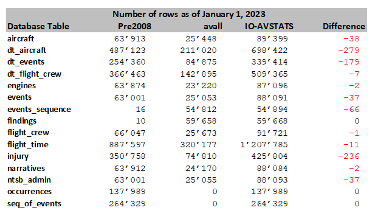

# Data Analysis: Aviation Accident Data Sets

**Note**: The **`IO-AVSTATS`** database used here contains NTSB aircraft accident data as of January 1, 2023.

This report is about comparing the NTSB Census of US Civil Aviation Accidents and the **`IO-AVSTATS`** database  for consistency.  

The NTSB provides U.S. aviation accident data in Microsoft Acces format on its website at the following [link](https://data.ntsb.gov/avdata).
There are three file types to distinguish:

* **`Pre2008`**: contains the data from 1982 to 2008 with some older data,
* **`avall`**: contains the data since 2008
* **`upDDMON`**: contains update data on the 1st, 8th, 15th and 22nd of each month. 

IO-Aero migrated the data from MS Access files **`Pre2008`** and **`avall`** to a PostgreSQL database on November 5, 2022, and has been processing new update files **`upDDMON`** since that time.

```
file_name |first_processed        |last_processed         |counter|
----------+-----------------------+-----------------------+-------+
Pre2008   |2022-11-05 10:44:38.868|2022-11-05 11:49:12.766|      2|
avall     |2022-11-05 11:59:49.223|2022-11-05 20:31:00.556|      2|
up01NOV   |2022-12-12 11:57:31.862|                       |      1|
up08NOV   |2022-12-12 12:05:13.850|                       |      1|
up15NOV   |2022-12-12 12:07:16.557|                       |      1|
up22NOV   |2022-11-27 13:40:18.094|2022-12-12 12:08:15.915|      2|
up01DEC   |2022-12-12 13:26:03.872|                       |      1|
up08DEC   |2022-12-12 13:29:14.703|                       |      1|
up15DEC   |2022-12-18 03:03:24.994|                       |      1|
up22DEC   |2022-12-23 02:41:07.220|                       |      1|
up01JAN   |2023-01-02 22:19:57.376|                       |      1|
```

This process is based on the assumption that by processing the two files **`Pre2008`** and **`avall`** once and regularly processing all update files since then, the NTSB data and the IO-Aero data match.
Unfortunately, this is not the case.

## 1. Cross check of the number of stored rows

A comparison of the current versions of the two files **`Pre2008`** and **`avall`** with the **`IO-AVSTATS`** database gives the following picture:

<kbd></kbd>

From this, one can clearly conclude that the NTSB is making data deletions without reflecting this in the update files.

## 2. Consistency check of MS Access file **`avall`**

One should expect as a result of loading the NTSB files **`Pre2008`**, **`avall`** and all subsequent update files that the data in the current NTSB file **`avall`** and the **`IO-AVSTATS`** database match.
This can be easily checked by reloading the current NTSB file **`avall`** into the **`IO-AVSTATS`** database. 
This is possible because in the **`IO-AVSTATS`** database a change is only made in a row if one of the columns has changed.

However, from the following log it is unfortunately evident that 3 changes in the NTSB database table **`events`** are not included in the change files.

```
Progress update 2023-01-08 10:54:57.926471 : ===============================================================================.
Progress update 2023-01-08 10:54:57.926471 : INFO.00.004 Start Launcher.
Progress update 2023-01-08 10:54:57.928471 : INFO.00.001 The logger is configured and ready.
Progress update 2023-01-08 10:54:57.936971 : INFO.00.008 Arguments task='l_n_a' msaccess='avall'.
Progress update 2023-01-08 10:54:57.936971 : -------------------------------------------------------------------------------.
Progress update 2023-01-08 10:54:57.936971 : INFO.00.049 Loading NTSB MS Access database data from file 'avall'.
Progress update 2023-01-08 10:54:57.937472 : --------------------------------------------------------------------------------
Progress update 2023-01-08 10:54:57.937472 : INFO.00.054 ODBC driver='DRIVER={Microsoft Access Driver (*.mdb, *.accdb)};DBQ=D:\SoftDevelopment\Projects\IO-Aero\io-avstats\data\download\avall.mdb;'.
Progress update 2023-01-08 10:54:58.124971 : INFO.00.021 The following database table is not processed: 'MSysAccessObjects'.
Progress update 2023-01-08 10:54:58.125472 : INFO.00.021 The following database table is not processed: 'MSysACEs'.
Progress update 2023-01-08 10:54:58.125472 : INFO.00.021 The following database table is not processed: 'MSysIMEXColumns'.
Progress update 2023-01-08 10:54:58.125472 : INFO.00.021 The following database table is not processed: 'MSysIMEXSpecs'.
Progress update 2023-01-08 10:54:58.125472 : INFO.00.021 The following database table is not processed: 'MSysModules2'.
Progress update 2023-01-08 10:54:58.125472 : INFO.00.021 The following database table is not processed: 'MSysNavPaneGroupCategories'.
Progress update 2023-01-08 10:54:58.125472 : INFO.00.021 The following database table is not processed: 'MSysNavPaneGroups'.
Progress update 2023-01-08 10:54:58.125972 : INFO.00.021 The following database table is not processed: 'MSysNavPaneGroupToObjects'.
Progress update 2023-01-08 10:54:58.125972 : INFO.00.021 The following database table is not processed: 'MSysNavPaneObjectIDs'.
Progress update 2023-01-08 10:54:58.125972 : INFO.00.021 The following database table is not processed: 'MSysObjects'.
Progress update 2023-01-08 10:54:58.125972 : INFO.00.021 The following database table is not processed: 'MSysQueries'.
Progress update 2023-01-08 10:54:58.125972 : INFO.00.021 The following database table is not processed: 'MSysRelationships'.
Progress update 2023-01-08 10:54:58.125972 : INFO.00.021 The following database table is not processed: 'Country'.
Progress update 2023-01-08 10:54:58.125972 : INFO.00.021 The following database table is not processed: 'ct_iaids'.
Progress update 2023-01-08 10:54:58.125972 : INFO.00.021 The following database table is not processed: 'ct_seqevt'.
Progress update 2023-01-08 10:54:58.125972 : INFO.00.021 The following database table is not processed: 'eADMSPUB_DataDictionary'.
Progress update 2023-01-08 10:54:58.126472 : INFO.00.021 The following database table is not processed: 'states'.
Progress update 2023-01-08 10:54:58.126472 :
Progress update 2023-01-08 10:54:58.126472 : Database table       : events              <-----------------------------------.
Progress update 2023-01-08 10:55:05.520972 : Number of rows so far read :   5000.
Progress update 2023-01-08 10:55:12.226010 : Number of rows so far read :  10000.
Progress update 2023-01-08 10:55:18.856471 : Number of rows so far read :  15000.
Progress update 2023-01-08 10:55:25.430471 : Number of rows so far read :  20000.
Progress update 2023-01-08 10:55:32.083403 : Number of rows so far read :  25000.
Progress update 2023-01-08 10:55:32.152403 : Number rows selected :  25053.
Progress update 2023-01-08 10:55:32.152403 : Number rows updated  :      3.
Progress update 2023-01-08 10:55:32.171903 :
Progress update 2023-01-08 10:55:32.171903 : Database table       : aircraft            <-----------------------------------.
Progress update 2023-01-08 10:59:44.049422 : Number of rows so far read :   5000.
Progress update 2023-01-08 11:03:55.709177 : Number of rows so far read :  10000.
Progress update 2023-01-08 11:08:07.079556 : Number of rows so far read :  15000.
Progress update 2023-01-08 11:12:18.158872 : Number of rows so far read :  20000.
Progress update 2023-01-08 11:16:29.489073 : Number of rows so far read :  25000.
Progress update 2023-01-08 11:16:51.969021 : Number rows selected :  25448.
Progress update 2023-01-08 11:16:51.992520 :
Progress update 2023-01-08 11:16:51.992520 : Database table       : dt_events           <-----------------------------------.
Progress update 2023-01-08 11:16:56.112522 : Number of rows so far read :   5000.
Progress update 2023-01-08 11:17:00.062021 : Number of rows so far read :  10000.
Progress update 2023-01-08 11:17:04.009521 : Number of rows so far read :  15000.
Progress update 2023-01-08 11:17:07.971827 : Number of rows so far read :  20000.
Progress update 2023-01-08 11:17:11.947351 : Number of rows so far read :  25000.
Progress update 2023-01-08 11:17:15.920851 : Number of rows so far read :  30000.
Progress update 2023-01-08 11:17:19.910351 : Number of rows so far read :  35000.
Progress update 2023-01-08 11:17:23.956872 : Number of rows so far read :  40000.
Progress update 2023-01-08 11:17:28.006459 : Number of rows so far read :  45000.
Progress update 2023-01-08 11:17:31.985360 : Number of rows so far read :  50000.
Progress update 2023-01-08 11:17:36.006304 : Number of rows so far read :  55000.
Progress update 2023-01-08 11:17:40.029105 : Number of rows so far read :  60000.
Progress update 2023-01-08 11:17:44.082605 : Number of rows so far read :  65000.
Progress update 2023-01-08 11:17:48.120527 : Number of rows so far read :  70000.
Progress update 2023-01-08 11:17:52.097052 : Number of rows so far read :  75000.
Progress update 2023-01-08 11:17:56.148091 : Number of rows so far read :  80000.
Progress update 2023-01-08 11:18:00.158587 : Number rows selected :  84875.
Progress update 2023-01-08 11:18:00.167086 :
Progress update 2023-01-08 11:18:00.167086 : Database table       : ntsb_admin          <-----------------------------------.
Progress update 2023-01-08 11:18:04.299087 : Number of rows so far read :   5000.
Progress update 2023-01-08 11:18:08.354587 : Number of rows so far read :  10000.
Progress update 2023-01-08 11:18:12.397087 : Number of rows so far read :  15000.
Progress update 2023-01-08 11:18:16.441587 : Number of rows so far read :  20000.
Progress update 2023-01-08 11:18:20.477758 : Number of rows so far read :  25000.
Progress update 2023-01-08 11:18:20.526759 : Number rows selected :  25055.
Progress update 2023-01-08 11:18:20.528759 :
Progress update 2023-01-08 11:18:20.528759 : Database table       : dt_aircraft         <-----------------------------------.
Progress update 2023-01-08 11:18:25.120259 : Number of rows so far read :   5000.
Progress update 2023-01-08 11:18:29.163736 : Number of rows so far read :  10000.
Progress update 2023-01-08 11:18:33.278735 : Number of rows so far read :  15000.
Progress update 2023-01-08 11:18:37.303235 : Number of rows so far read :  20000.
Progress update 2023-01-08 11:18:41.307235 : Number of rows so far read :  25000.
Progress update 2023-01-08 11:18:45.302735 : Number of rows so far read :  30000.
Progress update 2023-01-08 11:18:49.414235 : Number of rows so far read :  35000.
Progress update 2023-01-08 11:18:53.486735 : Number of rows so far read :  40000.
Progress update 2023-01-08 11:18:57.497234 : Number of rows so far read :  45000.
Progress update 2023-01-08 11:19:01.475167 : Number of rows so far read :  50000.
Progress update 2023-01-08 11:19:05.450167 : Number of rows so far read :  55000.
Progress update 2023-01-08 11:19:09.479167 : Number of rows so far read :  60000.
Progress update 2023-01-08 11:19:13.533167 : Number of rows so far read :  65000.
Progress update 2023-01-08 11:19:17.643945 : Number of rows so far read :  70000.
Progress update 2023-01-08 11:19:21.688945 : Number of rows so far read :  75000.
Progress update 2023-01-08 11:19:25.742069 : Number of rows so far read :  80000.
Progress update 2023-01-08 11:19:29.785071 : Number of rows so far read :  85000.
Progress update 2023-01-08 11:19:33.842569 : Number of rows so far read :  90000.
Progress update 2023-01-08 11:19:37.808569 : Number of rows so far read :  95000.
Progress update 2023-01-08 11:19:41.772069 : Number of rows so far read : 100000.
Progress update 2023-01-08 11:19:45.770178 : Number of rows so far read : 105000.
Progress update 2023-01-08 11:19:49.722678 : Number of rows so far read : 110000.
Progress update 2023-01-08 11:19:53.745178 : Number of rows so far read : 115000.
Progress update 2023-01-08 11:19:57.727178 : Number of rows so far read : 120000.
Progress update 2023-01-08 11:20:01.755178 : Number of rows so far read : 125000.
Progress update 2023-01-08 11:20:05.910679 : Number of rows so far read : 130000.
Progress update 2023-01-08 11:20:09.945678 : Number of rows so far read : 135000.
Progress update 2023-01-08 11:20:13.965285 : Number of rows so far read : 140000.
Progress update 2023-01-08 11:20:17.994762 : Number of rows so far read : 145000.
Progress update 2023-01-08 11:20:21.985261 : Number of rows so far read : 150000.
Progress update 2023-01-08 11:20:26.051761 : Number of rows so far read : 155000.
Progress update 2023-01-08 11:20:30.140762 : Number of rows so far read : 160000.
Progress update 2023-01-08 11:20:34.184261 : Number of rows so far read : 165000.
Progress update 2023-01-08 11:20:38.170761 : Number of rows so far read : 170000.
Progress update 2023-01-08 11:20:42.181261 : Number of rows so far read : 175000.
Progress update 2023-01-08 11:20:46.199261 : Number of rows so far read : 180000.
Progress update 2023-01-08 11:20:50.216762 : Number of rows so far read : 185000.
Progress update 2023-01-08 11:20:54.232387 : Number of rows so far read : 190000.
Progress update 2023-01-08 11:20:58.254460 : Number of rows so far read : 195000.
Progress update 2023-01-08 11:21:02.275612 : Number of rows so far read : 200000.
Progress update 2023-01-08 11:21:06.309111 : Number of rows so far read : 205000.
Progress update 2023-01-08 11:21:10.315400 : Number of rows so far read : 210000.
Progress update 2023-01-08 11:21:11.126900 : Number rows selected : 211020.
Progress update 2023-01-08 11:21:11.149399 :
Progress update 2023-01-08 11:21:11.149399 : Database table       : engines             <-----------------------------------.
Progress update 2023-01-08 11:21:15.703845 : Number of rows so far read :   5000.
Progress update 2023-01-08 11:21:20.078960 : Number of rows so far read :  10000.
Progress update 2023-01-08 11:21:24.511459 : Number of rows so far read :  15000.
Progress update 2023-01-08 11:21:28.959459 : Number of rows so far read :  20000.
Progress update 2023-01-08 11:21:31.813459 : Number rows selected :  23220.
Progress update 2023-01-08 11:21:31.819959 :
Progress update 2023-01-08 11:21:31.820459 : Database table       : events_sequence     <-----------------------------------.
Progress update 2023-01-08 11:21:36.214959 : Number of rows so far read :   5000.
Progress update 2023-01-08 11:21:40.382959 : Number of rows so far read :  10000.
Progress update 2023-01-08 11:21:44.580459 : Number of rows so far read :  15000.
Progress update 2023-01-08 11:21:48.780298 : Number of rows so far read :  20000.
Progress update 2023-01-08 11:21:52.972298 : Number of rows so far read :  25000.
Progress update 2023-01-08 11:21:57.171033 : Number of rows so far read :  30000.
Progress update 2023-01-08 11:22:01.358439 : Number of rows so far read :  35000.
Progress update 2023-01-08 11:22:05.542086 : Number of rows so far read :  40000.
Progress update 2023-01-08 11:22:09.698086 : Number of rows so far read :  45000.
Progress update 2023-01-08 11:22:13.884087 : Number of rows so far read :  50000.
Progress update 2023-01-08 11:22:17.898086 : Number rows selected :  54812.
Progress update 2023-01-08 11:22:17.906086 :
Progress update 2023-01-08 11:22:17.906086 : Database table       : findings            <-----------------------------------.
Progress update 2023-01-08 11:22:22.540089 : Number of rows so far read :   5000.
Progress update 2023-01-08 11:22:26.864086 : Number of rows so far read :  10000.
Progress update 2023-01-08 11:22:31.184492 : Number of rows so far read :  15000.
Progress update 2023-01-08 11:22:35.492492 : Number of rows so far read :  20000.
Progress update 2023-01-08 11:22:39.780492 : Number of rows so far read :  25000.
Progress update 2023-01-08 11:22:44.130992 : Number of rows so far read :  30000.
Progress update 2023-01-08 11:22:48.454677 : Number of rows so far read :  35000.
Progress update 2023-01-08 11:22:52.789844 : Number of rows so far read :  40000.
Progress update 2023-01-08 11:22:57.120637 : Number of rows so far read :  45000.
Progress update 2023-01-08 11:23:01.419796 : Number of rows so far read :  50000.
Progress update 2023-01-08 11:23:05.766431 : Number of rows so far read :  55000.
Progress update 2023-01-08 11:23:09.791340 : Number rows selected :  59658.
Progress update 2023-01-08 11:23:09.805840 :
Progress update 2023-01-08 11:23:09.805840 : Database table       : flight_crew         <-----------------------------------.
Progress update 2023-01-08 11:23:14.958784 : Number of rows so far read :   5000.
Progress update 2023-01-08 11:23:19.820268 : Number of rows so far read :  10000.
Progress update 2023-01-08 11:23:24.729594 : Number of rows so far read :  15000.
Progress update 2023-01-08 11:23:29.622084 : Number of rows so far read :  20000.
Progress update 2023-01-08 11:23:34.540084 : Number of rows so far read :  25000.
Progress update 2023-01-08 11:23:35.199084 : Number rows selected :  25673.
Progress update 2023-01-08 11:23:35.208584 :
Progress update 2023-01-08 11:23:35.208584 : Database table       : injury              <-----------------------------------.
Progress update 2023-01-08 11:23:39.735841 : Number of rows so far read :   5000.
Progress update 2023-01-08 11:23:43.896539 : Number of rows so far read :  10000.
Progress update 2023-01-08 11:23:47.861665 : Number of rows so far read :  15000.
Progress update 2023-01-08 11:23:51.935371 : Number of rows so far read :  20000.
Progress update 2023-01-08 11:23:55.984372 : Number of rows so far read :  25000.
Progress update 2023-01-08 11:24:00.036871 : Number of rows so far read :  30000.
Progress update 2023-01-08 11:24:04.101597 : Number of rows so far read :  35000.
Progress update 2023-01-08 11:24:08.135097 : Number of rows so far read :  40000.
Progress update 2023-01-08 11:24:12.153455 : Number of rows so far read :  45000.
Progress update 2023-01-08 11:24:16.246138 : Number of rows so far read :  50000.
Progress update 2023-01-08 11:24:20.300638 : Number of rows so far read :  55000.
Progress update 2023-01-08 11:24:24.341138 : Number of rows so far read :  60000.
Progress update 2023-01-08 11:24:28.366638 : Number of rows so far read :  65000.
Progress update 2023-01-08 11:24:32.397569 : Number of rows so far read :  70000.
Progress update 2023-01-08 11:24:36.310164 : Number rows selected :  74810.
Progress update 2023-01-08 11:24:36.318164 :
Progress update 2023-01-08 11:24:36.318664 : Database table       : narratives          <-----------------------------------.
Progress update 2023-01-08 11:25:06.658888 : Number of rows so far read :   5000.
Progress update 2023-01-08 11:25:38.351141 : Number of rows so far read :  10000.
Progress update 2023-01-08 11:26:14.370031 : Number of rows so far read :  15000.
Progress update 2023-01-08 11:26:41.030434 : Number of rows so far read :  20000.
Progress update 2023-01-08 11:26:52.552326 : Number rows selected :  24170.
Progress update 2023-01-08 11:26:52.576323 :
Progress update 2023-01-08 11:26:52.576323 : Database table       : occurrences         <-----------------------------------.
Progress update 2023-01-08 11:26:52.576824 : Number rows selected :      0.
Progress update 2023-01-08 11:26:52.576824 :
Progress update 2023-01-08 11:26:52.576824 : Database table       : dt_flight_crew      <-----------------------------------.
Progress update 2023-01-08 11:26:57.021429 : Number of rows so far read :   5000.
Progress update 2023-01-08 11:27:01.116839 : Number of rows so far read :  10000.
Progress update 2023-01-08 11:27:05.160588 : Number of rows so far read :  15000.
Progress update 2023-01-08 11:27:09.299411 : Number of rows so far read :  20000.
Progress update 2023-01-08 11:27:13.347448 : Number of rows so far read :  25000.
Progress update 2023-01-08 11:27:17.359906 : Number of rows so far read :  30000.
Progress update 2023-01-08 11:27:21.401896 : Number of rows so far read :  35000.
Progress update 2023-01-08 11:27:25.572195 : Number of rows so far read :  40000.
Progress update 2023-01-08 11:27:29.662676 : Number of rows so far read :  45000.
Progress update 2023-01-08 11:27:33.798273 : Number of rows so far read :  50000.
Progress update 2023-01-08 11:27:37.851519 : Number of rows so far read :  55000.
Progress update 2023-01-08 11:27:41.919623 : Number of rows so far read :  60000.
Progress update 2023-01-08 11:27:46.008191 : Number of rows so far read :  65000.
Progress update 2023-01-08 11:27:50.072306 : Number of rows so far read :  70000.
Progress update 2023-01-08 11:27:54.155886 : Number of rows so far read :  75000.
Progress update 2023-01-08 11:27:58.186193 : Number of rows so far read :  80000.
Progress update 2023-01-08 11:28:02.246693 : Number of rows so far read :  85000.
Progress update 2023-01-08 11:28:06.272698 : Number of rows so far read :  90000.
Progress update 2023-01-08 11:28:10.298302 : Number of rows so far read :  95000.
Progress update 2023-01-08 11:28:14.333921 : Number of rows so far read : 100000.
Progress update 2023-01-08 11:28:18.352599 : Number of rows so far read : 105000.
Progress update 2023-01-08 11:28:22.371189 : Number of rows so far read : 110000.
Progress update 2023-01-08 11:28:26.522324 : Number of rows so far read : 115000.
Progress update 2023-01-08 11:28:30.583703 : Number of rows so far read : 120000.
Progress update 2023-01-08 11:28:34.645931 : Number of rows so far read : 125000.
Progress update 2023-01-08 11:28:38.709503 : Number of rows so far read : 130000.
Progress update 2023-01-08 11:28:42.754553 : Number of rows so far read : 135000.
Progress update 2023-01-08 11:28:46.829771 : Number of rows so far read : 140000.
Progress update 2023-01-08 11:28:49.203271 : Number rows selected : 142895.
Progress update 2023-01-08 11:28:49.217771 :
Progress update 2023-01-08 11:28:49.217771 : Database table       : flight_time         <-----------------------------------.
Progress update 2023-01-08 11:28:54.286174 : Number of rows so far read :   5000.
Progress update 2023-01-08 11:28:58.389961 : Number of rows so far read :  10000.
Progress update 2023-01-08 11:29:02.508078 : Number of rows so far read :  15000.
Progress update 2023-01-08 11:29:06.645259 : Number of rows so far read :  20000.
Progress update 2023-01-08 11:29:10.783724 : Number of rows so far read :  25000.
Progress update 2023-01-08 11:29:14.909806 : Number of rows so far read :  30000.
Progress update 2023-01-08 11:29:19.026191 : Number of rows so far read :  35000.
Progress update 2023-01-08 11:29:23.150194 : Number of rows so far read :  40000.
Progress update 2023-01-08 11:29:27.367274 : Number of rows so far read :  45000.
Progress update 2023-01-08 11:29:31.566274 : Number of rows so far read :  50000.
Progress update 2023-01-08 11:29:35.726611 : Number of rows so far read :  55000.
Progress update 2023-01-08 11:29:39.869869 : Number of rows so far read :  60000.
Progress update 2023-01-08 11:29:43.982202 : Number of rows so far read :  65000.
Progress update 2023-01-08 11:29:48.071534 : Number of rows so far read :  70000.
Progress update 2023-01-08 11:29:52.189364 : Number of rows so far read :  75000.
Progress update 2023-01-08 11:29:56.321801 : Number of rows so far read :  80000.
Progress update 2023-01-08 11:30:00.433774 : Number of rows so far read :  85000.
Progress update 2023-01-08 11:30:04.542272 : Number of rows so far read :  90000.
Progress update 2023-01-08 11:30:08.643190 : Number of rows so far read :  95000.
Progress update 2023-01-08 11:30:12.731690 : Number of rows so far read : 100000.
Progress update 2023-01-08 11:30:16.840690 : Number of rows so far read : 105000.
Progress update 2023-01-08 11:30:20.935190 : Number of rows so far read : 110000.
Progress update 2023-01-08 11:30:25.021998 : Number of rows so far read : 115000.
Progress update 2023-01-08 11:30:29.117324 : Number of rows so far read : 120000.
Progress update 2023-01-08 11:30:33.218599 : Number of rows so far read : 125000.
Progress update 2023-01-08 11:30:37.348908 : Number of rows so far read : 130000.
Progress update 2023-01-08 11:30:41.463377 : Number of rows so far read : 135000.
Progress update 2023-01-08 11:30:45.552042 : Number of rows so far read : 140000.
Progress update 2023-01-08 11:30:49.702545 : Number of rows so far read : 145000.
Progress update 2023-01-08 11:30:53.813622 : Number of rows so far read : 150000.
Progress update 2023-01-08 11:30:57.958047 : Number of rows so far read : 155000.
Progress update 2023-01-08 11:31:02.064574 : Number of rows so far read : 160000.
Progress update 2023-01-08 11:31:06.185597 : Number of rows so far read : 165000.
Progress update 2023-01-08 11:31:10.347399 : Number of rows so far read : 170000.
Progress update 2023-01-08 11:31:14.460899 : Number of rows so far read : 175000.
Progress update 2023-01-08 11:31:18.566522 : Number of rows so far read : 180000.
Progress update 2023-01-08 11:31:22.656724 : Number of rows so far read : 185000.
Progress update 2023-01-08 11:31:26.759541 : Number of rows so far read : 190000.
Progress update 2023-01-08 11:31:30.850994 : Number of rows so far read : 195000.
Progress update 2023-01-08 11:31:34.977994 : Number of rows so far read : 200000.
Progress update 2023-01-08 11:31:39.104760 : Number of rows so far read : 205000.
Progress update 2023-01-08 11:31:43.224278 : Number of rows so far read : 210000.
Progress update 2023-01-08 11:31:47.343758 : Number of rows so far read : 215000.
Progress update 2023-01-08 11:31:51.473308 : Number of rows so far read : 220000.
Progress update 2023-01-08 11:31:55.610395 : Number of rows so far read : 225000.
Progress update 2023-01-08 11:31:59.722655 : Number of rows so far read : 230000.
Progress update 2023-01-08 11:32:03.829224 : Number of rows so far read : 235000.
Progress update 2023-01-08 11:32:07.926916 : Number of rows so far read : 240000.
Progress update 2023-01-08 11:32:12.021113 : Number of rows so far read : 245000.
Progress update 2023-01-08 11:32:16.121738 : Number of rows so far read : 250000.
Progress update 2023-01-08 11:32:20.230809 : Number of rows so far read : 255000.
Progress update 2023-01-08 11:32:24.428988 : Number of rows so far read : 260000.
Progress update 2023-01-08 11:32:28.552488 : Number of rows so far read : 265000.
Progress update 2023-01-08 11:32:32.683488 : Number of rows so far read : 270000.
Progress update 2023-01-08 11:32:36.809492 : Number of rows so far read : 275000.
Progress update 2023-01-08 11:32:40.943466 : Number of rows so far read : 280000.
Progress update 2023-01-08 11:32:45.062966 : Number of rows so far read : 285000.
Progress update 2023-01-08 11:32:49.188608 : Number of rows so far read : 290000.
Progress update 2023-01-08 11:32:53.319314 : Number of rows so far read : 295000.
Progress update 2023-01-08 11:32:57.395559 : Number of rows so far read : 300000.
Progress update 2023-01-08 11:33:01.511843 : Number of rows so far read : 305000.
Progress update 2023-01-08 11:33:05.647894 : Number of rows so far read : 310000.
Progress update 2023-01-08 11:33:09.775894 : Number of rows so far read : 315000.
Progress update 2023-01-08 11:33:13.911762 : Number of rows so far read : 320000.
Progress update 2023-01-08 11:33:14.060262 : Number rows selected : 320177.
Progress update 2023-01-08 11:33:14.105399 :
Progress update 2023-01-08 11:33:14.105399 : Database table       : seq_of_events       <-----------------------------------.
Progress update 2023-01-08 11:33:14.105899 : Number rows selected :      0.
Progress update 2023-01-08 11:33:14.205984 : INFO.00.065 Cleansing PostgreSQL data.
Progress update 2023-01-08 11:33:14.206484 : --------------------------------------------------------------------------------
Progress update 2023-01-08 11:33:14.248984 : INFO.00.066 Cleansing table 'aircraft' column 'acft_category'.
Progress update 2023-01-08 11:33:16.897611 : --------------------------------------------------------------------------------
Progress update 2023-01-08 11:33:16.897611 : INFO.00.066 Cleansing table 'aircraft' column 'far_part'.
Progress update 2023-01-08 11:33:19.546798 : --------------------------------------------------------------------------------
Progress update 2023-01-08 11:33:19.547298 : INFO.00.066 Cleansing table 'events' column 'ev_city'.
Progress update 2023-01-08 11:33:20.870836 : Number cols trimmed  :      3.
Progress update 2023-01-08 11:33:22.121143 : --------------------------------------------------------------------------------
Progress update 2023-01-08 11:33:22.121143 : INFO.00.066 Cleansing table 'events' column 'ev_site_zipcode'.
Progress update 2023-01-08 11:33:24.665371 : --------------------------------------------------------------------------------
Progress update 2023-01-08 11:33:24.665928 : INFO.00.066 Cleansing table 'events' column 'latitude'.
Progress update 2023-01-08 11:33:27.213439 : --------------------------------------------------------------------------------
Progress update 2023-01-08 11:33:27.213439 : INFO.00.066 Cleansing table 'events' column 'longitude'.
Progress update 2023-01-08 11:33:29.755180 : -------------------------------------------------------------------------------.
Progress update 2023-01-08 11:33:29.755180 :    2,311,946,209,000 ns - Total time launcher.
Progress update 2023-01-08 11:33:29.755180 : INFO.00.006 End   Launcher.
Progress update 2023-01-08 11:33:29.755679 : ===============================================================================.
```

## 3. Conclusions

The following actions should address these issues:

1. A new column **`last_seen_in_avall`** of format timestamp is added for all NTSB database tables stored in the **`IO-AVSTATS`** database.
2. The **`avall`** file is reloaded instead of the current update file at a rate to be defined. 
Thereby all rows of the NTSB file in the IO-AVSTATS database are provided with the same timestamp in the column **`last_seen_in_avall`**. 
After loading the NTSB data, all rows since 2008 in the **`IO-AVSTATS`** database that do not contain this timestamp are deleted. 
3. It is checked when loading the data that no data from before 2008 is affected.

## 4. 

````sql
SELECT 'aircraft'                                                                                      "DB Table",
       (SELECT count(*) FROM aircraft WHERE ev_id IN (SELECT ev_id FROM events WHERE ev_year < 2008))  "< 2008",
       (SELECT count(*) FROM aircraft WHERE ev_id IN (SELECT ev_id FROM events WHERE ev_year >= 2008)) ">= 2008",
       (SELECT count(*) FROM aircraft)                                                                 "Total"
UNION
SELECT 'dt_aircraft'                                                                                      "DB Table",
       (SELECT count(*) FROM dt_aircraft WHERE ev_id IN (SELECT ev_id FROM events WHERE ev_year < 2008))  "< 2008",
       (SELECT count(*) FROM dt_aircraft WHERE ev_id IN (SELECT ev_id FROM events WHERE ev_year >= 2008)) ">= 2008",
       (SELECT count(*) FROM dt_aircraft)                                                                 "Total"
UNION
SELECT 'dt_events'                                                                                      "DB Table",
       (SELECT count(*) FROM dt_events WHERE ev_id IN (SELECT ev_id FROM events WHERE ev_year < 2008))  "< 2008",
       (SELECT count(*) FROM dt_events WHERE ev_id IN (SELECT ev_id FROM events WHERE ev_year >= 2008)) ">= 2008",
       (SELECT count(*) FROM dt_events)                                                                 "Total"
UNION
SELECT 'dt_flight_crew'                                                                                      "DB Table",
       (SELECT count(*) FROM dt_flight_crew WHERE ev_id IN (SELECT ev_id FROM events WHERE ev_year < 2008))  "< 2008",
       (SELECT count(*) FROM dt_flight_crew WHERE ev_id IN (SELECT ev_id FROM events WHERE ev_year >= 2008)) ">= 2008",
       (SELECT count(*) FROM dt_flight_crew)                                                                 "Total"
UNION
SELECT 'engines'                                                                                      "DB Table",
       (SELECT count(*) FROM engines WHERE ev_id IN (SELECT ev_id FROM events WHERE ev_year < 2008))  "< 2008",
       (SELECT count(*) FROM engines WHERE ev_id IN (SELECT ev_id FROM events WHERE ev_year >= 2008)) ">= 2008",
       (SELECT count(*) FROM engines)                                                                 "Total"
UNION
SELECT 'events'                                            "DB Table",
       (SELECT count(*) FROM events WHERE ev_year < 2008)  "< 2008",
       (SELECT count(*) FROM events WHERE ev_year >= 2008) ">= 2008",
       (SELECT count(*) FROM events)                       "Total"
union
SELECT 'events_sequence'                                                                                      "DB Table",
       (SELECT count(*) FROM events_sequence WHERE ev_id IN (SELECT ev_id FROM events WHERE ev_year < 2008))  "< 2008",
       (SELECT count(*) FROM events_sequence WHERE ev_id IN (SELECT ev_id FROM events WHERE ev_year >= 2008)) ">= 2008",
       (SELECT count(*) FROM events_sequence)                                                                 "Total"
union
SELECT 'findings'                                                                                      "DB Table",
       (SELECT count(*) FROM findings WHERE ev_id IN (SELECT ev_id FROM events WHERE ev_year < 2008))  "< 2008",
       (SELECT count(*) FROM findings WHERE ev_id IN (SELECT ev_id FROM events WHERE ev_year >= 2008)) ">= 2008",
       (SELECT count(*) FROM findings)                                                                 "Total"
union
SELECT 'flight_crew'                                                                                      "DB Table",
       (SELECT count(*) FROM flight_crew WHERE ev_id IN (SELECT ev_id FROM events WHERE ev_year < 2008))  "< 2008",
       (SELECT count(*) FROM flight_crew WHERE ev_id IN (SELECT ev_id FROM events WHERE ev_year >= 2008)) ">= 2008",
       (SELECT count(*) FROM flight_crew)                                                                 "Total"
union
SELECT 'flight_time'                                                                                      "DB Table",
       (SELECT count(*) FROM flight_time WHERE ev_id IN (SELECT ev_id FROM events WHERE ev_year < 2008))  "< 2008",
       (SELECT count(*) FROM flight_time WHERE ev_id IN (SELECT ev_id FROM events WHERE ev_year >= 2008)) ">= 2008",
       (SELECT count(*) FROM flight_time)                                                                 "Total"
union
SELECT 'injury'                                                                                      "DB Table",
       (SELECT count(*) FROM injury WHERE ev_id IN (SELECT ev_id FROM events WHERE ev_year < 2008))  "< 2008",
       (SELECT count(*) FROM injury WHERE ev_id IN (SELECT ev_id FROM events WHERE ev_year >= 2008)) ">= 2008",
       (SELECT count(*) FROM injury)                                                                 "Total"
union
SELECT 'narratives'                                                                                      "DB Table",
       (SELECT count(*) FROM narratives WHERE ev_id IN (SELECT ev_id FROM events WHERE ev_year < 2008))  "< 2008",
       (SELECT count(*) FROM narratives WHERE ev_id IN (SELECT ev_id FROM events WHERE ev_year >= 2008)) ">= 2008",
       (SELECT count(*) FROM narratives)                                                                 "Total"
union
SELECT 'ntsb_admin'                                                                                      "DB Table",
       (SELECT count(*) FROM ntsb_admin WHERE ev_id IN (SELECT ev_id FROM events WHERE ev_year < 2008))  "< 2008",
       (SELECT count(*) FROM ntsb_admin WHERE ev_id IN (SELECT ev_id FROM events WHERE ev_year >= 2008)) ">= 2008",
       (SELECT count(*) FROM ntsb_admin)                                                                 "Total"
union
SELECT 'occurrences'                                                                                      "DB Table",
       (SELECT count(*) FROM occurrences WHERE ev_id IN (SELECT ev_id FROM events WHERE ev_year < 2008))  "< 2008",
       (SELECT count(*) FROM occurrences WHERE ev_id IN (SELECT ev_id FROM events WHERE ev_year >= 2008)) ">= 2008",
       (SELECT count(*) FROM occurrences)                                                                 "Total"
union
SELECT 'seq_of_events'                                                                                      "DB Table",
       (SELECT count(*) FROM seq_of_events WHERE ev_id IN (SELECT ev_id FROM events WHERE ev_year < 2008))  "< 2008",
       (SELECT count(*) FROM seq_of_events WHERE ev_id IN (SELECT ev_id FROM events WHERE ev_year >= 2008)) ">= 2008",
       (SELECT count(*) FROM seq_of_events)                                                                 "Total"
ORDER BY 1
````
