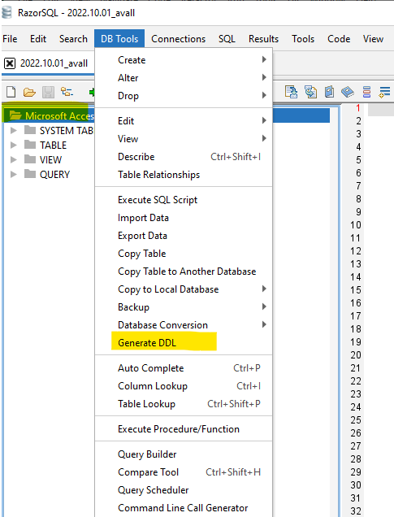

# IO-AVSTATS - Data - Data Source NTSB

The data used in **IO-AVSTATS** is provided by the [NTSB](https://www.ntsb.gov/Pages/home.aspx){:target="_blank"} (National Transportation Safety Board).
On the accident data page is the link [Downloadable data sets](https://www.ntsb.gov/safety/data/Pages/Data_Stats.aspx){:target="_blank"}, which contains the aviation accident data in Microsoft Access format for free download.  

| File          | Created (mm/dd/yyyy) | Description                                             |
|---------------|----------------------|---------------------------------------------------------|
| `avall.zip`   | current              | Data from January 1, 2008 to today                      |
| `PRE1982.zip` | 10/27/2020           | unknown                                                 |
| `Pre2008.zip` | 09/30/2020           | Data from January 1, 1982 to December 31, 2007          |
| `upDDMON.zip` | current              | New additions and updates until DD day in the month MON |

The schemas of the two databases `avall` and `Pre2008` are identical except for the two new optional columns `dec_latitude` and `dec_longitude` in the database table `events` of the database `avall`.

##  1. Database Schema Comparison

Before any new NTSB data set can be processed, the database schema of the new data set must first be compared with the database schema of the previous version of the NTSB data set `avall.mdb`. 

Procedure:

- The RazorSQL program is started.
- Under 'Connections' select 'Add Connection Profile'.
- Select `Microsoft Access` under `Add Connection Profile`.
- `Connection Type` is ODBC (Direct).
- in addition, an entry must be made at `Connection Profile Name` and `Database File`.
- After pressing the `CONNECT` button you will be connected to the selected Microsoft Access database.

- After opening the database, a SQL script with the DDL statements can be generated in the menu under `DB Tools` and `Generate DDL`.

- This SQL script can be saved as a file for further processing in the menu under `File` and `Save As`.

In case of any discrepancy, these must be implemented into the existing PostgreSQL database.

##  2. Table Processing Order

Based on the foreign keys (FK) present in the database schema, the following processing sequence results when creating the database schema and loading or updating the database tables:

### 2.1 Level 1 - without FK

- ~~Country~~
- ~~ct_iaids~~
- ~~ct_seqevt~~
- ~~eADMSPUB_DataDictionary~~
- events
- ~~states~~

### 2.2 Level 2 - FK: `ev_id`

- aircraft
- dt_events
- NTSB_Admin

### 2.3 Level 3 - FK: `ev_id` & `Aircraft_Key`

- dt_aircraft
- engines
- Events_Sequence
- Findings
- Flight_Crew
- injury
- narratives
- Occurrences

### 2.4 Level 4 - FK: `ev_id` & `Aircraft_Key` & `crew_no`

- dt_Flight_Crew
- flight_time

### 2.5 Level 4 - FK: `ev_id` & `Aircraft_Key` & `Occurrence_No`

- seq_of_events

##  3. Issues

The problem database tables listed below are not included in the PostgreSQL database schema.

### 3.1 Empty database tables

The following database tables are included in the Entity Relationship Diagram (ERD), but they do not contain any data in the database:

- Occurrences
- seq_of_events

### 3.2 Legacy database tables

The following database tables are included in the database but are missing from the ERD:

- Country
- ct_iaids
- ct_seqevt
- eADMSPUB_DataDictionary
- states

### 3.3 Inconsistent database data

- database table **`ntsb_admin`**: database table `event` has no row with `ev_id` = `20210527103155` (data source: `avall.zip`) - as a consequence, the foreign key to the events table had to be removed

