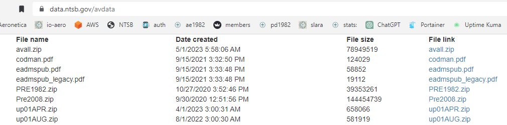
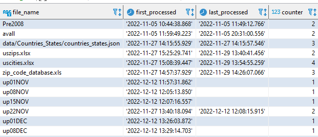

# How to add NTSB accident files

Aviation accident data provided by NTSB can be found at the following [website](https://www.ntsb.gov/safety/data/Pages/Data_Stats.aspx){:target="_blank"} under **Downloadable data sets**:

<kbd></kbd>

In the database table **`io_processed_files`** you can find the previously processed files:

<kbd></kbd>

Any file can be processed several times with the process described in the following, as long as one processes also afterwards all newer files again.

All necessary processing steps can be executed with the **`run_io_avstats`** script.
The script is available in a version for Windows 10 and 11 cmd and for Ubuntu 22.04 bash shell.

## 1. Quick reference

| No. | Task  | Description                                                    |
|----:|-------|----------------------------------------------------------------|
|   1 | d_n_a | Download a NTSB MS Access database file                        |
|   2 | l_n_a | Load NTSB MS Access database data into PostgreSQL              |
|   3 | d_s_f | Download basic simplemaps files                                |
|   4 | l_s_d | **Optional**: Load simplemaps data into PostgreSQL             |
|   5 |       | Download the ZIP Code Database file                            |
|   6 | l_z_d | **Optional**: Load ZIP Code Database data into PostgreSQL      |
|   7 | l_c_d | **Optional**: Load data from a correction file into PostgreSQL |
|   8 | c_l_l | Correct decimal US latitudes and longitudes                    |
|   9 | v_n_d | Verify selected NTSB data                                      |
|  10 | r_d_s | Refresh the PostgreSQL database schema                         |
|  11 |       | Backup the file directory **`data/postgres`**                  |
|  12 |       | Update the Google Drive                                        |
|  13 |       | Update **IO-AVSTATS** in the IO-Aero cloud                     |

## 2. Detailed description

### 2.1 **`d_n_a`** - Download a NTSB MS Access database file

**Relevant cofiguration parameters**:

```
download_chunk_size = 524288
download_timeout = 10
download_url_ntsb_prefix = "https://data.ntsb.gov/avdata/FileDirectory/DownloadFile?fileID=C%3A%5Cavdata%5C"
download_work_dir = "data/download"
```

**Example protocol**:

```
...\io-avstats>run_io_avstats
=========================================================
r_s_a   - Run a Streamlit application
---------------------------------------------------------
d_n_a   - Download a NTSB MS Access database file
l_n_a   - Load NTSB MS Access database data into PostgreSQL
c_l_l   - Correct decimal US latitudes and longitudes
v_n_d   - Verify selected NTSB data
r_d_s   - Refresh the PostgreSQL database schema
---------------------------------------------------------
c_p_d   - Cleansing PostgreSQL data
d_s_f   - Download basic simplemaps files
l_c_d   - Load data from a correction file into PostgreSQL
l_c_s   - Load country and state data into PostgreSQL
l_s_d   - Load simplemaps data into PostgreSQL
l_z_d   - Load ZIP Code Database data into PostgreSQL
---------------------------------------------------------
c_d_s   - Create the PostgreSQL database schema
d_d_f   - Delete the PostgreSQL database files
d_d_s   - Drop the PostgreSQL database schema
s_d_c   - Set up the PostgreSQL database container
u_d_s   - Update the PostgreSQL database schema
---------------------------------------------------------
version - Show the IO-AVSTATS-DB version
---------------------------------------------------------
Enter the desired task [default: r_s_a] d_n_a
=========================================================
avall   - Data from January 1, 2008 to today
Pre2008 - Data from January 1, 1982 to December 31, 2007
upDDMON - New additions and updates until DD day in the month MON
---------------------------------------------------------
Enter the stem name of the desired MS Access database file up15DEC

Script run_io_avstats is now running
=======================================================================
Start run_io_avstats
-----------------------------------------------------------------------
IO-AVSTATS - Aviation Accident Statistics.
-----------------------------------------------------------------------
PYTHONPATH :
-----------------------------------------------------------------------
TASK       : d_n_a
CORRECTION :
MSACCESS   : up15DEC
-----------------------------------------------------------------------
The current time is: 13:07:00.80
Enter the new time:
=======================================================================
Progress update 2022-12-17 13:07:04.105948 : ===============================================================================.
Progress update 2022-12-17 13:07:04.105948 : INFO.00.004 Start Launcher.
Progress update 2022-12-17 13:07:04.111448 : INFO.00.001 The logger is configured and ready.
Progress update 2022-12-17 13:07:04.120447 : INFO.00.008 Arguments task='d_n_a' msaccess='up15DEC'.
Progress update 2022-12-17 13:07:04.120447 : -------------------------------------------------------------------------------.
Progress update 2022-12-17 13:07:04.120447 : INFO.00.047 Downloading NTSB MS Access database file 'up15DEC'.
Progress update 2022-12-17 13:07:04.120447 : --------------------------------------------------------------------------------
Progress update 2022-12-17 13:07:06.491427 : INFO.00.013 The connection to the MS Access database file 'up15DEC.zip' on the NTSB download page was successfully established.
Progress update 2022-12-17 13:07:07.115755 : INFO.00.014 From the file 'up15DEC.zip' 2 chunks were downloaded.
Progress update 2022-12-17 13:07:07.133255 : INFO.00.015 The file 'up15DEC.zip' was successfully unpacked.
Progress update 2022-12-17 13:07:07.144255 : INFO.00.051 msaccess_file='D:\SoftDevelopment\Projects\IO-Aero\io-avstats\data\download\IO-AVSTATS.mdb'.
Progress update 2022-12-17 13:07:07.144755 : INFO.00.051 msaccess_file='D:\SoftDevelopment\Projects\IO-Aero\io-avstats\data\download\up15DEC.sql'.
Progress update 2022-12-17 13:07:07.144755 : INFO.00.052 razorsql_jar_file='C:\Program Files\RazorSQL\razorsql.jar'.
Progress update 2022-12-17 13:07:07.144755 : INFO.00.053 razorsql_java_path='C:\Program Files\RazorSQL\jre11\bin\java'.
1671278827242: launching RazorSQL . . .
1671278827242: args . . .
-backup
IO-AVSTATS
null
null
;
null
D:\SoftDevelopment\Projects\IO-Aero\io-avstats\data\download\up15DEC.sql
NO
tables
YES
null
NO
NO
1671278827278: userName: walte
1671278827278: libraryPath: C:\Program Files\RazorSQL\jre11\bin;C:\WINDOWS\Sun\Java\bin;C:\WINDOWS\system32;C:\WINDOWS;C:\Users\walte\.virtualenvs\io-avstats-zZIfNcpY\Scripts;C:\Program Files (x86)\VMware\VMware Player\bin\;C:\Program Files (x86)\infogridpacific\AZARDI;C:\Program Files (x86)\NVIDIA Corporation\PhysX\Common;C:\Program Files\Calibre2\;C:\Program Files\dotnet\;C:\Program Files\Git LFS;C:\Program Files\Microsoft SQL Server\110\Tools\Binn\;C:\Program Files\NVIDIA Corporation\NVIDIA NvDLISR;C:\Program Files\Pandoc\;C:\Program Files\TortoiseGit\bin;C:\Software\GnuWin32\bin;C:\WINDOWS;C:\WINDOWS\system32;C:\WINDOWS\System32\OpenSSH\;C:\WINDOWS\System32\Wbem;C:\WINDOWS\System32\WindowsPowerShell\v1.0\;C:\Users\walte\.nimble\bin;C:\Windows;C:\Windows\system32;C:\Windows\System32\OpenSSH\;C:\Windows\System32\Wbem;C:\Windows\System32\WindowsPowerShell\v1.0\;C:\Software\.cargo\bin;%GRADLE_HOME%\bin;%HOME_ELIXIR%\bin;%HOME_ERLANG%\bin;%HOME_GO%\bin;C:\Program Files\heroku\bin;%HOME_JULIA%\bin;%HOME_NIM%\bin;C:\Software\PostgreSQL\15\bin;C:\Software\poppler-0.68.0\bin;C:\Software\Python\Python310;C:\Software\Python\Python310\Scripts;C:\Software\rebar3;%HOME_RUST%\bin;C:\Software\Tesseract-OCR;C:\Software\jdk-18.0.2\bin;%KOTLIN_HOME%\bin;C:\Software\oracle\instantclient_21_6;C:\Software\Gpg4win\..\GnuPG\bin;C:\Program Files\LLVM\bin;C:\Program Files\nodejs\;C:\Program Files\Docker\Docker\resources\bin;C:\Program Files\Amazon\AWSCLIV2\;C:\Program Files\Git\cmd;C:\Program Files\PuTTY\;C:\Software\texlive\2022\bin\win32;C:\Users\walte\.cargo\bin;C:\Users\walte\AppData\Local\Microsoft\WindowsApps;C:\Software\Microsoft VS Code\bin;C:\Users\walte\go\bin;c:\users\walte\.local\bin;C:\Users\walte\AppData\Local\JetBrains\Toolbox\scripts;C:\Users\walte\AppData\Roaming\npm;C:\Software\MiKTeX\miktex\bin\x64\;.
1671278827279: javaVersion: 11.0.13
1671278827279:
1671278827279: Verifying RazorSQL resources location.
1671278827279:
1671278827280: testing base url: / = file:/C:/Program%20Files/RazorSQL/
1671278827280:
1671278827280: testString1: file:/C:/Program%20Files/RazorSQL/razorsql.jar
1671278827280: testString2: file:/C:/Program%20Files/RazorSQL/data/base.ssql
1671278827280: testFile1: C:\Program Files\RazorSQL\razorsql.jar
1671278827280: testFile2: C:\Program Files\RazorSQL\data\base.ssql
1671278827281: both test file exists.  Base URL found.
1671278827281: resource directory: file:/C:/Program%20Files/RazorSQL/
1671278827281: user home: C:\Users\walte
1671278827282: user profile: C:\Users\walte
1671278827282: app data: C:\Users\walte\AppData\Roaming
1671278827282: checking write access to: C:\Users\walte\AppData\Roaming
1671278827283: write dir: C:\Users\walte\AppData\Roaming\RichardsonSoftware
1671278827283: can write to C:\Users\walte\AppData\Roaming
1671278827283: user.home: C:\Users\walte\AppData\Roaming
1671278827283: RazorSQL Scratch Directory: C:\Users\walte\AppData\Roaming\RazorSQL
1671278827283: RazorSQL Scratch Directory exists
1671278827283: checking for sub directories
1671278827283: razorsql launch log: C:\Users\walte\AppData\Roaming\RazorSQL\razorsql_launch_log.txt
1671278827284: launch log file = C:\Users\walte\AppData\Roaming\RazorSQL\razorsql_launch_log.txt
1671278827284: Checking for graphics properties
1671278827284: graphics properties file: C:\Users\walte\AppData\Roaming\RazorSQL\data\graphics_properties.txt
1671278827284: gOverride: null
1671278827285: not disabling advanced graphics
1671278827285: path0: file:/C:/Program%20Files/RazorSQL/data/run.ssql
1671278827285: path1: file:/C:/Program%20Files/RazorSQL/razorsql.jar
1671278827285: runArgs: true
1671278827285: showScreen: false
1671278827285: args[0]: -backup
1671278827286: args[1]: IO-AVSTATS
1671278827286: args[2]: null
1671278827286: args[3]: null
1671278827286: args[4]: ;
1671278827286: args[5]: null
1671278827286: args[6]: D:\SoftDevelopment\Projects\IO-Aero\io-avstats\data\download\up15DEC.sql
1671278827286: args[7]: NO
1671278827286: args[8]: tables
1671278827286: args[9]: YES
1671278827286: args[10]: null
1671278827286: args[11]: NO
1671278827286: args[12]: NO
1671278827286: Command: -backup
1671278827286: Running -backup
h: name = C:\Program Files\RazorSQL\data\run.ssql
h: name = C:\Program Files\RazorSQL\razorsql.jar
1671278827293: Attempting to load . . .
command found
uOne: file:/C:/Program%20Files/RazorSQL/
h: name = C:\Program Files\RazorSQL\data\run.ssql
1671278827303reading file . . .C:\Program Files\RazorSQL\data\base.ssql
1671278827327done reading . . .
1671278827336done converting
1671278827336starting lib load.
1671278827347lib load complete.
In command line processor
Max Memory: 30688.0
Current Total Memory: 2048.0
Free Memory: 1957.998046875
1671278827417: r init
1671278827417: d init
1671278827417: get default file encoding
1671278827418: end d init
custom home directory: null
Checking for user data from old versions
1671278827419: user home: C:\Users\walte
1671278827419: user profile: C:\Users\walte
1671278827419: app data: C:\Users\walte\AppData\Roaming
1671278827419: checking write access to: C:\Users\walte\AppData\Roaming
1671278827419: write dir: C:\Users\walte\AppData\Roaming\RichardsonSoftware
1671278827419: can write to C:\Users\walte\AppData\Roaming
newHome: C:\Users\walte\AppData\Roaming\RazorSQL
dataHome: C:\Users\walte\AppData\Roaming/RazorSQL/data/
preferences file: C:\Users\walte\AppData\Roaming\RazorSQL\data\preferences.txt
Profiles Exist
1671278827429: loading icons
1671278827591: done r init
Getting connection data from: IO-AVSTATS
1671278827593: r init
1671278827593: d init
1671278827593: get default file encoding
1671278827593: end d init
custom home directory: null
Checking for user data from old versions
newHome: C:\Users\walte\AppData\Roaming\RazorSQL
dataHome: C:\Users\walte\AppData\Roaming/RazorSQL/data/
preferences file: C:\Users\walte\AppData\Roaming\RazorSQL\data\preferences.txt
Profiles Exist
1671278827594: loading icons
1671278827603: done r init
getting connection . . .
Not using SSH Tunnel
driver: sun.jdbc.odbc.JdbcOdbcDriver
classLocation: C:\Program Files\RazorSQL\drivers\common\odbc.jar
loadedCommonJars: false
commonURL: file:/C:/Program%20Files/RazorSQL/drivers/common/
commonDir: C:\Program Files\RazorSQL\drivers\common
commonFiles[0]: file:/C:/Program%20Files/RazorSQL/drivers/common/activation.jar
commonFiles[1]: file:/C:/Program%20Files/RazorSQL/drivers/common/common.jar
commonFiles[2]: file:/C:/Program%20Files/RazorSQL/drivers/common/jaxb-api.jar
commonFiles[3]: file:/C:/Program%20Files/RazorSQL/drivers/common/jaxb-core.jar
commonFiles[4]: file:/C:/Program%20Files/RazorSQL/drivers/common/jaxb-impl.jar
commonFiles[6]: file:/C:/Program%20Files/RazorSQL/drivers/common/odbc.jar
connection type: ODBC
final classLocation: C:\Program Files\RazorSQL\drivers\common\odbc.jar
classLocation file: C:\Program Files\RazorSQL\drivers\common\odbc.jar
building sql manager
Loading driver
Done loading driver
Getting connection with no login info
JdbcOdbcDriver: in initialize
OdbcApi == null
Creating new OdbcApi, nativePrefix:
JdbcOdbc constructor
Attempting to load JdbcOdbc library
Got OdbcApi: sun.jdbc.odbc.JdbcOdbc@2d127a61
Getting charset
JdbcOdbcDriver.OdbcApi.charSet: Cp1252
Connection obtained
obtained connection
database major version = 2
database product name: ACCESS
multiValueInsert: false
includeIdentifyColumns: false
Calling backup . . .
Retrieving Tables . . .
Generating Table DDL . . .
1 of 20
number of columns 93
column map size: 93
foundNull: false
2 of 20
number of columns 2
column map size: 2
foundNull: false
3 of 20
number of columns 11
column map size: 11
foundNull: false
4 of 20
number of columns 2
column map size: 2
foundNull: false
5 of 20
number of columns 6
column map size: 6
foundNull: false
6 of 20
number of columns 5
column map size: 5
foundNull: false
7 of 20
number of columns 7
column map size: 7
foundNull: false
8 of 20
number of columns 13
column map size: 13
foundNull: false
9 of 20
number of columns 17
column map size: 17
foundNull: false
10 of 20
number of columns 73
column map size: 73
foundNull: false
11 of 20
number of columns 10
column map size: 10
foundNull: false
12 of 20
number of columns 13
column map size: 13
foundNull: false
13 of 20
number of columns 33
column map size: 33
foundNull: false
14 of 20
number of columns 8
column map size: 8
foundNull: false
15 of 20
number of columns 7
column map size: 7
foundNull: false
16 of 20
number of columns 8
column map size: 8
foundNull: false
17 of 20
number of columns 5
column map size: 5
foundNull: false
18 of 20
number of columns 8
column map size: 8
foundNull: false
19 of 20
number of columns 11
column map size: 11
foundNull: false
20 of 20
number of columns 3
column map size: 3
foundNull: false
Generating Alter Table DDL . . .
1 of 20
2 of 20
3 of 20
4 of 20
5 of 20
6 of 20
7 of 20
8 of 20
9 of 20
10 of 20
11 of 20
12 of 20
13 of 20
14 of 20
15 of 20
16 of 20
17 of 20
18 of 20
19 of 20
20 of 20
backup finished
closing connection . . .
connection closed.
Shutting down logging streams
Done shutting down logging streams
Exiting . . .
Progress update 2022-12-17 13:07:08.208772 : INFO.00.011 The DDL script for the MS Access database 'up15DEC.mdb' was created successfully.
Progress update 2022-12-17 13:07:08.216271 : INFO.00.012 The DDL script for the MS Access database 'up15DEC.mdb' is identical to the reference script.
Progress update 2022-12-17 13:07:08.216271 : -------------------------------------------------------------------------------.
Progress update 2022-12-17 13:07:08.216271 :        4,294,822,800 ns - Total time launcher.
Progress update 2022-12-17 13:07:08.216271 : INFO.00.006 End   Launcher.
Progress update 2022-12-17 13:07:08.216772 : ===============================================================================.

-----------------------------------------------------------------------
The current time is: 13:07:08.37
Enter the new time:
-----------------------------------------------------------------------
End   run_io_avstats
=======================================================================
```

### 2.2 **`l_n_a`** - Load NTSB MS Access database data into PostgreSQL

**Relevant cofiguration parameters**:

```
download_work_dir = "data/download"
```

**Example protocol**:

```
...\io-avstats>run_io_avstats
=========================================================
r_s_a   - Run a Streamlit application
---------------------------------------------------------
d_n_a   - Download a NTSB MS Access database file
l_n_a   - Load NTSB MS Access database data into PostgreSQL
c_l_l   - Correct decimal US latitudes and longitudes
v_n_d   - Verify selected NTSB data
r_d_s   - Refresh the PostgreSQL database schema
---------------------------------------------------------
c_p_d   - Cleansing PostgreSQL data
d_s_f   - Download basic simplemaps files
l_c_d   - Load data from a correction file into PostgreSQL
l_c_s   - Load country and state data into PostgreSQL
l_s_d   - Load simplemaps data into PostgreSQL
l_z_d   - Load ZIP Code Database data into PostgreSQL
---------------------------------------------------------
c_d_s   - Create the PostgreSQL database schema
d_d_f   - Delete the PostgreSQL database files
d_d_s   - Drop the PostgreSQL database schema
s_d_c   - Set up the PostgreSQL database container
u_d_s   - Update the PostgreSQL database schema
---------------------------------------------------------
version - Show the IO-AVSTATS-DB version
---------------------------------------------------------
Enter the desired task [default: r_s_a] l_n_a
=========================================================
IO-AVSTATS.mdb
up01DEC.mdb
up08DEC.mdb
up15DEC.mdb
up22OCT.mdb
---------------------------------------------------------
Enter the stem name of the desired MS Access database file up15DEC

Script run_io_avstats is now running
=======================================================================
Start run_io_avstats
-----------------------------------------------------------------------
IO-AVSTATS - Aviation Accident Statistics.
-----------------------------------------------------------------------
PYTHONPATH :
-----------------------------------------------------------------------
TASK       : l_n_a
CORRECTION :
MSACCESS   : up15DEC
-----------------------------------------------------------------------
The current time is:  3:01:56.55
Enter the new time:
=======================================================================
Progress update 2022-12-18 03:01:59.422228 : ===============================================================================.
Progress update 2022-12-18 03:01:59.422228 : INFO.00.004 Start Launcher.
Progress update 2022-12-18 03:01:59.424228 : INFO.00.001 The logger is configured and ready.
Progress update 2022-12-18 03:01:59.432728 : INFO.00.008 Arguments task='l_n_a' msaccess='up15DEC'.
Progress update 2022-12-18 03:01:59.433228 : -------------------------------------------------------------------------------.
Progress update 2022-12-18 03:01:59.433228 : INFO.00.049 Loading NTSB MS Access database data from  file 'up15DEC'.
Progress update 2022-12-18 03:01:59.433228 : --------------------------------------------------------------------------------
Progress update 2022-12-18 03:01:59.433228 : INFO.00.054 ODBC driver='DRIVER={Microsoft Access Driver (*.mdb, *.accdb)};DBQ=D:\SoftDevelopment\Projects\IO-Aero\io-avstats\data\download\up15DEC.mdb;'.
Progress update 2022-12-18 03:02:00.468009 : INFO.00.021 The following database table is not processed: 'MSysAccessObjects'.
Progress update 2022-12-18 03:02:00.468009 : INFO.00.021 The following database table is not processed: 'MSysACEs'.
Progress update 2022-12-18 03:02:00.468009 : INFO.00.021 The following database table is not processed: 'MSysIMEXColumns'.
Progress update 2022-12-18 03:02:00.468510 : INFO.00.021 The following database table is not processed: 'MSysIMEXSpecs'.
Progress update 2022-12-18 03:02:00.468510 : INFO.00.021 The following database table is not processed: 'MSysModules2'.
Progress update 2022-12-18 03:02:00.468510 : INFO.00.021 The following database table is not processed: 'MSysNavPaneGroupCategories'.
Progress update 2022-12-18 03:02:00.468510 : INFO.00.021 The following database table is not processed: 'MSysNavPaneGroups'.
Progress update 2022-12-18 03:02:00.468510 : INFO.00.021 The following database table is not processed: 'MSysNavPaneGroupToObjects'.
Progress update 2022-12-18 03:02:00.468510 : INFO.00.021 The following database table is not processed: 'MSysNavPaneObjectIDs'.
Progress update 2022-12-18 03:02:00.468510 : INFO.00.021 The following database table is not processed: 'MSysObjects'.
Progress update 2022-12-18 03:02:00.468510 : INFO.00.021 The following database table is not processed: 'MSysQueries'.
Progress update 2022-12-18 03:02:00.468510 : INFO.00.021 The following database table is not processed: 'MSysRelationships'.
Progress update 2022-12-18 03:02:00.468510 : INFO.00.021 The following database table is not processed: 'Country'.
Progress update 2022-12-18 03:02:00.469012 : INFO.00.021 The following database table is not processed: 'ct_iaids'.
Progress update 2022-12-18 03:02:00.469012 : INFO.00.021 The following database table is not processed: 'ct_seqevt'.
Progress update 2022-12-18 03:02:00.469012 : INFO.00.021 The following database table is not processed: 'eADMSPUB_DataDictionary'.
Progress update 2022-12-18 03:02:00.469012 : INFO.00.021 The following database table is not processed: 'states'.
Progress update 2022-12-18 03:02:00.469012 :
Progress update 2022-12-18 03:02:00.469012 : Database table       : events              <-----------------------------------.
Progress update 2022-12-18 03:02:02.829483 : Number rows selected :     77.
Progress update 2022-12-18 03:02:02.829483 : Number rows inserted :     15.
Progress update 2022-12-18 03:02:02.829997 : Number rows updated  :     62.
Progress update 2022-12-18 03:02:02.829997 :
Progress update 2022-12-18 03:02:02.829997 : Database table       : aircraft            <-----------------------------------.
Progress update 2022-12-18 03:02:07.828401 : Number rows selected :     77.
Progress update 2022-12-18 03:02:07.828401 : Number rows inserted :     15.
Progress update 2022-12-18 03:02:07.828903 : Number rows updated  :     62.
Progress update 2022-12-18 03:02:07.828903 :
Progress update 2022-12-18 03:02:07.828903 : Database table       : dt_events           <-----------------------------------.
Progress update 2022-12-18 03:02:18.425030 : Number rows selected :    385.
Progress update 2022-12-18 03:02:18.425030 : Number rows inserted :    159.
Progress update 2022-12-18 03:02:18.425523 : Number rows updated  :    226.
Progress update 2022-12-18 03:02:18.425523 :
Progress update 2022-12-18 03:02:18.425523 : Database table       : ntsb_admin          <-----------------------------------.
Progress update 2022-12-18 03:02:20.508241 : Number rows selected :     77.
Progress update 2022-12-18 03:02:20.508241 : Number rows inserted :     15.
Progress update 2022-12-18 03:02:20.508241 : Number rows updated  :     62.
Progress update 2022-12-18 03:02:20.508241 :
Progress update 2022-12-18 03:02:20.508241 : Database table       : dt_aircraft         <-----------------------------------.
Progress update 2022-12-18 03:02:37.020238 : Number rows selected :    683.
Progress update 2022-12-18 03:02:37.020238 : Number rows inserted :    385.
Progress update 2022-12-18 03:02:37.020738 : Number rows updated  :    298.
Progress update 2022-12-18 03:02:37.020738 :
Progress update 2022-12-18 03:02:37.020738 : Database table       : engines             <-----------------------------------.
Progress update 2022-12-18 03:02:38.360943 : Number rows selected :     47.
Progress update 2022-12-18 03:02:38.361447 : Number rows inserted :     36.
Progress update 2022-12-18 03:02:38.361447 : Number rows updated  :     11.
Progress update 2022-12-18 03:02:38.361447 :
Progress update 2022-12-18 03:02:38.361447 : Database table       : events_sequence     <-----------------------------------.
Progress update 2022-12-18 03:02:41.193854 : Number rows selected :    108.
Progress update 2022-12-18 03:02:41.194353 : Number rows inserted :     62.
Progress update 2022-12-18 03:02:41.194353 : Number rows updated  :     46.
Progress update 2022-12-18 03:02:41.194353 :
Progress update 2022-12-18 03:02:41.194353 : Database table       : findings            <-----------------------------------.
Progress update 2022-12-18 03:02:43.593633 : Number rows selected :     94.
Progress update 2022-12-18 03:02:43.593633 : Number rows inserted :     94.
Progress update 2022-12-18 03:02:43.593633 :
Progress update 2022-12-18 03:02:43.594133 : Database table       : flight_crew         <-----------------------------------.
Progress update 2022-12-18 03:02:45.726279 : Number rows selected :     74.
Progress update 2022-12-18 03:02:45.726279 : Number rows inserted :     57.
Progress update 2022-12-18 03:02:45.726279 : Number rows updated  :     17.
Progress update 2022-12-18 03:02:45.726279 :
Progress update 2022-12-18 03:02:45.726781 : Database table       : injury              <-----------------------------------.
Progress update 2022-12-18 03:02:53.998519 : Number rows selected :    305.
Progress update 2022-12-18 03:02:53.998519 : Number rows inserted :     97.
Progress update 2022-12-18 03:02:53.998519 : Number rows updated  :    208.
Progress update 2022-12-18 03:02:53.999019 :
Progress update 2022-12-18 03:02:53.999019 : Database table       : narratives          <-----------------------------------.
Progress update 2022-12-18 03:02:55.873454 : Number rows selected :     60.
Progress update 2022-12-18 03:02:55.873454 : Number rows inserted :     39.
Progress update 2022-12-18 03:02:55.873454 : Number rows updated  :     21.
Progress update 2022-12-18 03:02:55.873454 :
Progress update 2022-12-18 03:02:55.873454 : Database table       : occurrences         <-----------------------------------.
Progress update 2022-12-18 03:02:55.885477 : Number rows selected :      0.
Progress update 2022-12-18 03:02:55.885477 :
Progress update 2022-12-18 03:02:55.885477 : Database table       : dt_flight_crew      <-----------------------------------.
Progress update 2022-12-18 03:03:04.629342 : Number rows selected :    338.
Progress update 2022-12-18 03:03:04.629342 : Number rows inserted :    280.
Progress update 2022-12-18 03:03:04.629844 : Number rows updated  :     58.
Progress update 2022-12-18 03:03:04.629844 :
Progress update 2022-12-18 03:03:04.629844 : Database table       : flight_time         <-----------------------------------.
Progress update 2022-12-18 03:03:24.973637 : Number rows selected :    774.
Progress update 2022-12-18 03:03:24.973637 : Number rows inserted :    676.
Progress update 2022-12-18 03:03:24.973637 : Number rows updated  :     98.
Progress update 2022-12-18 03:03:24.973637 :
Progress update 2022-12-18 03:03:24.974133 : Database table       : seq_of_events       <-----------------------------------.
Progress update 2022-12-18 03:03:24.994181 : Number rows selected :      0.
Progress update 2022-12-18 03:03:25.075929 : INFO.00.065 Cleansing PostgreSQL data.
Progress update 2022-12-18 03:03:25.075929 : --------------------------------------------------------------------------------
Progress update 2022-12-18 03:03:25.142428 : INFO.00.066 Cleansing table 'events' column 'ev_city'.
Progress update 2022-12-18 03:03:28.571816 : --------------------------------------------------------------------------------
Progress update 2022-12-18 03:03:28.572316 : INFO.00.066 Cleansing table 'events' column 'ev_site_zipcode'.
Progress update 2022-12-18 03:03:31.104986 : --------------------------------------------------------------------------------
Progress update 2022-12-18 03:03:31.104986 : INFO.00.066 Cleansing table 'events' column 'latitude'.
Progress update 2022-12-18 03:03:33.629172 : --------------------------------------------------------------------------------
Progress update 2022-12-18 03:03:33.629172 : INFO.00.066 Cleansing table 'events' column 'longitude'.
Progress update 2022-12-18 03:03:36.180510 : -------------------------------------------------------------------------------.
Progress update 2022-12-18 03:03:36.180510 :       96,908,281,000 ns - Total time launcher.
Progress update 2022-12-18 03:03:36.180510 : INFO.00.006 End   Launcher.
Progress update 2022-12-18 03:03:36.180510 : ===============================================================================.

-----------------------------------------------------------------------
The current time is:  3:03:36.36
Enter the new time:
-----------------------------------------------------------------------
End   run_io_avstats
=======================================================================
```

### 2.2.1 Data quality check

**Query**:

```sql92
SELECT count(*) "Count",
       'Events Total' "Description"
  FROM events e
 UNION
SELECT count(*) ,
       'Events Total with Fatalities'
  FROM events e
 WHERE inj_tot_f > 0
 UNION
SELECT count(*) ,
       'Events US'
  FROM events e
 WHERE ev_state IS NOT NULL
   AND ev_state IN (SELECT state
                      FROM io_states is2)
 UNION
SELECT count(*) ,
       'Events US with Fatalities'
  FROM events e
 WHERE inj_tot_f > 0
   AND ev_state IS NOT NULL
   AND ev_state IN (SELECT state
                      FROM io_states is2)
 UNION
SELECT count(*) "Count",
       'Events Total since 1982' "Description"
  FROM events e
 WHERE ev_year >= 1982
 UNION
SELECT count(*) ,
       'Events Total with Fatalities since 1982'
  FROM events e
 WHERE ev_year >= 1982
   AND inj_tot_f > 0
 UNION
SELECT count(*) ,
       'Events US since 1982'
  FROM events e
 WHERE ev_year >= 1982
   AND ev_state IS NOT NULL
   AND ev_state IN (SELECT state
                      FROM io_states is2)
 UNION
SELECT count(*) ,
       'Events US with Fatalities since 1982'
  FROM events e
 WHERE ev_year >= 1982
   AND inj_tot_f > 0
   AND ev_state IS NOT NULL
   AND ev_state IN (SELECT state
                      FROM io_states is2)
 UNION
SELECT count(*) "Count",
       'Events Total since 2008' "Description"
  FROM events e
 WHERE ev_year >= 2008
 UNION
SELECT count(*) ,
       'Events Total with Fatalities since 2008'
  FROM events e
 WHERE ev_year >= 2008
   AND inj_tot_f > 0
 UNION
SELECT count(*) ,
       'Events US since 2008'
  FROM events e
 WHERE ev_year >= 2008
   AND ev_state IS NOT NULL
   AND ev_state IN (SELECT state
                      FROM io_states is2)
 UNION
SELECT count(*) ,
       'Events US with Fatalities since 2008'
  FROM events e
 WHERE ev_year >= 2008
   AND inj_tot_f > 0
   AND ev_state IS NOT NULL
   AND ev_state IN (SELECT state
                      FROM io_states is2)
 ORDER BY 2
```

**Results**:

```
Count|Description                            |
-----+---------------------------------------+
88091|Events Total                           |
88084|Events Total since 1982                |
25055|Events Total since 2008                |
17576|Events Total with Fatalities           |
17570|Events Total with Fatalities since 1982|
 5260|Events Total with Fatalities since 2008|
81107|Events US                              |
81100|Events US since 1982                   |
20750|Events US since 2008                   |
14689|Events US with Fatalities              |
14683|Events US with Fatalities since 1982   |
 3501|Events US with Fatalities since 2008   |
```

### 2.3 **`d_s_f`** - Download basic simplemaps files

**Relevant cofiguration parameters**:

```
download_chunk_size = 524288
download_timeout = 10
download_file_simplemaps_us_cities_xlsx = "uscities.xlsx"
download_file_simplemaps_us_cities_zip = "simplemaps_uscities_basicv1.75.zip"
download_file_simplemaps_us_zips_xlsx = "uszips.xlsx"
download_file_simplemaps_us_zips_zip = "simplemaps_uszips_basicv1.81.zip"
download_work_dir = "data/download"
```

**Example protocol**:

```
...\io-avstats>run_io_avstats
=========================================================
r_s_a   - Run a Streamlit application
---------------------------------------------------------
d_n_a   - Download a NTSB MS Access database file
l_n_a   - Load NTSB MS Access database data into PostgreSQL
c_l_l   - Correct decimal US latitudes and longitudes
v_n_d   - Verify selected NTSB data
r_d_s   - Refresh the PostgreSQL database schema
---------------------------------------------------------
c_p_d   - Cleansing PostgreSQL data
d_s_f   - Download basic simplemaps files
l_c_d   - Load data from a correction file into PostgreSQL
l_c_s   - Load country and state data into PostgreSQL
l_s_d   - Load simplemaps data into PostgreSQL
l_z_d   - Load ZIP Code Database data into PostgreSQL
---------------------------------------------------------
c_d_s   - Create the PostgreSQL database schema
d_d_f   - Delete the PostgreSQL database files
d_d_s   - Drop the PostgreSQL database schema
s_d_c   - Set up the PostgreSQL database container
u_d_s   - Update the PostgreSQL database schema
---------------------------------------------------------
version - Show the IO-AVSTATS-DB version
---------------------------------------------------------
Enter the desired task [default: r_s_a] d_s_f

Script run_io_avstats is now running
=======================================================================
Start run_io_avstats
-----------------------------------------------------------------------
IO-AVSTATS - Aviation Accident Statistics.
-----------------------------------------------------------------------
PYTHONPATH :
-----------------------------------------------------------------------
TASK       : d_s_f
CORRECTION :
MSACCESS   :
-----------------------------------------------------------------------
The current time is:  3:10:34.78
Enter the new time:
=======================================================================
Progress update 2022-12-18 03:10:36.547946 : ===============================================================================.
Progress update 2022-12-18 03:10:36.547946 : INFO.00.004 Start Launcher.
Progress update 2022-12-18 03:10:36.549946 : INFO.00.001 The logger is configured and ready.
Progress update 2022-12-18 03:10:36.558445 : INFO.00.005 Argument task='d_s_f'.
Progress update 2022-12-18 03:10:36.558945 : -------------------------------------------------------------------------------.
Progress update 2022-12-18 03:10:36.558945 : INFO.00.048 Downloading basic simplemaps files.
Progress update 2022-12-18 03:10:36.558945 : --------------------------------------------------------------------------------
Progress update 2022-12-18 03:10:36.743463 : INFO.00.030 The connection to the US city file 'simplemaps_uscities_basicv1.75.zip' on the simplemaps download page was successfully established.
Progress update 2022-12-18 03:10:36.919741 : INFO.00.023 From the file 'simplemaps_uscities_basicv1.75.zip' 8 chunks were downloaded.
Progress update 2022-12-18 03:10:36.951741 : INFO.00.024 The file 'simplemaps_uscities_basicv1.75.zip' was successfully unpacked.
Progress update 2022-12-18 03:10:37.131672 : INFO.00.022 The connection to the US zip code file 'simplemaps_uszips_basicv1.81.zip' on the simplemaps download page was successfully established.
Progress update 2022-12-18 03:10:37.226532 : INFO.00.023 From the file 'simplemaps_uszips_basicv1.81.zip' 8 chunks were downloaded.
Progress update 2022-12-18 03:10:37.262050 : INFO.00.024 The file 'simplemaps_uszips_basicv1.81.zip' was successfully unpacked.
Progress update 2022-12-18 03:10:37.262549 : -------------------------------------------------------------------------------.
Progress update 2022-12-18 03:10:37.262549 :          870,102,500 ns - Total time launcher.
Progress update 2022-12-18 03:10:37.262549 : INFO.00.006 End   Launcher.
Progress update 2022-12-18 03:10:37.262549 : ===============================================================================.

-----------------------------------------------------------------------
The current time is:  3:10:37.41
Enter the new time:
-----------------------------------------------------------------------
End   run_io_avstats
=======================================================================
```

The downloaded files **`uscities.csv`** and **`uszips.xlsx`** must be checked with the reference files in the file directory **`data/reference`** for a match.
If there is no mismatch, then the next step can be skipped.

### 2.4 **`l_s_d`** - Load simplemaps data into PostgreSQL

Only necessary if the file downloaded in the previous step contains changes.

TODO

**Relevant cofiguration parameters**:

```
download_work_dir = "data/download"
```

**Example protocol**:

```
TODO
```

### 2.5 Download the ZIP Code Database file

The **`Personal Free`** version of the ZIP Code Database file must be downloaded manually from the **`https://www.unitedstateszipcodes.org/zip-code-database/`** website to the file directory according to the **`download_work_dir`** configuration parameter.

<kbd></kbd>

The two formats **`Excel Format (data only)`** and **`CSV Format`** must be downloaded one after the other.
The downloaded file **`zip_code_database.csv`** must be checked with the reference files in the file directory **`data/reference`** for a match.
If there is no mismatch, then the next step can be skipped.

**Relevant cofiguration parameters**:

```
download_work_dir = "data/download"
```

### 2.6 **`l_z_d`** - Load ZIP Code Database data into PostgreSQL

Only necessary if the file downloaded in the previous step contains changes.

TODO

**Relevant cofiguration parameters**:

```
download_work_dir = "data/download"
```

**Example protocol**:

```
TODO
```

### 2.7 **`l_c_d`** - Load data from a correction file into PostgreSQL

This step only needs to be performed if modified or new correction files are available.

**Relevant cofiguration parameters**:

```
correction_work_dir = "data/correction"
```

**Example protocol**:

```
TODO
```

### 2.8 **`c_l_l`** - Correct decimal US latitudes and longitudes

**Example protocol**:

```
...\io-avstats>run_io_avstats
=========================================================
r_s_a   - Run a Streamlit application
---------------------------------------------------------
d_n_a   - Download a NTSB MS Access database file
l_n_a   - Load NTSB MS Access database data into PostgreSQL
c_l_l   - Correct decimal US latitudes and longitudes
v_n_d   - Verify selected NTSB data
r_d_s   - Refresh the PostgreSQL database schema
---------------------------------------------------------
c_p_d   - Cleansing PostgreSQL data
d_s_f   - Download basic simplemaps files
l_c_d   - Load data from a correction file into PostgreSQL
l_c_s   - Load country and state data into PostgreSQL
l_s_d   - Load simplemaps data into PostgreSQL
l_z_d   - Load ZIP Code Database data into PostgreSQL
---------------------------------------------------------
c_d_s   - Create the PostgreSQL database schema
d_d_f   - Delete the PostgreSQL database files
d_d_s   - Drop the PostgreSQL database schema
s_d_c   - Set up the PostgreSQL database container
u_d_s   - Update the PostgreSQL database schema
---------------------------------------------------------
version - Show the IO-AVSTATS-DB version
---------------------------------------------------------
Enter the desired task [default: r_s_a] c_l_l

Script run_io_avstats is now running
=======================================================================
Start run_io_avstats
-----------------------------------------------------------------------
IO-AVSTATS - Aviation Accident Statistics.
-----------------------------------------------------------------------
PYTHONPATH :
-----------------------------------------------------------------------
TASK       : c_l_l
CORRECTION :
MSACCESS   :
-----------------------------------------------------------------------
The current time is:  3:48:26.10
Enter the new time:
=======================================================================
Progress update 2022-12-18 03:48:27.970732 : ===============================================================================.
Progress update 2022-12-18 03:48:27.970732 : INFO.00.004 Start Launcher.
Progress update 2022-12-18 03:48:27.972731 : INFO.00.001 The logger is configured and ready.
Progress update 2022-12-18 03:48:27.981231 : INFO.00.005 Argument task='c_l_l'.
Progress update 2022-12-18 03:48:27.981231 : -------------------------------------------------------------------------------.
Progress update 2022-12-18 03:48:27.981231 : INFO.00.040 Correct decimal US latitudes and longitudes.
Progress update 2022-12-18 03:48:27.981231 : --------------------------------------------------------------------------------
Progress update 2022-12-18 03:48:31.040942 : INFO.00.063 Processed data source 'events'.
Progress update 2022-12-18 03:48:31.040942 : Number cols deleted  :  60561.
Progress update 2022-12-18 03:48:31.040942 : --------------------------------------------------------------------------------
Progress update 2022-12-18 03:50:40.621017 : Number of rows so far read :   5000.
Progress update 2022-12-18 03:52:41.946249 : Number of rows so far read :  10000.
Progress update 2022-12-18 03:54:48.519956 : Number of rows so far read :  15000.
Progress update 2022-12-18 03:56:53.584921 : Number of rows so far read :  20000.
Progress update 2022-12-18 03:59:01.258705 : Number of rows so far read :  25000.
Progress update 2022-12-18 04:01:09.806450 : Number of rows so far read :  30000.
Progress update 2022-12-18 04:03:12.247750 : Number of rows so far read :  35000.
Progress update 2022-12-18 04:05:16.963868 : Number of rows so far read :  40000.
Progress update 2022-12-18 04:07:21.854231 : Number of rows so far read :  45000.
Progress update 2022-12-18 04:09:33.068583 : Number of rows so far read :  50000.
Progress update 2022-12-18 04:11:47.889551 : Number of rows so far read :  55000.
Progress update 2022-12-18 04:14:07.417816 : Number of rows so far read :  60000.
Progress update 2022-12-18 04:16:14.266251 : Number of rows so far read :  65000.
Progress update 2022-12-18 04:18:20.373523 : Number of rows so far read :  70000.
Progress update 2022-12-18 04:20:29.429655 : Number of rows so far read :  75000.
Progress update 2022-12-18 04:22:47.616519 : Number of rows so far read :  80000.
Progress update 2022-12-18 04:24:49.899572 : Number of rows so far read :  85000.
Progress update 2022-12-18 04:26:53.415653 : Number of rows so far read :  90000.
Progress update 2022-12-18 04:29:00.088868 : Number of rows so far read :  95000.
Progress update 2022-12-18 04:31:06.729171 : Number of rows so far read : 100000.
Progress update 2022-12-18 04:33:26.507860 : Number of rows so far read : 105000.
Progress update 2022-12-18 04:35:45.652623 : Number of rows so far read : 110000.
Progress update 2022-12-18 04:37:52.009456 : Number of rows so far read : 115000.
Progress update 2022-12-18 04:39:51.601865 : Number of rows so far read : 120000.
Progress update 2022-12-18 04:42:02.349044 : Number of rows so far read : 125000.
Progress update 2022-12-18 04:44:07.523367 : Number of rows so far read : 130000.
Progress update 2022-12-18 04:46:14.330089 : Number of rows so far read : 135000.
Progress update 2022-12-18 04:46:16.882015 : Number rows selected : 135089.
Progress update 2022-12-18 04:46:16.882015 : Number rows updated  : 135089.
Progress update 2022-12-18 04:46:16.882015 : -------------------------------------------------------------------------------.
Progress update 2022-12-18 04:46:16.882015 :    3,469,058,783,600 ns - Total time launcher.
Progress update 2022-12-18 04:46:16.882516 : INFO.00.006 End   Launcher.
Progress update 2022-12-18 04:46:16.882516 : ===============================================================================.

-----------------------------------------------------------------------
The current time is:  4:46:17.03
Enter the new time:
-----------------------------------------------------------------------
End   run_io_avstats
=======================================================================
```

### 2.8.1 Data quality check

**Query Total:**:

```sql92
SELECT count(*) "Count",
       io_dec_lat_lng_actions
  FROM events 
 WHERE io_dec_lat_lng_actions IS NOT NULL 
 GROUP BY io_dec_lat_lng_actions 
 ORDER BY io_dec_lat_lng_actions
```

**Results**:

```
Count|io_dec_lat_lng_actions                                                                                                                                                                                                                                         |
-----+---------------------------------------------------------------------------------------------------------------------------------------------------------------------------------------------------------------------------------------------------------------+
  510|ERROR.00.915 Unknown US zip code & ERROR.00.916 Unknown US state and city & INFO.00.035 Correction based on US state                                                                                                                                           |
 4088|ERROR.00.915 Unknown US zip code & INFO.00.034 Correction based on US state and city                                                                                                                                                                           |
  586|ERROR.00.916 Unknown US state and city & INFO.00.035 Correction based on US state                                                                                                                                                                              |
    5|ERROR.00.922 Invalid US state id & ERROR.00.915 Unknown US zip code & ERROR.00.916 Unknown US state and city & ERROR.00.917 Unknown US state & INFO.00.036 Correction based on US country                                                                      |
    4|ERROR.00.922 Invalid US state id & ERROR.00.915 Unknown US zip code & ERROR.00.916 Unknown US state and city & INFO.00.036 Correction based on US country                                                                                                      |
   14|ERROR.00.922 Invalid US state id & ERROR.00.916 Unknown US state and city & ERROR.00.917 Unknown US state & INFO.00.036 Correction based on US country                                                                                                         |
   14|ERROR.00.922 Invalid US state id & ERROR.00.916 Unknown US state and city & INFO.00.036 Correction based on US country                                                                                                                                         |
    8|ERROR.00.922 Invalid US state id & INFO.00.033 Correction based on US zip code                                                                                                                                                                                 |
    3|ERROR.00.922 Invalid US state id & INFO.00.034 Correction based on US state and city                                                                                                                                                                           |
   91|ERROR.00.922 Invalid US state id & INFO.00.037 Correction based on latitude and longitude                                                                                                                                                                      |
    1|ERROR.00.922 Invalid US state id & INFO.00.037 Correction based on latitude and longitude & ERROR.00.920 Invalid latitude string & ERROR.00.921 Invalid longitude string & ERROR.00.915 Unknown US zip code & ERROR.00.916 Unknown US state and city & ERROR.00|
    2|ERROR.00.922 Invalid US state id & INFO.00.037 Correction based on latitude and longitude & ERROR.00.921 Invalid longitude string                                                                                                                              |
42689|INFO.00.033 Correction based on US zip code                                                                                                                                                                                                                    |
 1292|INFO.00.034 Correction based on US state and city                                                                                                                                                                                                              |
10959|INFO.00.037 Correction based on latitude and longitude                                                                                                                                                                                                         |
  101|INFO.00.037 Correction based on latitude and longitude & ERROR.00.920 Invalid latitude string                                                                                                                                                                  |
    4|INFO.00.037 Correction based on latitude and longitude & ERROR.00.920 Invalid latitude string & ERROR.00.921 Invalid longitude string & ERROR.00.915 Unknown US zip code & INFO.00.034 Correction based on US state and city                                   |
   64|INFO.00.037 Correction based on latitude and longitude & ERROR.00.920 Invalid latitude string & ERROR.00.921 Invalid longitude string & INFO.00.033 Correction based on US zip code                                                                            |
  123|INFO.00.037 Correction based on latitude and longitude & ERROR.00.921 Invalid longitude string                                                                                                                                                                 |
```

**Query Total since 1982:**:

```sql92
SELECT count(*) "Count",
       io_dec_lat_lng_actions
  FROM events 
 WHERE ev_year >= 1982
   AND io_dec_lat_lng_actions IS NOT NULL 
 GROUP BY io_dec_lat_lng_actions 
 ORDER BY io_dec_lat_lng_actions
```

**Results**:

```
Count|io_dec_lat_lng_actions                                                                                                                                                                                                                                         |
-----+---------------------------------------------------------------------------------------------------------------------------------------------------------------------------------------------------------------------------------------------------------------+
  510|ERROR.00.915 Unknown US zip code & ERROR.00.916 Unknown US state and city & INFO.00.035 Correction based on US state                                                                                                                                           |
 4088|ERROR.00.915 Unknown US zip code & INFO.00.034 Correction based on US state and city                                                                                                                                                                           |
  586|ERROR.00.916 Unknown US state and city & INFO.00.035 Correction based on US state                                                                                                                                                                              |
    5|ERROR.00.922 Invalid US state id & ERROR.00.915 Unknown US zip code & ERROR.00.916 Unknown US state and city & ERROR.00.917 Unknown US state & INFO.00.036 Correction based on US country                                                                      |
    4|ERROR.00.922 Invalid US state id & ERROR.00.915 Unknown US zip code & ERROR.00.916 Unknown US state and city & INFO.00.036 Correction based on US country                                                                                                      |
   14|ERROR.00.922 Invalid US state id & ERROR.00.916 Unknown US state and city & ERROR.00.917 Unknown US state & INFO.00.036 Correction based on US country                                                                                                         |
   14|ERROR.00.922 Invalid US state id & ERROR.00.916 Unknown US state and city & INFO.00.036 Correction based on US country                                                                                                                                         |
    8|ERROR.00.922 Invalid US state id & INFO.00.033 Correction based on US zip code                                                                                                                                                                                 |
    3|ERROR.00.922 Invalid US state id & INFO.00.034 Correction based on US state and city                                                                                                                                                                           |
   91|ERROR.00.922 Invalid US state id & INFO.00.037 Correction based on latitude and longitude                                                                                                                                                                      |
    1|ERROR.00.922 Invalid US state id & INFO.00.037 Correction based on latitude and longitude & ERROR.00.920 Invalid latitude string & ERROR.00.921 Invalid longitude string & ERROR.00.915 Unknown US zip code & ERROR.00.916 Unknown US state and city & ERROR.00|
    2|ERROR.00.922 Invalid US state id & INFO.00.037 Correction based on latitude and longitude & ERROR.00.921 Invalid longitude string                                                                                                                              |
42685|INFO.00.033 Correction based on US zip code                                                                                                                                                                                                                    |
 1291|INFO.00.034 Correction based on US state and city                                                                                                                                                                                                              |
10957|INFO.00.037 Correction based on latitude and longitude                                                                                                                                                                                                         |
  101|INFO.00.037 Correction based on latitude and longitude & ERROR.00.920 Invalid latitude string                                                                                                                                                                  |
    4|INFO.00.037 Correction based on latitude and longitude & ERROR.00.920 Invalid latitude string & ERROR.00.921 Invalid longitude string & ERROR.00.915 Unknown US zip code & INFO.00.034 Correction based on US state and city                                   |
   64|INFO.00.037 Correction based on latitude and longitude & ERROR.00.920 Invalid latitude string & ERROR.00.921 Invalid longitude string & INFO.00.033 Correction based on US zip code                                                                            |
  123|INFO.00.037 Correction based on latitude and longitude & ERROR.00.921 Invalid longitude string                                                                                                                                                                 |
```

**Query Total since 2008:**:

```sql92
SELECT count(*) "Count",
       io_dec_lat_lng_actions
  FROM events 
 WHERE ev_year >= 2008
   AND io_dec_lat_lng_actions IS NOT NULL 
 GROUP BY io_dec_lat_lng_actions 
 ORDER BY io_dec_lat_lng_actions
```

**Results**:

```
Count|io_dec_lat_lng_actions                                                                                                                                   |
-----+---------------------------------------------------------------------------------------------------------------------------------------------------------+
    1|ERROR.00.915 Unknown US zip code & ERROR.00.916 Unknown US state and city & INFO.00.035 Correction based on US state                                     |
    7|ERROR.00.915 Unknown US zip code & INFO.00.034 Correction based on US state and city                                                                     |
    6|ERROR.00.916 Unknown US state and city & INFO.00.035 Correction based on US state                                                                        |
    1|ERROR.00.922 Invalid US state id & ERROR.00.915 Unknown US zip code & ERROR.00.916 Unknown US state and city & INFO.00.036 Correction based on US country|
    8|ERROR.00.922 Invalid US state id & ERROR.00.916 Unknown US state and city & ERROR.00.917 Unknown US state & INFO.00.036 Correction based on US country   |
   10|ERROR.00.922 Invalid US state id & ERROR.00.916 Unknown US state and city & INFO.00.036 Correction based on US country                                   |
   16|INFO.00.033 Correction based on US zip code                                                                                                              |
   32|INFO.00.034 Correction based on US state and city                                                                                                        |
```

### 2.9 **`v_n_d`** - Verify selected NTSB data

**Relevant cofiguration parameters**:

```
max_deviation_latitude = 0.01
max_deviation_longitude = 0.01
```

**Example protocol**:

```
...\io-avstats>run_io_avstats
=========================================================
r_s_a   - Run a Streamlit application
---------------------------------------------------------
d_n_a   - Download a NTSB MS Access database file
l_n_a   - Load NTSB MS Access database data into PostgreSQL
c_l_l   - Correct decimal US latitudes and longitudes
v_n_d   - Verify selected NTSB data
r_d_s   - Refresh the PostgreSQL database schema
---------------------------------------------------------
c_p_d   - Cleansing PostgreSQL data
d_s_f   - Download basic simplemaps files
l_c_d   - Load data from a correction file into PostgreSQL
l_c_s   - Load country and state data into PostgreSQL
l_s_d   - Load simplemaps data into PostgreSQL
l_z_d   - Load ZIP Code Database data into PostgreSQL
---------------------------------------------------------
c_d_s   - Create the PostgreSQL database schema
d_d_f   - Delete the PostgreSQL database files
d_d_s   - Drop the PostgreSQL database schema
s_d_c   - Set up the PostgreSQL database container
u_d_s   - Update the PostgreSQL database schema
---------------------------------------------------------
version - Show the IO-AVSTATS-DB version
---------------------------------------------------------
Enter the desired task [default: r_s_a] v_n_d

Script run_io_avstats is now running
=======================================================================
Start run_io_avstats
-----------------------------------------------------------------------
IO-AVSTATS - Aviation Accident Statistics.
-----------------------------------------------------------------------
PYTHONPATH :
-----------------------------------------------------------------------
TASK       : v_n_d
CORRECTION :
MSACCESS   :
-----------------------------------------------------------------------
The current time is:  7:01:26.47
Enter the new time:
=======================================================================
Progress update 2022-12-18 07:01:28.302801 : ===============================================================================.
Progress update 2022-12-18 07:01:28.303299 : INFO.00.004 Start Launcher.
Progress update 2022-12-18 07:01:28.305302 : INFO.00.001 The logger is configured and ready.
Progress update 2022-12-18 07:01:28.313799 : INFO.00.005 Argument task='v_n_d'.
Progress update 2022-12-18 07:01:28.313799 : -------------------------------------------------------------------------------.
Progress update 2022-12-18 07:01:28.313799 : INFO.00.043 Verify selected NTSB data.
Progress update 2022-12-18 07:01:28.313799 : --------------------------------------------------------------------------------
Progress update 2022-12-18 07:01:29.791861 : INFO.00.063 Processed data source 'events'.
Progress update 2022-12-18 07:01:29.791861 : Number cols deleted  :  27378.
Progress update 2022-12-18 07:01:29.791861 : --------------------------------------------------------------------------------
Progress update 2022-12-18 07:01:29.847379 : INFO.00.064 Verification of table 'events' column(s) 'latitude & longitude'.
Progress update 2022-12-18 07:01:29.847879 : --------------------------------------------------------------------------------
Progress update 2022-12-18 07:01:30.779339 : Number of rows so far read :   5000.
Progress update 2022-12-18 07:01:35.923824 : Number of rows so far read :  10000.
Progress update 2022-12-18 07:02:21.619041 : Number of rows so far read :  15000.
Progress update 2022-12-18 07:03:23.893470 : Number of rows so far read :  20000.
Progress update 2022-12-18 07:04:30.130890 : Number of rows so far read :  25000.
Progress update 2022-12-18 07:05:33.466294 : Number of rows so far read :  30000.
Progress update 2022-12-18 07:06:30.937809 : Number rows errors   :  12374.
Progress update 2022-12-18 07:06:30.937809 : --------------------------------------------------------------------------------
Progress update 2022-12-18 07:06:30.938308 : INFO.00.064 Verification of table 'events' column(s) 'ev_city'.
Progress update 2022-12-18 07:06:32.108776 : Number rows errors   :   6041.
Progress update 2022-12-18 07:06:32.108776 : --------------------------------------------------------------------------------
Progress update 2022-12-18 07:06:32.108776 : INFO.00.064 Verification of table 'events' column(s) 'ev_city & ev_site_zipcode'.
Progress update 2022-12-18 07:06:33.699993 : Number rows errors   :  16516.
Progress update 2022-12-18 07:06:33.700494 : --------------------------------------------------------------------------------
Progress update 2022-12-18 07:06:33.700494 : INFO.00.064 Verification of table 'events' column(s) 'ev_state'.
Progress update 2022-12-18 07:06:34.416462 : Number rows errors   :    291.
Progress update 2022-12-18 07:06:34.416462 : --------------------------------------------------------------------------------
Progress update 2022-12-18 07:06:34.416462 : INFO.00.064 Verification of table 'events' column(s) 'ev_site_zipcode'.
Progress update 2022-12-18 07:06:34.866764 : Number rows errors   :   6034.
Progress update 2022-12-18 07:06:34.866764 : --------------------------------------------------------------------------------
Progress update 2022-12-18 07:06:34.867763 : Number rows selected :  34324.
Progress update 2022-12-18 07:06:34.867763 : Number rows updated  :  41256.
Progress update 2022-12-18 07:06:34.867763 : Number rows errors   :  41256.
Progress update 2022-12-18 07:06:34.868264 : -------------------------------------------------------------------------------.
Progress update 2022-12-18 07:06:34.868264 :      306,720,465,000 ns - Total time launcher.
Progress update 2022-12-18 07:06:34.868264 : INFO.00.006 End   Launcher.
Progress update 2022-12-18 07:06:34.868264 : ===============================================================================.

-----------------------------------------------------------------------
The current time is:  7:06:35.04
Enter the new time:
-----------------------------------------------------------------------
End   run_io_avstats
=======================================================================
```

### 2.9.1 Data quality check

**Query Total:**:

```sql92
SELECT count(*) "Count",
       'Latitude deviation' "Description"
  FROM events e
 WHERE io_dec_latitude_deviating IS NOT NULL 
 UNION
SELECT count(*),
       'Longitude deviation'
  FROM events e
 WHERE io_dec_longitude_deviating IS NOT NULL 
 UNION
SELECT count(*) ,
       'Invalid Latitude'
  FROM events e
 WHERE io_invalid_latitude IS NOT NULL 
 UNION
SELECT count(*) ,
       'Invalid Longitude'
  FROM events e
 WHERE io_invalid_longitude IS NOT NULL 
 UNION
SELECT count(*) ,
       'Invalid US City'
  FROM events e
 WHERE io_invalid_us_city IS NOT NULL 
 UNION
SELECT count(*) ,
       'Invalid US City & Zipcode'
  FROM events e
 WHERE io_invalid_us_city_zipcode IS NOT NULL 
 UNION
SELECT count(*) ,
       'Invalid US State'
  FROM events e
 WHERE io_invalid_us_state IS NOT NULL 
 UNION
SELECT count(*) ,
       'Invalid US Zipcode'
  FROM events e
 WHERE io_invalid_us_zipcode IS NOT NULL 
 ORDER BY 2
```

**Results**:

```
Count|Description              |
-----+-------------------------+
 3800|Invalid Latitude         |
 4123|Invalid Longitude        |
 6042|Invalid US City          |
16525|Invalid US City & Zipcode|
  292|Invalid US State         |
 6040|Invalid US Zipcode       |
 3722|Latitude deviation       |
 3652|Longitude deviation      |
```

**Query US since 1982:**:

```sql92
SELECT count(*) "Count",
       'Latitude deviation' "Description"
  FROM events e
 WHERE ev_year >= 1982 
   AND io_dec_latitude_deviating IS NOT NULL 
 UNION
SELECT count(*),
       'Longitude deviation'
  FROM events e
 WHERE ev_year >= 1982 
   AND io_dec_longitude_deviating IS NOT NULL 
 UNION
SELECT count(*) ,
       'Invalid Latitude'
  FROM events e
 WHERE ev_year >= 1982 
   AND io_invalid_latitude IS NOT NULL 
 UNION
SELECT count(*) ,
       'Invalid Longitude'
  FROM events e
 WHERE ev_year >= 1982 
   AND io_invalid_longitude IS NOT NULL 
 UNION
SELECT count(*) ,
       'Invalid US City'
  FROM events e
 WHERE ev_year >= 1982 
   AND io_invalid_us_city IS NOT NULL 
 UNION
SELECT count(*) ,
       'Invalid US City & Zipcode'
  FROM events e
 WHERE ev_year >= 1982 
   AND io_invalid_us_city_zipcode IS NOT NULL 
 UNION
SELECT count(*) ,
       'Invalid US State'
  FROM events e
 WHERE ev_year >= 1982 
   AND io_invalid_us_state IS NOT NULL 
 UNION
SELECT count(*) ,
       'Invalid US Zipcode'
  FROM events e
 WHERE ev_year >= 1982 
   AND io_invalid_us_zipcode IS NOT NULL 
 ORDER BY 2
```

**Results**:

```
Count|Description              |
-----+-------------------------+
 3628|Invalid Latitude         |
 3927|Invalid Longitude        |
 1191|Invalid US City          |
 4104|Invalid US City & Zipcode|
  169|Invalid US State         |
  927|Invalid US Zipcode       |
 3721|Latitude deviation       |
 3652|Longitude deviation      |
```

**Query US Accidents since 1982:**:

```sql92
SELECT count(*) "Count",
       'Latitude deviation' "Description"
  FROM events e
 WHERE ev_year >= 2008 
   AND io_dec_latitude_deviating IS NOT NULL 
 UNION
SELECT count(*),
       'Longitude deviation'
  FROM events e
 WHERE ev_year >= 2008 
   AND io_dec_longitude_deviating IS NOT NULL 
 UNION
SELECT count(*) ,
       'Invalid Latitude'
  FROM events e
 WHERE ev_year >= 2008 
   AND io_invalid_latitude IS NOT NULL 
 UNION
SELECT count(*) ,
       'Invalid Longitude'
  FROM events e
 WHERE ev_year >= 2008 
   AND io_invalid_longitude IS NOT NULL 
 UNION
SELECT count(*) ,
       'Invalid US City'
  FROM events e
 WHERE ev_year >= 2008 
   AND io_invalid_us_city IS NOT NULL 
 UNION
SELECT count(*) ,
       'Invalid US City & Zipcode'
  FROM events e
 WHERE ev_year >= 2008 
   AND io_invalid_us_city_zipcode IS NOT NULL 
 UNION
SELECT count(*) ,
       'Invalid US State'
  FROM events e
 WHERE ev_year >= 2008 
   AND io_invalid_us_state IS NOT NULL 
 UNION
SELECT count(*) ,
       'Invalid US Zipcode'
  FROM events e
 WHERE ev_year >= 2008 
   AND io_invalid_us_zipcode IS NOT NULL 
 ORDER BY 2
```

**Results**:

```
Count|Description              |
-----+-------------------------+
 3628|Invalid Latitude         |
 3927|Invalid Longitude        |
 1191|Invalid US City          |
 4104|Invalid US City & Zipcode|
  169|Invalid US State         |
  927|Invalid US Zipcode       |
 3721|Latitude deviation       |
 3652|Longitude deviation      |
```

### 2.10 **`r_d_s`** - Refresh the PostgreSQL database schema

**Example protocol**:

```
...\io-avstats>run_io_avstats
=========================================================
r_s_a   - Run a Streamlit application
---------------------------------------------------------
d_n_a   - Download a NTSB MS Access database file
l_n_a   - Load NTSB MS Access database data into PostgreSQL
c_l_l   - Correct decimal US latitudes and longitudes
v_n_d   - Verify selected NTSB data
r_d_s   - Refresh the PostgreSQL database schema
---------------------------------------------------------
c_p_d   - Cleansing PostgreSQL data
d_s_f   - Download basic simplemaps files
l_c_d   - Load data from a correction file into PostgreSQL
l_c_s   - Load country and state data into PostgreSQL
l_s_d   - Load simplemaps data into PostgreSQL
l_z_d   - Load ZIP Code Database data into PostgreSQL
---------------------------------------------------------
c_d_s   - Create the PostgreSQL database schema
d_d_f   - Delete the PostgreSQL database files
d_d_s   - Drop the PostgreSQL database schema
s_d_c   - Set up the PostgreSQL database container
u_d_s   - Update the PostgreSQL database schema
---------------------------------------------------------
version - Show the IO-AVSTATS-DB version
---------------------------------------------------------
Enter the desired task [default: r_s_a] r_d_s

Script run_io_avstats is now running
=======================================================================
Start run_io_avstats
-----------------------------------------------------------------------
IO-AVSTATS - Aviation Accident Statistics.
-----------------------------------------------------------------------
PYTHONPATH :
-----------------------------------------------------------------------
TASK       : r_d_s
CORRECTION :
MSACCESS   :
-----------------------------------------------------------------------
The current time is:  7:51:13.14
Enter the new time:
=======================================================================
Progress update 2022-12-18 07:51:14.915905 : ===============================================================================.
Progress update 2022-12-18 07:51:14.915905 : INFO.00.004 Start Launcher.
Progress update 2022-12-18 07:51:14.918905 : INFO.00.001 The logger is configured and ready.
Progress update 2022-12-18 07:51:14.927904 : INFO.00.005 Argument task='r_d_s'.
Progress update 2022-12-18 07:51:14.927904 : -------------------------------------------------------------------------------.
Progress update 2022-12-18 07:51:14.928406 : INFO.00.071 Refreshing the database schema.
Progress update 2022-12-18 07:51:14.928406 : --------------------------------------------------------------------------------
Progress update 2022-12-18 07:51:23.134620 : INFO.00.069 Materialized database view is refreshed: io_app_aaus1982.
Progress update 2022-12-18 07:51:23.134620 : -------------------------------------------------------------------------------.
Progress update 2022-12-18 07:51:23.135120 :        8,366,215,500 ns - Total time launcher.
Progress update 2022-12-18 07:51:23.135120 : INFO.00.006 End   Launcher.
Progress update 2022-12-18 07:51:23.135120 : ===============================================================================.

-----------------------------------------------------------------------
The current time is:  7:51:23.31
Enter the new time:
-----------------------------------------------------------------------
End   run_io_avstats
=======================================================================
```

### 2.11 Backup the file directory **`data/postgres`** 

- Stop the Docker container **`io_avstats_db`**.
- Zip the file directory **`postgres`** in the file directory **`data`** - result is the file **`postgres.zip`**.
- Rename the file **`postgres.sql`** to **`yy.mm.dd_postgres_upDDMON.zip`**.
- Create a copy of the file **`yy.mm.dd_postgres_upDDMON.zip`** with the name **`latest_postgres.zip`**.

### 2.12 Update the Google Drive 

- Log in to Google Drive with the Google Account **`io-avstats.io-aero@gmail.com`**.
- Upload the file **`yy.mm.dd_postgres_upDDMON.zip`**.
- Share the newly uploaded file.

### 2.13 Update **IO-AVSTATS** in the IO-Aero cloud 

- Run the script **`scripts/run_cloud_files_zip`**.
- Upload the resulting **`cloud.zip`** file to the cloud and process it there.
