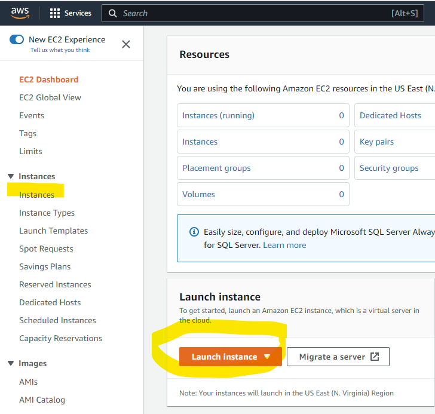
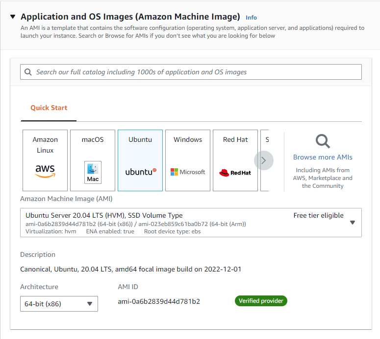
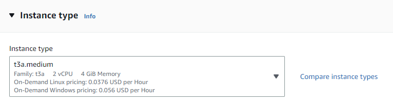
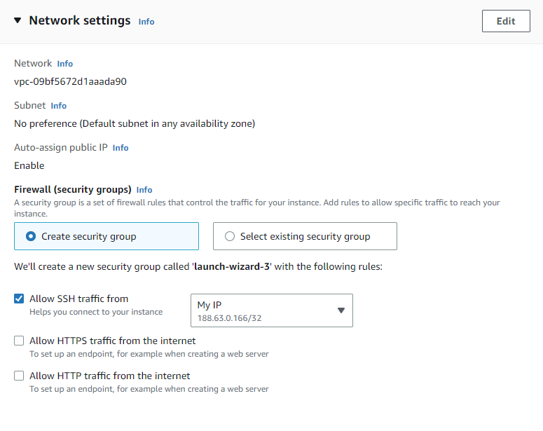
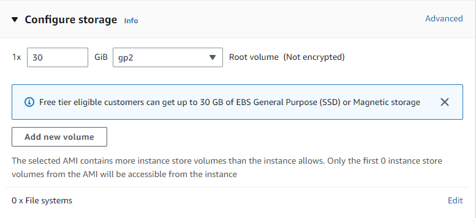
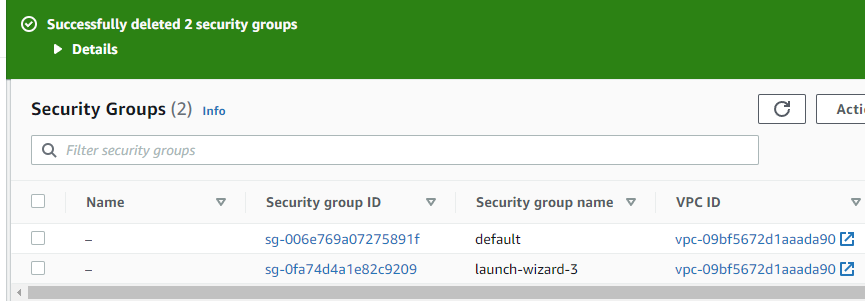
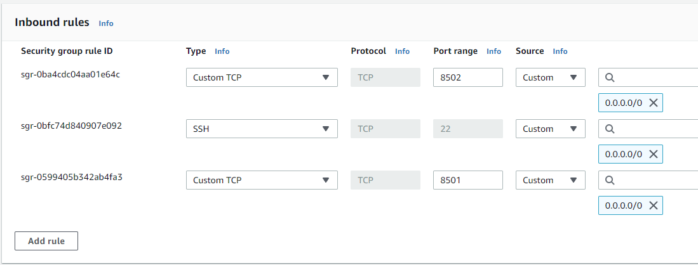

# How to set up an AWS instance

Creating an AWS instance requires access to an AWS account as a root user or as an IAM user with appropriate permissions.

IO-AVSTATS can be run on EC2 instances by default. 
The EC2 instances are managed on the EC2 Dashboard.

<kbd></kbd>

## 1. Instance creation

On the EC2 dashboard, select **Instances** and then **Launch instance**.

<kbd></kbd>

### 1.1 Name and tags

- **`IO-AVSTATS`**

<kbd></kbd>

### 1.2 Application and OS Images

- **`Ubuntu Server 20.04 LTS (HVM), SSD Volume Type`**

<kbd></kbd>

### 1.3 Instance type

- **`t3a.medium`**

<kbd></kbd>

### 1.4 Key pair (login)

- Either choose an existing one or create a new one.

<kbd></kbd>

### 1.5 Network settings

<kbd></kbd>

### 1.6 Configure Storage

- 1x **`30`** GiB

<kbd></kbd>

### 1.7 Launch instance

<kbd></kbd>

## 2. Open port numbers

Each Streamlit application must be assigned its own port number so that they can run simultaneously.
Currently, the following Streamlit applications are supported:

| Application                                                 |
|-------------------------------------------------------------|
| ae1982 - Aviation Events since since 1982                   |
| pd1982 - Profiling Data since 1982                          |
| slara  - Association Rule Analysis                          |
| stats  - Aviation Events since since 1982 - Limited Version |

### 2.1 Determine the security

To determine the security group assigned to the intance: on the EC2 dashboard, select **Instances** and then **Security**.

<kbd></kbd>

### 2.2 Choose the security group

To choose the security group assigned to the instance: on the EC2 dashboard, select **Security Groups** and **Security**.

<kbd></kbd>

### 2.3 Open the port numbers 

For each streamline application port number press **`Add rule`** and enter the data.

<kbd></kbd>

### 2.4 Finsh with **`Save rules`**

<kbd></kbd>

## 3. Upload installation script

On Windows, the [WinSCP](https://winscp.net/eng/index.php){:target="_blank"} program can be used to upload data from the local system to the AWS Cloud.
The script to be uploaded is called **`run_cloud_setup_instance.sh`**.

<kbd></kbd>

<kbd></kbd>

## 4. Run installation script

### 4.1 Load terminal window

<kbd></kbd>

<kbd></kbd>

<kbd></kbd>

### 4.2 **`run_cloud_setup_instance`**

**`chmod +x run_cloud_setup_instance.sh`** 

**`./run_cloud_setup_instance.sh`** 

**Example protocol**:

    ubuntu@ip-172-31-89-93:~$ chmod +x run_cloud_setup_instance.sh
    ubuntu@ip-172-31-89-93:~$ ./run_cloud_setup_instance.sh
    ==============================================================================
    Start ./run_cloud_setup_instance.sh
    ------------------------------------------------------------------------------
    DATE TIME : 19.12.2022 10:49:15
    ==============================================================================
    Supplement necessary system software
    ------------------------------------------------------------------------------
    Hit:1 http://us-east-1.ec2.archive.ubuntu.com/ubuntu focal InRelease
    Get:2 http://us-east-1.ec2.archive.ubuntu.com/ubuntu focal-updates InRelease [114 kB]
    Get:3 http://us-east-1.ec2.archive.ubuntu.com/ubuntu focal-backports InRelease [108 kB]
    Get:4 http://security.ubuntu.com/ubuntu focal-security InRelease [114 kB]
    Get:5 http://us-east-1.ec2.archive.ubuntu.com/ubuntu focal/universe amd64 Packages [8628 kB]
    Get:6 http://us-east-1.ec2.archive.ubuntu.com/ubuntu focal/universe Translation-en [5124 kB]
    Get:7 http://us-east-1.ec2.archive.ubuntu.com/ubuntu focal/universe amd64 c-n-f Metadata [265 kB]
    Get:8 http://us-east-1.ec2.archive.ubuntu.com/ubuntu focal/multiverse amd64 Packages [144 kB]
    Get:9 http://us-east-1.ec2.archive.ubuntu.com/ubuntu focal/multiverse Translation-en [104 kB]
    Get:10 http://us-east-1.ec2.archive.ubuntu.com/ubuntu focal/multiverse amd64 c-n-f Metadata [9136 B]
    Get:11 http://us-east-1.ec2.archive.ubuntu.com/ubuntu focal-updates/main amd64 Packages [2269 kB]
    Get:12 http://us-east-1.ec2.archive.ubuntu.com/ubuntu focal-updates/main Translation-en [395 kB]
    Get:13 http://us-east-1.ec2.archive.ubuntu.com/ubuntu focal-updates/main amd64 c-n-f Metadata [16.1 kB]
    Get:14 http://us-east-1.ec2.archive.ubuntu.com/ubuntu focal-updates/restricted amd64 Packages [1476 kB]
    Get:15 http://us-east-1.ec2.archive.ubuntu.com/ubuntu focal-updates/restricted Translation-en [208 kB]
    Get:16 http://us-east-1.ec2.archive.ubuntu.com/ubuntu focal-updates/restricted amd64 c-n-f Metadata [592 B]
    Get:17 http://us-east-1.ec2.archive.ubuntu.com/ubuntu focal-updates/universe amd64 Packages [1009 kB]
    Get:18 http://us-east-1.ec2.archive.ubuntu.com/ubuntu focal-updates/universe Translation-en [234 kB]
    Get:19 http://us-east-1.ec2.archive.ubuntu.com/ubuntu focal-updates/universe amd64 c-n-f Metadata [23.2 kB]
    Get:20 http://us-east-1.ec2.archive.ubuntu.com/ubuntu focal-updates/multiverse amd64 Packages [24.5 kB]
    Get:21 http://us-east-1.ec2.archive.ubuntu.com/ubuntu focal-updates/multiverse Translation-en [7380 B]
    Get:22 http://us-east-1.ec2.archive.ubuntu.com/ubuntu focal-updates/multiverse amd64 c-n-f Metadata [592 B]
    Get:23 http://us-east-1.ec2.archive.ubuntu.com/ubuntu focal-backports/main amd64 Packages [45.7 kB]
    Get:24 http://us-east-1.ec2.archive.ubuntu.com/ubuntu focal-backports/main Translation-en [16.3 kB]
    Get:25 http://us-east-1.ec2.archive.ubuntu.com/ubuntu focal-backports/main amd64 c-n-f Metadata [1420 B]
    Get:26 http://us-east-1.ec2.archive.ubuntu.com/ubuntu focal-backports/restricted amd64 c-n-f Metadata [116 B]
    Get:27 http://us-east-1.ec2.archive.ubuntu.com/ubuntu focal-backports/universe amd64 Packages [24.9 kB]
    Get:28 http://us-east-1.ec2.archive.ubuntu.com/ubuntu focal-backports/universe Translation-en [16.3 kB]
    Get:29 http://us-east-1.ec2.archive.ubuntu.com/ubuntu focal-backports/universe amd64 c-n-f Metadata [880 B]
    Get:30 http://us-east-1.ec2.archive.ubuntu.com/ubuntu focal-backports/multiverse amd64 c-n-f Metadata [116 B]
    Get:31 http://security.ubuntu.com/ubuntu focal-security/main amd64 Packages [1895 kB]
    Get:32 http://security.ubuntu.com/ubuntu focal-security/main Translation-en [311 kB]
    Get:33 http://security.ubuntu.com/ubuntu focal-security/main amd64 c-n-f Metadata [11.5 kB]
    Get:34 http://security.ubuntu.com/ubuntu focal-security/restricted amd64 Packages [1385 kB]
    Get:35 http://security.ubuntu.com/ubuntu focal-security/restricted Translation-en [195 kB]
    Get:36 http://security.ubuntu.com/ubuntu focal-security/restricted amd64 c-n-f Metadata [596 B]
    Get:37 http://security.ubuntu.com/ubuntu focal-security/universe amd64 Packages [778 kB]
    Get:38 http://security.ubuntu.com/ubuntu focal-security/universe Translation-en [150 kB]
    Get:39 http://security.ubuntu.com/ubuntu focal-security/universe amd64 c-n-f Metadata [16.8 kB]
    Get:40 http://security.ubuntu.com/ubuntu focal-security/multiverse amd64 Packages [22.2 kB]
    Get:41 http://security.ubuntu.com/ubuntu focal-security/multiverse Translation-en [5464 B]
    Get:42 http://security.ubuntu.com/ubuntu focal-security/multiverse amd64 c-n-f Metadata [516 B]
    Fetched 25.2 MB in 4s (5617 kB/s)
    Reading package lists...
    
    ...
    
    =============================================================================> Version  Docker Compose: 
     
    Current version of Docker Compose: docker-compose version 1.25.0, build unknown
    docker-py version: 4.1.0
    CPython version: 3.8.10
    OpenSSL version: OpenSSL 1.1.1f  31 Mar 2020
     
    ==============================================================================
     
    =============================================================================> Version  Docker Desktop: 
     
    Current version of Docker Desktop: Client: Docker Engine - Community
     Version:           20.10.22
     API version:       1.41
     Go version:        go1.18.9
     Git commit:        3a2c30b
     Built:             Thu Dec 15 22:28:08 2022
     OS/Arch:           linux/amd64
     Context:           default
     Experimental:      true
    
    Server: Docker Engine - Community
     Engine:
      Version:          20.10.22
      API version:      1.41 (minimum version 1.12)
      Go version:       go1.18.9
      Git commit:       42c8b31
      Built:            Thu Dec 15 22:25:58 2022
      OS/Arch:          linux/amd64
      Experimental:     false
     containerd:
      Version:          1.6.13
      GitCommit:        78f51771157abb6c9ed224c22013cdf09962315d
     runc:
      Version:          1.1.4
      GitCommit:        v1.1.4-0-g5fd4c4d
     docker-init:
      Version:          0.19.0
      GitCommit:        de40ad0
     
    ==============================================================================
     
    =============================================================================> Version  dos2unix: 
     
    Current version of dos2unix: dos2unix 7.4.0 (2017-10-10)
    With Unicode UTF-16 support.
    With native language support.
    With support to preserve the user and group ownership of files.
    LOCALEDIR: /usr/share/locale
    http://waterlan.home.xs4all.nl/dos2unix.html
     
    ==============================================================================
     
    =============================================================================> Version  unzip: 
     
    Current version of unzip: UnZip 6.00 of 20 April 2009, by Debian. Original by Info-ZIP.
    
    Latest sources and executables are at ftp://ftp.info-zip.org/pub/infozip/ ;
    see ftp://ftp.info-zip.org/pub/infozip/UnZip.html for other sites.
    
    Compiled with gcc 9.4.0 for Unix (Linux ELF).
    
    UnZip special compilation options:
            ACORN_FTYPE_NFS
            COPYRIGHT_CLEAN (PKZIP 0.9x unreducing method not supported)
            SET_DIR_ATTRIB
            SYMLINKS (symbolic links supported, if RTL and file system permit)
            TIMESTAMP
            UNIXBACKUP
            USE_EF_UT_TIME
            USE_UNSHRINK (PKZIP/Zip 1.x unshrinking method supported)
            USE_DEFLATE64 (PKZIP 4.x Deflate64(tm) supported)
            UNICODE_SUPPORT [wide-chars, char coding: UTF-8] (handle UTF-8 paths)
            LARGE_FILE_SUPPORT (large files over 2 GiB supported)
            ZIP64_SUPPORT (archives using Zip64 for large files supported)
            USE_BZIP2 (PKZIP 4.6+, using bzip2 lib version 1.0.8, 13-Jul-2019)
            VMS_TEXT_CONV
            WILD_STOP_AT_DIR
            [decryption, version 2.11 of 05 Jan 2007]
    
    UnZip and ZipInfo environment options:
               UNZIP:  [none]
            UNZIPOPT:  [none]
             ZIPINFO:  [none]
          ZIPINFOOPT:  [none]
     
    ==============================================================================
    
    --------------------------------------------------------------------------------
    DATE TIME : 19.12.2022 10:50:52
    --------------------------------------------------------------------------------
    End   ./run_cloud_setup_instance.sh
    ================================================================================
