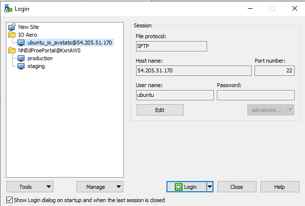
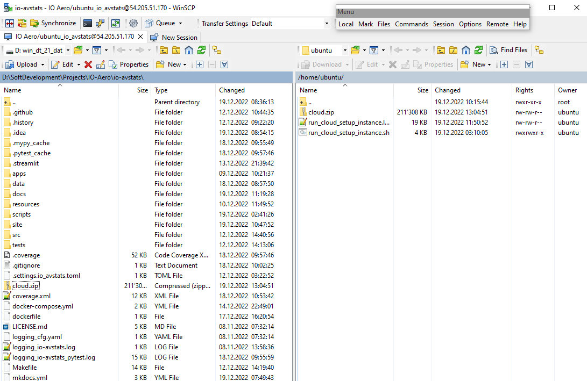
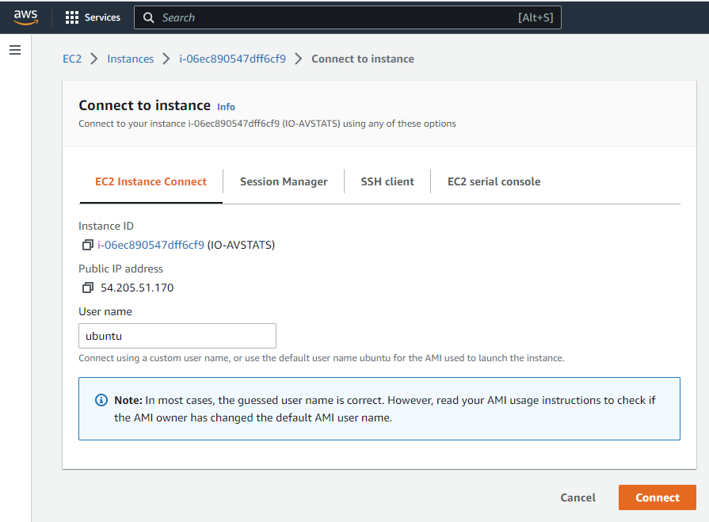
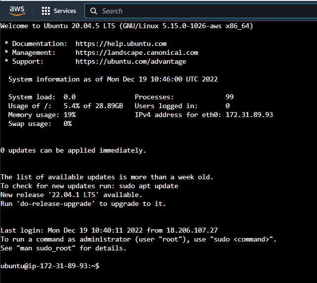

# How to update **IO-AVSTATS** in an AWS instance

The cloud version of **IO-AVSTATS** consists of a series of docker containers that are launched using Docker Compose.
For the PostgreSQL database, the official DockerHub image from [here](https://hub.docker.com/_/postgres) is used.
A separate Docker image is created for each of the Streamlit applications. 

## 1. Docker images

Currently, the following Streamlit applications are supported:

| Application | Description                             |
|-------------|-----------------------------------------|
| aaus1982    | Aircraft Accidents in the US since 1982 |
| pdus1982    | Profiling Data for the US since 1982    |

The **`data/run_create_image`** script can be used to generate a Docker image for each of these applications.

## 2. Zip local files

The **`run_cloud_files_zip`** script zips the required files into the **` cloud.zip`** file.
The very first thing the script does is stop the PostgreSQL database so that the database files are in a consistent state.

**Example protocol**:

```
`...`>scripts\run_cloud_files_zip
=======================================================================
Start scripts\run_cloud_files_zip
-----------------------------------------------------------------------
File Collection for AWS
-----------------------------------------------------------------------
The current time is: 13:04:45.23
Enter the new time:
=======================================================================

7-Zip (a) [32] 15.14 : Copyright (c) 1999-2015 Igor Pavlov : 2015-12-31

Scanning the drive:
3 files, 225736114 bytes (216 MiB)

Creating archive: cloud.zip

Items to compress: 3


Files read from disk: 3
Archive size: 216379120 bytes (207 MiB)
Everything is Ok

=======================================================================
Archive Content
-----------------------------------------------------------------------

7-Zip (a) [32] 15.14 : Copyright (c) 1999-2015 Igor Pavlov : 2015-12-31

Scanning the drive for archives:
1 file, 216379120 bytes (207 MiB)

Listing archive: cloud.zip

--
Path = cloud.zip
Type = zip
Physical Size = 216379120

   Date      Time    Attr         Size   Compressed  Name
------------------- ----- ------------ ------------  ------------------------
2022-12-18 08:50:04 ....A    225728618    216377107  data\latest_postgres.zip
2022-12-14 22:49:01 ....A         1677          443  docker-compose.yml
2022-12-19 02:59:47 ....A         5819         1070  scripts\run_docker_compose.sh
------------------- ----- ------------ ------------  ------------------------
2022-12-19 02:59:47          225736114    216378620  3 files
=======================================================================

-----------------------------------------------------------------------
The current time is: 13:04:52.02
Enter the new time:
-----------------------------------------------------------------------
End   scripts\run_cloud_files_zip
=======================================================================
```

## 3. Upload zip file

On Windows, the [WinSCP](https://winscp.net/eng/index.php){:target="_blank"} program can be used to upload the **`cloud.zip`** file from the local system to the AWS Cloud.

<kbd></kbd>

<kbd></kbd>

## 4. Load terminal window

<kbd></kbd>

<kbd></kbd>

<kbd></kbd>

## 5. Unzip in the cloud

First, the file **`cloud.zip`** is unzipped.

- **`unzip cloud.zip`**

Subsequently, the shell script must be made executable:

- **`chmod +x scripts/*.sh`**

Afterwards , a possibly running **IO-AVSTATS** is terminated.

- **`./scripts/run_docker_compose.sh down`**

Next, unzip the database files.

- **`cd data`**
- **`rm -rf postgres`**
- **`unzip latest_postgres.zip`**

Finally, clean up unnecessary files.

- **`rm latest_postgres.zip`**
- **`cd ..`**
- **`rm cloud.zip`**

## 5. Restart ***IO-AVSTATS**

- **`./scripts/run_docker_compose.sh up`**
