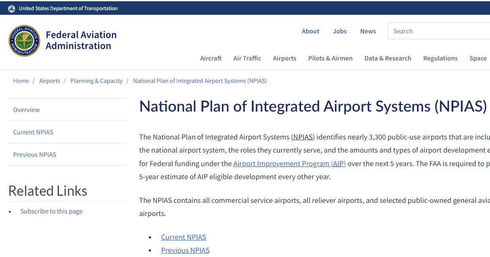

============
Data Sources
============

The data sources used are documented in detail here: `IO-XPA Data Processing <https://io-aero.github.io/io-olympus/io-data-sources/data_sources/io-avstats/index.html>`_

1. Accidents and Incidents
==========================

`NTSB <https://www.ntsb.gov/Pages/home.aspx>`_

The main data used in **IO-AVSTATS** is provided by the National Transportation Safety Board.
On the accident data page is the link `Downloadable data sets <https://www.ntsb.gov/safety/data/Pages/Data_Stats.aspx>`_, which contains the aviation accident data in MS Access format for free download.

.. list-table::
   :header-rows: 1

   * - File
     - Created (mm/dd/yyyy)
     - Description
   * - `avall.zip`
     - current
     - Data from January 1, 2008 to today
   * - `PRE1982.zip`
     - 10/27/2020
     - unknown
   * - `Pre2008.zip`
     - 09/30/2020
     - Data from January 1, 1982 to December 31, 2007
   * - `upDDMON.zip`
     - current
     - New additions and updates until DD day in the month MON

The schemas of the two databases `avall` and `Pre2008` are identical except for the two new optional columns `dec_latitude` and `dec_longitude` in the database table `events` of the database `avall`.

1.1 Database Schema Comparison
------------------------------

Before any new **NTSB** data set can be processed, the database schema of the new data set must first be compared with the database schema of the previous version of the **NTSB** data set `avall.mdb`.

Procedure:

- The RazorSQL program is started.
- Under 'Connections' select 'Add Connection Profile'.
- Select `MS Access` under `Add Connection Profile`.
- `Connection Type` is ODBC (Direct).
- In addition, an entry must be made at `Connection Profile Name` and `Database File`:
  - Connection Profile Name: IO-AVSTATS
  - Database File: IO-AVSTATS.mdb
- After pressing the `CONNECT` button you will be connected to the selected MS Access database.

- After opening the database, a SQL script with the DDL statements can be generated in the menu under `DB Tools` and `Generate DDL`.

.. image:: img/RazorSQL_Generate_DDL.png

- This SQL script can be saved as a file for further processing in the menu under `File` and `Save As`.

In case of any discrepancy, these must be implemented into the existing PostgreSQL database.

1.2 Table Processing Order
--------------------------

Based on the foreign keys (FK) present in the database schema, the following processing sequence results when creating the database schema and loading or updating the database tables:

Level 1 - without FK
- events

Level 2 - FK: `ev_id`
- aircraft
- dt_events
- NTSB_Admin

Level 3 - FK: `ev_id` & `Aircraft_Key`
- dt_aircraft
- engines
- Events_Sequence
- Findings
- Flight_Crew
- injury
- narratives
- Occurrences

Level 4 - FK: `ev_id` & `Aircraft_Key` & `crew_no`
- dt_Flight_Crew
- flight_time

Level 4 - FK: `ev_id` & `Aircraft_Key` & `Occurrence_No`
- seq_of_events

1.3 Issues
----------

The problem database tables listed below are not included in the PostgreSQL database schema.

A) Empty database tables
........................

The following database tables are included in the Entity Relationship Diagram (ERD), but they do not contain any data in the database:
- Occurrences
- seq_of_events

B) Legacy database tables
.........................

The following database tables are included in the database but are missing from the ERD:
- Country
- ct_iaids
- ct_seqevt
- eADMSPUB_DataDictionary
- states

C) Inconsistent database data - foreign key
...........................................

- database table `ntsb_admin`: database table `event` has no row with `ev_id` = `20210527103155` (data source: `avall.zip`) - as a consequence, the foreign key to the events table had to be removed

D) Inconsistent database data - country USA and state
.....................................................

.. code-block:: sql

   SELECT ev_state,
          count(*)
   FROM events
   WHERE ev_country = 'USA'
     AND NOT ev_state IN (SELECT state
                            FROM io_states ius)
   GROUP BY ev_state
   ORDER BY ev_state

.. list-table::
   :header-rows: 1

   * - ev_state
     - count
   * - AO
     - 17
   * - CB
     - 1
   * - GM
     - 45
   * - GU
     - 8
   * - OF
     - 14
   * - PO
     - 15
   * - PR
     - 112
   * - UN
     - 3
   * - VI
     - 6

E) ...Inconsistent database data - invalid USA latitude
.......................................................

.. code-block:: sql

   SELECT count(*)
     FROM io_lat_lng_issues
    WHERE io_dec_lat_lng_actions LIKE '%ERROR.00.920%'

.. list-table::
   :header-rows: 1

   * - count
   * - 430

F) Inconsistent database data - invalid USA longitude
.....................................................

.. code-block:: sql

   SELECT count(*)
     FROM io_lat_lng_issues
    WHERE io_dec_lat_lng_actions LIKE '%ERROR.00.921%'

.. list-table::
   :header-rows: 1

   * - count
   * - 462

2. Airports and Runways
=======================

`2.1 FAA Airports <https://adds-faa.opendata.arcgis.com/datasets/faa::airports-1/explore?location=0.158824%2C-1.633886%2C2.00>`_
--------------------------------------------------------------------------------------------------------------------------------

The FAA provides data on airports in the United States in the form of a csv file.
This data is updated by the FAA at irregular intervals.

.. image:: img/FAA_Airports.png

`2.2 FAA Runways <https://adds-faa.opendata.arcgis.com/datasets/faa::runways/explore?location=0.059024%2C-1.628764%2C2.00>`_
----------------------------------------------------------------------------------------------------------------------------

The FAA provides data on runways in the United States in the form of a csv file.
This data is updated by the FAA at irregular intervals.

.. image:: img/FAA_Runways.png

`2.3 National Plan of Integrated Airport Systems (NPIAS) <https://www.faa.gov/airports/planning_capacity/npias/current>`_
-------------------------------------------------------------------------------------------------------------------------

The FAA provides data on preferred airports in the United States in the form of an MS Excel file.
This data is updated by the FAA at irregular intervals.

`3. AVIATION OCCURRENCE CATEGORIES <https://www.ntsb.gov/safety/data/Documents/datafiles/OccurrenceCategoryDefinitions.pdf>`_
=============================================================================================================================

The CICTT codes used in the **`Aviation_Occurrence_Categories/aviation_occurrence_categories.xlsx`** file is taken from `this document <https://www.ntsb.gov/safety/data/Documents/datafiles/OccurrenceCategoryDefinitions.pdf>`_.

.. image:: img/aviation_occurrence_categories_pdf.png

`4. Countries <https://github.com/mledoze/countries/>`_
=======================================================

This repository contains a list of world countries, as defined by ISO Standard 3166-1, in JSON, CSV, XML and YAML.

`4.1. geodatos <https://www.geodatos.net/en>`_
----------------------------------------------

The decimal latitude and longitude for the USA used in the **`Countries_States/countries_states.json`** file is taken from the `geodatos website <https://www.geodatos.net/en/coordinates/united-states>`_.

.. image:: img/geodatos.png

5. Look-up Tables
=================

This document outlines the lookup tables used within the Streamlit application.
These tables provide standardized codes and descriptions for various categories, events, modifiers, phases, sections, subcategories, and subsections related to aviation accidents and incidents, ensuring consistent data management and analysis.

  - io_md_codes_category from findings (category_no, finding_description)
  - io_md_codes_eventsoe from events_sequence (eventsoe_no, occurrence_description)
  - io_md_codes_modifier from findings (modifier_no, finding_description)
  - io_md_codes_phase from events_sequence (phase_no, occurrence_description)
  - io_md_codes_section from findings (category_no, subcategory_no, section_no, finding_description)
  - io_md_codes_subcategory from findings (category_no, subcategory_no, finding_description)
  - io_md_codes_subsection from findings (category_no, subcategory_no, section_no, subsection_no, finding_description)

6. Sequence of Events
=====================

The content of the database table `io_sequence_of_events` is created based on the following csv file.
The file was provided to Loyd by the NTSB.

.. image:: img/CICTT_SOE_MAP.png

`7. simplemaps <https://simplemaps.com/>`_
===========================================

In order to fill in the missing decimal latitudes and longitudes, free available data from **simplemaps** is used.
simplemaps offers postal codes and cities with their latitude and longitude.

The `US Zip Codes Database <https://simplemaps.com/data/us-zips>`_ link provides latitude and longitude for selected US zip codes:

.. image:: img/uszips.png

The `United States Cities Database <https://simplemaps.com/data/us-cities>`_ link provides latitude and longitude for selected US cities:

8. States
=========

`opendatasoft <https://www.opendatasoft.com/?hsLang=en>`_

The decimal latitudes and longitudes for the US states used in the **`Countries_States/countries_states.json`** file are taken from the `opendatasoft website <https://public.opendatasoft.com/explore/dataset/us-state-boundaries/export/>`_.

.. image:: img/opendatasoft.png

`9. United States Zip Codes.org <https://www.unitedstateszipcodes.org/>`_
=========================================================================

In order to fill in the missing decimal latitudes and longitudes, free available data from **United States Zip Codes.org** is used.
**United States Zip Codes.org** offers more complete postal codes but only with estimated latitudes and longitudes.

.. image:: img/zip_code_database.png

.. End
