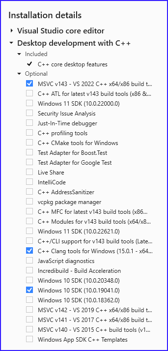

=============
Release Notes
=============

.. Templates
   ===
   New Features
   ------------
   Modified Features
   -----------------
   Deleted Features
   ----------------
   Applied Software
   ----------------
   Windows-specific Software
   .........................
   Open Issues
   -----------
   Detailed Open Issues
   --------------------
   Processed files
   ---------------
   ===
   `FAA - Aeronautical data Delivery Service <https://adds-faa.opendata.arcgis.com>`__\
   ....................................................................................
   Data source `Airports`
   ^^^^^^^^^^^^^^^^^^^^^^
   - Download link: `Version: 10/05/2023 <https://adds-faa.opendata.arcgis.com/datasets/faa::airports-1/explore?location=0.007428%2C-1.633886%2C2.00>`__\
   Data source `Runways`
   ^^^^^^^^^^^^^^^^^^^^^^
   - Download link: `Version: 10/05/2023 <https://https://adds-faa.opendata.arcgis.com/datasets/faa::runways/explore?location=0.002760%2C-1.628764%2C2.00>`__\
   ===
   `NTSB - National Transport Safety Board <https://www.ntsb.gov/Pages/home.aspx>`__\
   ..................................................................................
   Data source `avall.zip`
   ^^^^^^^^^^^^^^^^^^^^^^^
   - Download link: `01/01/2024 06:23:50 AM <https://data.ntsb.gov/avdata/FileDirectory/DownloadFile?fileID=C%3A%5Cavdata%5Cavall.zip>`__\
   Data source `up15JAN.zip`
   ^^^^^^^^^^^^^^^^^^^^^^^^^
   - Download link: `01/08/2024 3:00:17 AM <https://data.ntsb.gov/avdata/FileDirectory/DownloadFile?fileID=C%3A%5Cavdata%5Cup08JAN.zip>`__\
   ===
   `simplemaps - Interactive Maps & Data <https://simplemaps.com/>`__\
   ..................................................................................
   Data source `United States Cities Database`
   ^^^^^^^^^^^^^^^^^^^^^^^^^^^^^^^^^^^^^^^^^^^
   - Download link: `Version: 11/12/2023 <https://simplemaps.com/data/us-cities>`__\
   Data source `US Zip Codes Database`
   ^^^^^^^^^^^^^^^^^^^^^^^^^^^^^^^^^^^
   - Download link: `Version: 11/12/2023 <https://simplemaps.com/data/us-zips>`__\

Version 24.05.15
================

Release Date: 15.04.2024

Applied Software
----------------

.. list-table::
   :header-rows: 1
   :widths: 30 10 20 10

   * - Software
     - Version
     - Remark
     - Status
   * - Docker Desktop
     - 4.30.0
     -
     -
   * - PostgreSQL
     - 16.3
     -
     - upgrade
   * - Python
     - 3.11.9
     -
     -
   * - RazorSQL
     - 10.5.5
     -
     -

Windows-specific Software
.........................

**Important**: All software components should be installed in the 64 bit version!

.. list-table::
   :header-rows: 1
   :widths: 30 10 20 10

   * - Software
     - Version
     - Remark
     - Status
   * - 7-Zip
     - 23.01
     -
     -
   * - Make for Windows
     - 3.81
     -
     -
   * - MS Access Database Engine 2016 Redistributable
     - 8/11/2020
     -
     -

Processed files
---------------

`NTSB - National Transport Safety Board <https://www.ntsb.gov/Pages/home.aspx>`__\
..................................................................................

Data source `up15MAY`
^^^^^^^^^^^^^^^^^^^^^^^^^

- Download link: `05/15/2024 3:00:30 AM <https://data.ntsb.gov/avdata/FileDirectory/DownloadFile?fileID=C%3A%5Cavdata%5Cup15MAY.zip>`__\

Version 24.05.08
================

Release Date: 10.05.2024

Modified Features
-----------------

- Binary version with Nuitka.

Applied Software
----------------

.. list-table::
   :header-rows: 1
   :widths: 30 10 20 10

   * - Software
     - Version
     - Remark
     - Status
   * - Docker Desktop
     - 4.30.0
     -
     - upgrade
   * - PostgreSQL
     - 16.3
     -
     - upgrade
   * - Python
     - 3.11.9
     -
     -
   * - RazorSQL
     - 10.5.5
     -
     - upgrade

Windows-specific Software
.........................

**Important**: All software components should be installed in the 64 bit version!

.. list-table::
   :header-rows: 1
   :widths: 30 10 20 10

   * - Software
     - Version
     - Remark
     - Status
   * - 7-Zip
     - 23.01
     -
     -
   * - Make for Windows
     - 3.81
     -
     -
   * - MS Access Database Engine 2016 Redistributable
     - 8/11/2020
     -
     -

Processed files
---------------

`NTSB - National Transport Safety Board <https://www.ntsb.gov/Pages/home.aspx>`__\
..................................................................................

Data source `up08APR.zip`
^^^^^^^^^^^^^^^^^^^^^^^^^

- Download link: `05/08/2024 3:00:19 AM <https://data.ntsb.gov/avdata/FileDirectory/DownloadFile?fileID=C%3A%5Cavdata%5Cup08MAY.zip>`__\

Version 24.05.01
================

Release Date: 01.05.2024

Applied Software
----------------

.. list-table::
   :header-rows: 1
   :widths: 30 10 20 10

   * - Software
     - Version
     - Remark
     - Status
   * - Docker Desktop
     - 4.29.0
     -
     -
   * - PostgreSQL
     - 16.2
     -
     -
   * - Python
     - 3.11.9
     -
     -
   * - RazorSQL
     - 10.5.4
     -
     -

Windows-specific Software
.........................

**Important**: All software components should be installed in the 64 bit version!

.. list-table::
   :header-rows: 1
   :widths: 30 10 20 10

   * - Software
     - Version
     - Remark
     - Status
   * - 7-Zip
     - 23.01
     -
     -
   * - Make for Windows
     - 3.81
     -
     -
   * - MS Access Database Engine 2016 Redistributable
     - 8/11/2020
     -
     -
   * - Visual Studio Community 2022
     - 2022
     -
     -

Minimal Requirements Visual Studio Community 2022
^^^^^^^^^^^^^^^^^^^^^^^^^^^^^^^^^^^^^^^^^^^^^^^^^

Processed files
---------------

`simplemaps - Interactive Maps & Data <https://simplemaps.com/>`__\
..................................................................................

Data source `US Zip Codes Database`
^^^^^^^^^^^^^^^^^^^^^^^^^^^^^^^^^^^
- Download link: `Version: 1.85 <https://simplemaps.com/data/us-zips>`__\

`NTSB - National Transport Safety Board <https://www.ntsb.gov/Pages/home.aspx>`__\
..................................................................................

Data source `avall.zip`
^^^^^^^^^^^^^^^^^^^^^^^

- Download link: `05/01/2024 06:16:00 AM <https://data.ntsb.gov/avdata/FileDirectory/DownloadFile?fileID=C%3A%5Cavdata%5Cavall.zip>`__\

Data source `up01MAY.zip`
^^^^^^^^^^^^^^^^^^^^^^^^^

- Download link: `05/01/2024 3:00:20 AM <https://data.ntsb.gov/avdata/FileDirectory/DownloadFile?fileID=C%3A%5Cavdata%5Cup01MAY.zip>`__\

Version 24.04.22
================

Release Date: 22.04.2024

Modified Features
-----------------

- Migration to Python 3.11.
- pipenv replaced by conda.

Applied Software
----------------

.. list-table::
   :header-rows: 1
   :widths: 30 10 20 10

   * - Software
     - Version
     - Remark
     - Status
   * - Docker Desktop
     - 4.29.0
     -
     - upgrade
   * - Python
     - 3.11.9
     -
     - upgrade
   * - RazorSQL
     - 10.5.4
     -
     - upgrade

Windows-specific Software
.........................

**Important**: All software components should be installed in the 64 bit version!

.. list-table::
   :header-rows: 1
   :widths: 30 10 20 10

   * - Software
     - Version
     - Remark
     - Status
   * - 7-Zip
     - 23.01
     -
     -
   * - Make for Windows
     - 3.81
     -
     -
   * - MS Access Database Engine 2016 Redistributable
     - 8/11/2020
     -
     -

Processed files
---------------

`NTSB - National Transport Safety Board <https://www.ntsb.gov/Pages/home.aspx>`__\
..................................................................................

Data source `up22APR.zip`
^^^^^^^^^^^^^^^^^^^^^^^^^

- Download link: `04/22/2024 3:00:19 AM <https://data.ntsb.gov/avdata/FileDirectory/DownloadFile?fileID=C%3A%5Cavdata%5Cup22APR.zip>`__\

Version 24.04.15
================

Release Date: 15.04.2024

Modified Features
-----------------

- Removing CodeArtifact.

Applied Software
----------------

.. list-table::
   :header-rows: 1
   :widths: 30 10 20 10

   * - Software
     - Version
     - Remark
     - Status
   * - Docker Desktop
     - 4.28.0
     -
     -
   * - Python
     - 3.10.11
     -
     -
   * - RazorSQL
     - 10.5.3
     -
     -

Windows-specific Software
.........................

**Important**: All software components should be installed in the 64 bit version!

.. list-table::
   :header-rows: 1
   :widths: 30 10 20 10

   * - Software
     - Version
     - Remark
     - Status
   * - 7-Zip
     - 23.01
     -
     -
   * - Make for Windows
     - 3.81
     -
     -
   * - MS Access Database Engine 2016 Redistributable
     - 8/11/2020
     -
     -

Processed files
---------------

`NTSB - National Transport Safety Board <https://www.ntsb.gov/Pages/home.aspx>`__\
..................................................................................

Data source `up15APR.zip`
^^^^^^^^^^^^^^^^^^^^^^^^^

- Download link: `04/15/2024 3:00:27 AM <https://data.ntsb.gov/avdata/FileDirectory/DownloadFile?fileID=C%3A%5Cavdata%5Cup15APR.zip>`__\

Version 24.04.08
================

Release Date: 08.04.2024

Modified Features
-----------------

- Removing CodeArtifact.

Applied Software
----------------

.. list-table::
   :header-rows: 1
   :widths: 30 10 20 10

   * - Software
     - Version
     - Remark
     - Status
   * - Docker Desktop
     - 4.28.0
     -
     -
   * - Python
     - 3.10.11
     -
     -
   * - RazorSQL
     - 10.5.3
     -
     -

Windows-specific Software
.........................

**Important**: All software components should be installed in the 64 bit version!

.. list-table::
   :header-rows: 1
   :widths: 30 10 20 10

   * - Software
     - Version
     - Remark
     - Status
   * - 7-Zip
     - 23.01
     -
     -
   * - Make for Windows
     - 3.81
     -
     -
   * - MS Access Database Engine 2016 Redistributable
     - 8/11/2020
     -
     -

Processed files
---------------

`NTSB - National Transport Safety Board <https://www.ntsb.gov/Pages/home.aspx>`__\
..................................................................................

Data source `up08APR.zip`
^^^^^^^^^^^^^^^^^^^^^^^^^

- Download link: `04/08/2024 3:00:20 AM <https://data.ntsb.gov/avdata/FileDirectory/DownloadFile?fileID=C%3A%5Cavdata%5Cup08APR.zip>`__\

Version 24.04.01
================

Release Date: 01.04.2024

Applied Software
----------------

.. list-table::
   :header-rows: 1
   :widths: 30 10 20 10

   * - Software
     - Version
     - Remark
     - Status
   * - AWS CLI
     - 2.15.34
     -
     - upgrade
   * - Docker Desktop
     - 4.28.0
     -
     -
   * - Python
     - 3.10.11
     -
     -
   * - RazorSQL
     - 10.5.3
     -
     -

Windows-specific Software
.........................

**Important**: All software components should be installed in the 64 bit version!

.. list-table::
   :header-rows: 1
   :widths: 30 10 20 10

   * - Software
     - Version
     - Remark
     - Status
   * - 7-Zip
     - 23.01
     -
     -
   * - Make for Windows
     - 3.81
     -
     -
   * - MS Access Database Engine 2016 Redistributable
     - 8/11/2020
     -
     -

Processed files
---------------

`FAA - Aeronautical data Delivery Service <https://adds-faa.opendata.arcgis.com>`__\
....................................................................................

Data source `Airports`
^^^^^^^^^^^^^^^^^^^^^^
- Download link: `Version: 03/21/2024 <https://adds-faa.opendata.arcgis.com/datasets/faa::airports-1/explore?location=0.007405%2C-1.633886%2C2.00>`__\

Data source `Runways`
^^^^^^^^^^^^^^^^^^^^^^
- Download link: `Version: 03/21/2024 <https://adds-faa.opendata.arcgis.com/datasets/faa::runways/explore?location=0.002752%2C-1.628764%2C2.00>`__\

`NTSB - National Transport Safety Board <https://www.ntsb.gov/Pages/home.aspx>`__\
..................................................................................

Data source `avall.zip`
^^^^^^^^^^^^^^^^^^^^^^^

- Download link: `04/01/2024 06:09:05 AM <https://data.ntsb.gov/avdata/FileDirectory/DownloadFile?fileID=C%3A%5Cavdata%5Cavall.zip>`__\

Data source `up01APR.zip`
^^^^^^^^^^^^^^^^^^^^^^^^^

- Download link: `04/01/2024 3:00:22 AM <https://data.ntsb.gov/avdata/FileDirectory/DownloadFile?fileID=C%3A%5Cavdata%5Cup01APR.zip>`__\

Version 24.03.22
================

Release Date: 22.03.2024

Modified Features
-----------------

- Applying ruff to the code.

Applied Software
----------------

.. list-table::
   :header-rows: 1
   :widths: 30 10 20 10

   * - Software
     - Version
     - Remark
     - Status
   * - AWS CLI
     - 2.15.31
     -
     - upgrade
   * - Docker Desktop
     - 4.28.0
     -
     -
   * - Python
     - 3.10.11
     -
     -
   * - RazorSQL
     - 10.5.3
     -
     -

Windows-specific Software
.........................

**Important**: All software components should be installed in the 64 bit version!

.. list-table::
   :header-rows: 1
   :widths: 30 10 20 10

   * - Software
     - Version
     - Remark
     - Status
   * - 7-Zip
     - 23.01
     -
     -
   * - Make for Windows
     - 3.81
     -
     -
   * - MS Access Database Engine 2016 Redistributable
     - 8/11/2020
     -
     -

Processed files
---------------

`NTSB - National Transport Safety Board <https://www.ntsb.gov/Pages/home.aspx>`__\
..................................................................................

Data source `up15MAR.zip`
^^^^^^^^^^^^^^^^^^^^^^^^^

- Download link: `03/22/2024 3:00:23 AM <https://data.ntsb.gov/avdata/FileDirectory/DownloadFile?fileID=C%3A%5Cavdata%5Cup22MAR.zip>`__\

Version 24.03.15
================

Release Date: 15.03.2024

Modified Features
-----------------

- Using Pandas to load csv, xls and xlsx data.

Applied Software
----------------

.. list-table::
   :header-rows: 1
   :widths: 30 10 20 10

   * - Software
     - Version
     - Remark
     - Status
   * - AWS CLI
     - 2.15.29
     -
     - upgrade
   * - Docker Desktop
     - 4.28.0
     -
     -
   * - Python
     - 3.10.11
     -
     -
   * - RazorSQL
     - 10.5.3
     -
     -

Windows-specific Software
.........................

**Important**: All software components should be installed in the 64 bit version!

.. list-table::
   :header-rows: 1
   :widths: 30 10 20 10

   * - Software
     - Version
     - Remark
     - Status
   * - 7-Zip
     - 23.01
     -
     -
   * - Make for Windows
     - 3.81
     -
     -
   * - MS Access Database Engine 2016 Redistributable
     - 8/11/2020
     -
     -

Processed files
---------------

`NTSB - National Transport Safety Board <https://www.ntsb.gov/Pages/home.aspx>`__\
..................................................................................

Data source `up15MAR.zip`
^^^^^^^^^^^^^^^^^^^^^^^^^

- Download link: `03/15/2024 8:28:07 AM <https://data.ntsb.gov/avdata/FileDirectory/DownloadFile?fileID=C%3A%5Cavdata%5Cup15MAR.zip>`__\

Version 24.03.08
================

Release Date: 08.03.2024

Applied Software
----------------

.. list-table::
   :header-rows: 1
   :widths: 30 10 20 10

   * - Software
     - Version
     - Remark
     - Status
   * - AWS CLI
     - 2.15.26
     -
     - upgrade
   * - Docker Desktop
     - 4.28.0
     -
     - upgrade
   * - Python
     - 3.10.11
     -
     -
   * - RazorSQL
     - 10.5.3
     -
     -

Windows-specific Software
.........................

**Important**: All software components should be installed in the 64 bit version!

.. list-table::
   :header-rows: 1
   :widths: 30 10 20 10

   * - Software
     - Version
     - Remark
     - Status
   * - 7-Zip
     - 23.01
     -
     -
   * - Make for Windows
     - 3.81
     -
     -
   * - MS Access Database Engine 2016 Redistributable
     - 8/11/2020
     -
     -

Processed files
---------------

`FAA - Aeronautical data Delivery Service <https://adds-faa.opendata.arcgis.com>`__\
....................................................................................

Data source `Airports`
^^^^^^^^^^^^^^^^^^^^^^
- Download link: `Version: 02/21/2024 <https://adds-faa.opendata.arcgis.com/datasets/faa::airports-1/explore?location=0.007405%2C-1.633886%2C2.00>`__\

Data source `Runways`
^^^^^^^^^^^^^^^^^^^^^^
- Download link: `Version: 02/20/2024 <https://adds-faa.opendata.arcgis.com/datasets/faa::runways/explore?location=0.002752%2C-1.628764%2C2.00>`__\

`NTSB - National Transport Safety Board <https://www.ntsb.gov/Pages/home.aspx>`__\
..................................................................................

Data source `up08MAR.zip`
^^^^^^^^^^^^^^^^^^^^^^^^^

- Download link: `03/08/2024 3:00:14 AM <https://data.ntsb.gov/avdata/FileDirectory/DownloadFile?fileID=C%3A%5Cavdata%5Cup08MAR.zip>`__\

Version 24.03.01
================

Release Date: 01.03.2024

Applied Software
----------------

.. list-table::
   :header-rows: 1
   :widths: 30 10 20 10

   * - Software
     - Version
     - Remark
     - Status
   * - AWS CLI
     - 2.15.20
     -
     -
   * - Docker Desktop
     - 4.27.2
     -
     - upgrade
   * - Python
     - 3.10.11
     -
     -
   * - RazorSQL
     - 10.5.3
     -
     -

Windows-specific Software
.........................

**Important**: All software components should be installed in the 64 bit version!

.. list-table::
   :header-rows: 1
   :widths: 30 10 20 10

   * - Software
     - Version
     - Remark
     - Status
   * - 7-Zip
     - 23.01
     -
     -
   * - Make for Windows
     - 3.81
     -
     -
   * - MS Access Database Engine 2016 Redistributable
     - 8/11/2020
     -
     -

Minimal Requirements Visual Studio Community 2022
^^^^^^^^^^^^^^^^^^^^^^^^^^^^^^^^^^^^^^^^^^^^^^^^^

Processed files
---------------

`NTSB - National Transport Safety Board <https://www.ntsb.gov/Pages/home.aspx>`__\
..................................................................................

Data source `avall.zip`
^^^^^^^^^^^^^^^^^^^^^^^

- Download link: `03/01/2024 06:03:06 AM <https://data.ntsb.gov/avdata/FileDirectory/DownloadFile?fileID=C%3A%5Cavdata%5Cavall.zip>`__\

Data source `up01MAR.zip`
^^^^^^^^^^^^^^^^^^^^^^^^^

- Download link: `03/01/2024 3:00:23 AM <https://data.ntsb.gov/avdata/FileDirectory/DownloadFile?fileID=C%3A%5Cavdata%5Cup01MAR.zip>`__\

Version 24.02.22
================

Release Date: 22.02.2024

Applied Software
----------------

.. list-table::
   :header-rows: 1
   :widths: 30 10 20 10

   * - Software
     - Version
     - Remark
     - Status
   * - AWS CLI
     - 2.15.20
     -
     -
   * - Docker Desktop
     - 4.27.1
     -
     -
   * - Python
     - 3.10.11
     -
     -
   * - RazorSQL
     - 10.5.3
     -
     -

Windows-specific Software
.........................

**Important**: All software components should be installed in the 64 bit version!

.. list-table::
   :header-rows: 1
   :widths: 30 10 20 10

   * - Software
     - Version
     - Remark
     - Status
   * - 7-Zip
     - 23.01
     -
     -
   * - Make for Windows
     - 3.81
     -
     -
   * - MS Access Database Engine 2016 Redistributable
     - 8/11/2020
     -
     -

Processed files
---------------

`NTSB - National Transport Safety Board <https://www.ntsb.gov/Pages/home.aspx>`__\
..................................................................................

Data source `up22FEB.zip`
^^^^^^^^^^^^^^^^^^^^^^^^^

- Download link: `02/22/2024 3:00:14 AM <https://data.ntsb.gov/avdata/FileDirectory/DownloadFile?fileID=C%3A%5Cavdata%5Cup22FEB.zip>`__\

Version 24.02.15
================

Release Date: 15.02.2024

Applied Software
----------------

.. list-table::
   :header-rows: 1
   :widths: 30 10 20 10

   * - Software
     - Version
     - Remark
     - Status
   * - AWS CLI
     - 2.15.20
     -
     - upgrade
   * - Docker Desktop
     - 4.27.1
     -
     - upgrade
   * - Python
     - 3.10.11
     -
     -
   * - RazorSQL
     - 10.5.3
     -
     -

Windows-specific Software
.........................

**Important**: All software components should be installed in the 64 bit version!

.. list-table::
   :header-rows: 1
   :widths: 30 10 20 10

   * - Software
     - Version
     - Remark
     - Status
   * - 7-Zip
     - 23.01
     -
     -
   * - Make for Windows
     - 3.81
     -
     -
   * - MS Access Database Engine 2016 Redistributable
     - 8/11/2020
     -
     -

Processed files
---------------

`NTSB - National Transport Safety Board <https://www.ntsb.gov/Pages/home.aspx>`__\
..................................................................................

Data source `up15FEB.zip`
^^^^^^^^^^^^^^^^^^^^^^^^^

- Download link: `02/15/2024 3:00:23 AM <https://data.ntsb.gov/avdata/FileDirectory/DownloadFile?fileID=C%3A%5Cavdata%5Cup15FEB.zip>`__\

Version 24.02.08
================

Release Date: 08.02.2024

Applied Software
----------------

.. list-table::
   :header-rows: 1
   :widths: 30 10 20 10

   * - Software
     - Version
     - Remark
     - Status
   * - AWS CLI
     - 2.15.16
     -
     - upgrade
   * - Docker Desktop
     - 4.26.1
     -
     -
   * - PostgreSQL
     - 16.1
     -
     -
   * - Python
     - 3.10.11
     -
     -
   * - RazorSQL
     - 10.5.3
     -
     - upgrade

Windows-specific Software
.........................

**Important**: All software components should be installed in the 64 bit version!

.. list-table::
   :header-rows: 1
   :widths: 30 10 20 10

   * - Software
     - Version
     - Remark
     - Status
   * - 7-Zip
     - 23.01
     -
     -
   * - The LLVM Compiler Infrastructure
     - 17.0.6
     -
     -
   * - Make for Windows
     - 3.81
     -
     -
   * - MS Access Database Engine 2016 Redistributable
     - 8/11/2020
     -
     -
   * - Visual Studio Community 2022
     - 2022
     -
     -

Minimal Requirements Visual Studio Community 2022
^^^^^^^^^^^^^^^^^^^^^^^^^^^^^^^^^^^^^^^^^^^^^^^^^

Processed files
---------------

`NTSB - National Transport Safety Board <https://www.ntsb.gov/Pages/home.aspx>`__\
..................................................................................

Data source `up08FEB.zip`
^^^^^^^^^^^^^^^^^^^^^^^^^

- Download link: `02/08/2024 3:00:18 AM <https://data.ntsb.gov/avdata/FileDirectory/DownloadFile?fileID=C%3A%5Cavdata%5Cup08FEB.zip>`__\

Version 24.02.01
================

Release Date: 01.02.2024

Applied Software
----------------

.. list-table::
   :header-rows: 1
   :widths: 30 10 20 10

   * - Software
     - Version
     - Remark
     - Status
   * - AWS CLI
     - 2.15.16
     -
     - upgrade
   * - Docker Desktop
     - 4.26.1
     -
     -
   * - PostgreSQL
     - 16.1
     -
     -
   * - Python
     - 3.10.11
     -
     -
   * - RazorSQL
     - 10.5.3
     -
     - upgrade

Windows-specific Software
.........................

**Important**: All software components should be installed in the 64 bit version!

.. list-table::
   :header-rows: 1
   :widths: 30 10 20 10

   * - Software
     - Version
     - Remark
     - Status
   * - 7-Zip
     - 23.01
     -
     -
   * - The LLVM Compiler Infrastructure
     - 17.0.6
     -
     -
   * - Make for Windows
     - 3.81
     -
     -
   * - MS Access Database Engine 2016 Redistributable
     - 8/11/2020
     -
     -
   * - Visual Studio Community 2022
     - 2022
     -
     -

Minimal Requirements Visual Studio Community 2022
^^^^^^^^^^^^^^^^^^^^^^^^^^^^^^^^^^^^^^^^^^^^^^^^^

Processed files
---------------

`FAA - Aeronautical data Delivery Service <https://adds-faa.opendata.arcgis.com>`__\
....................................................................................

Data source `Airports`
^^^^^^^^^^^^^^^^^^^^^^
- Download link: `Version: 01/25/2024 <https://adds-faa.opendata.arcgis.com/datasets/faa::airports-1/explore?location=0.007405%2C-1.633886%2C2.00>`__\

Data source `Runways`
^^^^^^^^^^^^^^^^^^^^^^
- Download link: `Version: 01/25/2024 <https://adds-faa.opendata.arcgis.com/datasets/faa::runways/explore?location=0.002752%2C-1.628764%2C2.00>`__\

`simplemaps - Interactive Maps & Data <https://simplemaps.com/>`__\
..................................................................................

Data source `United States Cities Database`
^^^^^^^^^^^^^^^^^^^^^^^^^^^^^^^^^^^^^^^^^^^
- Download link: `Version: 1.78 <https://simplemaps.com/data/us-cities>`__\

Data source `US Zip Codes Database`
^^^^^^^^^^^^^^^^^^^^^^^^^^^^^^^^^^^
- Download link: `Version: 1.84 <https://simplemaps.com/data/us-zips>`__\

`NTSB - National Transport Safety Board <https://www.ntsb.gov/Pages/home.aspx>`__\
..................................................................................

Data source `avall.zip`
^^^^^^^^^^^^^^^^^^^^^^^

- Download link: `02/01/2024 06:15:30 AM <https://data.ntsb.gov/avdata/FileDirectory/DownloadFile?fileID=C%3A%5Cavdata%5Cavall.zip>`__\

Data source `up01FEB.zip`
^^^^^^^^^^^^^^^^^^^^^^^^^

- Download link: `02/01/2024 3:00:41 AM <https://data.ntsb.gov/avdata/FileDirectory/DownloadFile?fileID=C%3A%5Cavdata%5Cup01FEB.zip>`__\

Version 24.01.22
================

Release Date: 22.01.2024

Modified Features
-----------------

- new column 'cm_inPc' in database table 'findings'

Applied Software
----------------

.. list-table::
   :header-rows: 1
   :widths: 30 10 20 10

   * - Software
     - Version
     - Remark
     - Status
   * - AWS CLI
     - 2.15.3
     -
     -
   * - Docker Desktop
     - 4.26.1
     -
     -
   * - PostgreSQL
     - 16.1
     -
     -
   * - Python
     - 3.10.11
     -
     -
   * - RazorSQL
     - 10.5.2
     -
     - update

Windows-specific Software
.........................

**Important**: All software components should be installed in the 64 bit version!

.. list-table::
   :header-rows: 1
   :widths: 30 10 20 10

   * - Software
     - Version
     - Remark
     - Status
   * - 7-Zip
     - 23.01
     -
     -
   * - The LLVM Compiler Infrastructure
     - 17.0.6
     -
     -
   * - Make for Windows
     - 3.81
     -
     -
   * - MS Access Database Engine 2016 Redistributable
     - 8/11/2020
     -
     -
   * - Visual Studio Community 2022
     - 2022
     -
     -

Minimal Requirements Visual Studio Community 2022
^^^^^^^^^^^^^^^^^^^^^^^^^^^^^^^^^^^^^^^^^^^^^^^^^

Processed files
---------------

`NTSB - National Transport Safety Board <https://www.ntsb.gov/Pages/home.aspx>`__\
..................................................................................

Data source `up22JAN.zip`
^^^^^^^^^^^^^^^^^^^^^^^^^

- Download link: `01/22/2024 3:00:11 AM <https://data.ntsb.gov/avdata/FileDirectory/DownloadFile?fileID=C%3A%5Cavdata%5Cup22JAN.zip>`__\

Version 24.01.15
================

Release Date: 15.01.2024

New Features
------------

-  IO-AVSTATS includes IO-AVSTATS-DB

Modified Features
-----------------

-  new IO-TEMPLATE-APP version

Applied Software
----------------

.. list-table::
   :header-rows: 1
   :widths: 30 10 20 10

   * - Software
     - Version
     - Remark
     - Status
   * - AWS CLI
     - 2.15.3
     -
     -
   * - Docker Desktop
     - 4.26.1
     -
     -
   * - PostgreSQL
     - 16.1
     -
     -
   * - Python
     - 3.10.11
     -
     -
   * - RazorSQL
     - 10.5.1
     -
     -

Windows-specific Software
.........................

**Important**: All software components should be installed in the 64 bit version!

.. list-table::
   :header-rows: 1
   :widths: 30 10 20 10

   * - Software
     - Version
     - Remark
     - Status
   * - 7-Zip
     - 23.01
     -
     -
   * - The LLVM Compiler Infrastructure
     - 17.0.6
     -
     -
   * - Make for Windows
     - 3.81
     -
     -
   * - MS Access Database Engine 2016 Redistributable
     - 8/11/2020
     -
     -
   * - Visual Studio Community 2022
     - 2022
     -
     -

Minimal Requirements Visual Studio Community 2022
^^^^^^^^^^^^^^^^^^^^^^^^^^^^^^^^^^^^^^^^^^^^^^^^^

Processed files
---------------

`NTSB - National Transport Safety Board <https://www.ntsb.gov/Pages/home.aspx>`__\
..................................................................................

Data source `up15JAN.zip`
^^^^^^^^^^^^^^^^^^^^^^^^^

- Download link: `01/15/2024 3:00:19 AM <https://data.ntsb.gov/avdata/FileDirectory/DownloadFile?fileID=C%3A%5Cavdata%5Cup15JAN.zip>`__\

Version 24.01.08
================

Release Date: 08.01.2024

Applied Software
----------------

.. list-table::
   :header-rows: 1
   :widths: 30 10 20 10

   * - Software
     - Version
     - Remark
     - Status
   * - AWS CLI
     - 2.15.3
     -
     - update
   * - Docker Desktop
     - 4.26.1
     -
     -
   * - PostgreSQL
     - 16.1
     -
     -
   * - Python
     - 3.10.11
     -
     -
   * - RazorSQL
     - 10.5.1
     -
     -

Windows-specific Software
.........................

**Important**: All software components should be installed in the 64 bit version!

.. list-table::
   :header-rows: 1
   :widths: 30 10 20 10

   * - Software
     - Version
     - Remark
     - Status
   * - 7-Zip
     - 23.01
     -
     -
   * - The LLVM Compiler Infrastructure
     - 17.0.6
     -
     -
   * - Make for Windows
     - 3.81
     -
     -
   * - MS Access Database Engine 2016 Redistributable
     - 8/11/2020
     -
     -
   * - Visual Studio Community 2022
     - 2022
     -
     -

Minimal Requirements Visual Studio Community 2022
^^^^^^^^^^^^^^^^^^^^^^^^^^^^^^^^^^^^^^^^^^^^^^^^^

Processed files
---------------

`NTSB - National Transport Safety Board <https://www.ntsb.gov/Pages/home.aspx>`__\
..................................................................................

Data source `up08JAN.zip`
^^^^^^^^^^^^^^^^^^^^^^^^^

- Download link: `01/08/2024 3:00:17 AM <https://data.ntsb.gov/avdata/FileDirectory/DownloadFile?fileID=C%3A%5Cavdata%5Cup08JAN.zip>`__\

Version 24.01.01
================

Release Date: 01.01.2024

Applied Software
----------------

.. list-table::
   :header-rows: 1
   :widths: 30 10 20 10

   * - Software
     - Version
     - Remark
     - Status
   * - AWS CLI
     - 2.15.3
     -
     -
   * - Docker Desktop
     - 4.26.1
     -
     -
   * - PostgreSQL
     - 16.1
     -
     -
   * - Python
     - 3.10.11
     -
     -
   * - RazorSQL
     - 10.5.1
     -
     -

Windows-specific Software
.........................

**Important**: All software components should be installed in the 64 bit version!

.. list-table::
   :header-rows: 1
   :widths: 30 10 20 10

   * - Software
     - Version
     - Remark
     - Status
   * - 7-Zip
     - 23.01
     -
     -
   * - The LLVM Compiler Infrastructure
     - 17.0.6
     -
     -
   * - Make for Windows
     - 3.81
     -
     -
   * - MS Access Database Engine 2016 Redistributable
     - 8/11/2020
     -
     -
   * - Visual Studio Community 2022
     - 2022
     -
     -

Minimal Requirements Visual Studio Community 2022
^^^^^^^^^^^^^^^^^^^^^^^^^^^^^^^^^^^^^^^^^^^^^^^^^

Processed files
---------------

`NTSB - National Transport Safety Board <https://www.ntsb.gov/Pages/home.aspx>`__\
..................................................................................

Data source `avall.zip`
^^^^^^^^^^^^^^^^^^^^^^^

- Download link: `01/01/2024 06:23:50 AM <https://data.ntsb.gov/avdata/FileDirectory/DownloadFile?fileID=C%3A%5Cavdata%5Cavall.zip>`__\

Data source `up01JAN.zip`
^^^^^^^^^^^^^^^^^^^^^^^^^

- Download link: `01/01/2024 3:00:17 AM <https://data.ntsb.gov/avdata/FileDirectory/DownloadFile?fileID=C%3A%5Cavdata%5Cup01JAN.zip>`__\
